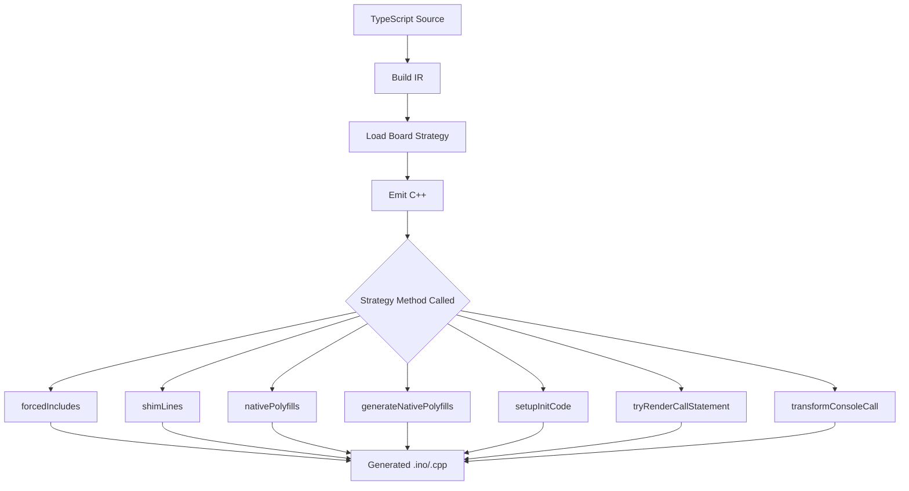

# Board Package Development Guide

> **Audience**: This document is designed for LLM/AI agents to understand how to create and configure board packages for the TypeCode transpiler.

## Overview

Board packages are npm packages that define hardware-specific code generation for the TypeCode TypeScript-to-C++ transpiler. Each board package provides:

1. **TypeScript type definitions** for pins, peripherals, and board capabilities
2. **A code generation strategy** that controls how TypeScript is translated to C++
3. **Native implementations** that replace Arduino framework calls with direct register access

## Package Structure

```
packages/board-<vendor>-<model>/
├── package.json              # npm package configuration
├── tsconfig.json             # TypeScript configuration
└── src/
    ├── index.ts              # Entry point: exports BoardStrategy + BoardDefinition
    ├── strategy.ts           # PlatformStrategy implementation
    ├── pins.ts               # Pin constants and mappings
    ├── peripherals.ts        # I2C, SPI, Serial peripheral definitions
    ├── analog.ts             # ADC/PWM configuration
    ├── timing.ts             # delay/millis functions
    ├── interrupts.ts         # Interrupt handling
    └── board.ts              # Board namespace facade
```

## Core Concepts

### 1. PlatformStrategy Interface

The [`PlatformStrategy`](packages/cli/src/platform/platform-strategy.ts) interface defines all hooks for code generation. Key methods:

```typescript
interface PlatformStrategy {
  readonly id: string;  // Strategy identifier (e.g., "arduino", "generic")
  
  // === Code Generation Hooks ===
  forcedIncludes(program, ctx): string[];           // #include headers
  symbolAliases(program, ctx): Record<string, string>;  // TS name → C++ name
  shimLines(program, ctx): string[];                // Extra code after includes
  setupInitCode?(program, ctx): string[];           // Code at start of setup()
  
  // === Polyfill Control ===
  nativePolyfills?(): Set<string>;                  // Polyfills handled natively
  generateNativePolyfills?(program, ctx): RuntimePolyfillIR[];  // Native implementations
  
  // === File Shape ===
  sourceExtension(isEntryFile, isNpmPackage): string;  // "ino", "cpp", "c"
  entrypointFunctionName(): string;                     // "setup" or "main"
  requiresLoopFunction(): boolean;                      // Arduino needs loop()
  
  // === Type Mapping ===
  normalizeCppType(typeName: string): string;
  mapReturnType(functionName, returnType): string;
  
  // === Expression/Statement Rendering ===
  tryRenderCallStatement(callee, args, renderArg, boardConstants): string | undefined;
  tryRenderTypecodeCall(receiver, receiverKind, method, args, ...): string | undefined;
  transformConsoleCall(method, renderedArgs, forHeader): string;
  
  // === Reserved Names ===
  reservedNames(): ReadonlySet<string>;  // Names that conflict with platform
}
```

### 2. ArduinoStrategy Base Class

Most board packages should extend [`ArduinoStrategy`](packages/cli/src/platform/arduino-strategy.ts):

```typescript
import { ArduinoStrategy } from 'typecode/platform';

export class MyBoardStrategy extends ArduinoStrategy {
  override readonly id = "arduino";  // Keep "arduino" to use Arduino toolchain
  
  // Override specific methods as needed
  override forcedIncludes(program, ctx): string[] {
    return ['<avr/io.h>', '<util/delay.h>'];
  }
}
```

### 3. Strategy Registration

Board packages must export their strategy as `BoardStrategy`:

```typescript
// src/index.ts
import { registerPlatformStrategy } from 'typecode/platform/registry';
import { MyBoardStrategy } from './strategy';

// Export for CLI to load
export { MyBoardStrategy as BoardStrategy } from './strategy';

// Auto-register when imported
registerPlatformStrategy(new MyBoardStrategy());
```

## Code Generation Flow



## Key Strategy Methods

### forcedIncludes()

Returns `#include` headers for the generated file:

```typescript
override forcedIncludes(_program?: any, _ctx?: any): string[] {
  return [
    '<avr/io.h>',        // AVR register definitions
    '<util/delay.h>',    // Delay functions
    '<avr/interrupt.h>', // Interrupt support
  ];
}
```

### shimLines()

Returns helper code emitted after includes. Use for native implementations:

```typescript
override shimLines(program?: any, _ctx?: any): string[] {
  return [
    '#ifndef F_CPU',
    '#define F_CPU 16000000UL  // 16 MHz clock frequency',
    '#endif',
    '',
    '// UART initialization (native AVR USART0)',
    'static inline void _uart_init(unsigned long baud) {',
    '  unsigned int ubrr = (F_CPU / 16 / baud - 1);',
    '  UBRR0H = (unsigned char)(ubrr >> 8);',
    '  UBRR0L = (unsigned char)ubrr;',
    '  UCSR0B = (1 << RXEN0) | (1 << TXEN0);',
    '  UCSR0C = (1 << UCSZ01) | (1 << UCSZ00);  // 8N1',
    '}',
  ];
}
```

### setupInitCode()

Returns code to insert at the beginning of `setup()`:

```typescript
setupInitCode(program?: any, _ctx?: any): string[] {
  return [
    '_uart_init(9600)',  // Initialize UART for serial output
    '_init_adc()',       // Initialize ADC for analog reads
  ];
}
```

**Important**: Return statements WITHOUT trailing semicolons. The emitter handles semicolon insertion.

### nativePolyfills()

Returns set of polyfill IDs that this strategy handles natively:

```typescript
nativePolyfills(): Set<string> {
  return new Set(['console']);  // We provide native console.log
}
```

### generateNativePolyfills()

Returns native polyfill implementations:

```typescript
generateNativePolyfills(program?: any, _ctx?: any): RuntimePolyfillIR[] {
  return [{
    id: 'console',
    kind: 'polyfill',
    domain: 'arduino',
    requiredIncludes: [],
    forwardDeclarations: [],
    helperStructs: [],
    helperFunctions: [
      'inline void console_log(const char* msg) { _uart_println(msg); }',
      'inline void console_log(int val) { _uart_println_long(val); }',
    ],
    shimMacros: [
      '#define console_log(...) console_log(__VA_ARGS__)',
    ],
    dependencies: [],
  }];
}
```

### tryRenderCallStatement()

Transforms function calls to native implementations:

```typescript
tryRenderCallStatement(
  callee: string,
  args: ReadonlyArray<ExpressionIR>,
  renderArg: (e: ExpressionIR) => string,
  boardConstants?: BoardConstants,
): string | undefined {
  // Transform digitalWrite(pin, value) to native register access
  if (callee === 'digitalWrite') {
    const pin = parseInt(renderArg(args[0]));
    const value = renderArg(args[1]);
    return this.renderNativeDigitalWrite(pin, value);
  }
  
  return undefined;  // Fall back to default rendering
}
```

### transformConsoleCall()

Transforms console.* calls:

```typescript
transformConsoleCall(
  method: string,
  renderedArgs: string,
  forHeader: boolean,
): string {
  if (method === 'console.log') {
    return forHeader 
      ? `console_log(${renderedArgs})`
      : `console_log(${renderedArgs});`;
  }
  // ... handle error/warn
}
```

## Native Implementation Pattern

For native board packages (no Arduino framework), follow this pattern:

### 1. Define Native Helpers in shimLines()

```typescript
override shimLines(program?: any, _ctx?: any): string[] {
  const lines: string[] = [];
  
  // F_CPU must be defined before util/delay.h
  lines.push('#ifndef F_CPU');
  lines.push('#define F_CPU 16000000UL');
  lines.push('#endif');
  lines.push('#include <util/delay.h>');
  lines.push('');
  
  // Native UART functions
  lines.push('// UART initialization (native AVR USART0)');
  lines.push('static inline void _uart_init(unsigned long baud) { ... }');
  lines.push('static inline void _uart_write(unsigned char data) { ... }');
  lines.push('static inline void _uart_print(const char* str) { ... }');
  
  return lines;
}
```

### 2. Provide Native Polyfills

```typescript
nativePolyfills(): Set<string> {
  return new Set(['console']);  // Replace console polyfill
}

generateNativePolyfills(program?: any, _ctx?: any): RuntimePolyfillIR[] {
  return [{
    id: 'console',
    kind: 'polyfill',
    domain: 'arduino',
    // ... native console implementation using _uart_* functions
  }];
}
```

### 3. Initialize Hardware in setupInitCode()

```typescript
setupInitCode(program?: any, _ctx?: any): string[] {
  return [
    '_uart_init(9600)',   // Initialize UART for console
    '_init_adc()',        // Initialize ADC
  ];
}
```

## Pin Mapping

Define pin constants in `pins.ts`:

```typescript
// Pin mappings for ATmega328P
export const PIN_MAP = {
  // Digital pins
  0:  { port: 'D', bit: 0 },
  1:  { port: 'D', bit: 1 },
  // ...
  13: { port: 'B', bit: 5 },  // LED
  
  // Analog pins
  A0: { port: 'C', bit: 0, adc: 0 },
  // ...
};

// Helper functions
export function getPortReg(pin: number): string | undefined {
  const mapping = PIN_MAP[pin];
  if (!mapping) return undefined;
  return `PORT${mapping.port}`;
}

export function getDDRReg(pin: number): string | undefined {
  const mapping = PIN_MAP[pin];
  if (!mapping) return undefined;
  return `DDR${mapping.port}`;
}

export function getPinMask(pin: number): number | undefined {
  const mapping = PIN_MAP[pin];
  if (!mapping) return undefined;
  return 1 << mapping.bit;
}
```

## Board Definition

Export a `BoardDefinition` in `index.ts`:

```typescript
import type { BoardDefinition } from '@typecode/core';

export const Board: BoardDefinition = {
  name: 'ATmega328P Native',
  architecture: 'avr',
  mcu: 'atmega328p',
  clockSpeed: 16000000,
  
  pins: {
    digital: [0, 1, 2, /* ... */ 13],
    analog: ['A0', 'A1', /* ... */ 'A5'],
    pwm: [3, 5, 6, 9, 10, 11],
  },
  
  capabilities: {
    gpio: true,
    adc: true,
    pwm: true,
    uart: true,
    i2c: true,
    spi: true,
  },
};
```

## Configuration

Users configure the board in `typecode.config.ts`:

```typescript
import type { TypecodeConfig } from '@typecode/core';

const config: TypecodeConfig = {
  target: 'avr',
  board: '@typecode/board-native-atmega328p',
  fqbn: 'arduino:avr:uno',
  output: {
    framework: 'arduino',
    outDir: './out',
  },
};

export default config;
```

## Testing

Build and test the board package:

```bash
# Build the board package
cd packages/board-native-atmega328p
npm run build

# Test with an example
cd ../..
npx typecode example.ts --compile
```

## Complete Example: Native ATmega328P

Reference implementation: [`packages/board-native-atmega328p/`](packages/board-native-atmega328p/)

Key files:
- [`src/strategy.ts`](packages/board-native-atmega328p/src/strategy.ts) - Code generation strategy
- [`src/pins.ts`](packages/board-native-atmega328p/src/pins.ts) - Pin mappings
- [`src/analog.ts`](packages/board-native-atmega328p/src/analog.ts) - Native ADC/PWM
- [`src/uart.ts`](packages/board-native-atmega328p/src/uart.ts) - Native UART

## Troubleshooting

### Strategy Not Loading

Ensure the package:
1. Exports `BoardStrategy` class
2. Calls `registerPlatformStrategy()` in `index.ts`
3. Is listed in `typecode.config.ts` → `board` field

### Polyfills Not Replaced

1. Return the polyfill ID from `nativePolyfills()`
2. Provide implementation in `generateNativePolyfills()`
3. Ensure `shimLines()` includes required helper functions

### setupInitCode Not Emitted

1. Return an array of strings (not empty array)
2. Each string should be a valid C++ statement (without trailing semicolon)
3. The emitter adds semicolons automatically

### Compilation Errors

1. Check `forcedIncludes()` returns required headers
2. Verify `shimLines()` defines all native functions
3. Ensure F_CPU is defined before including `<util/delay.h>`
