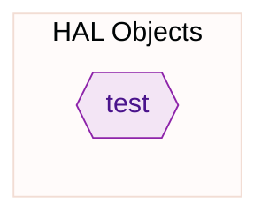
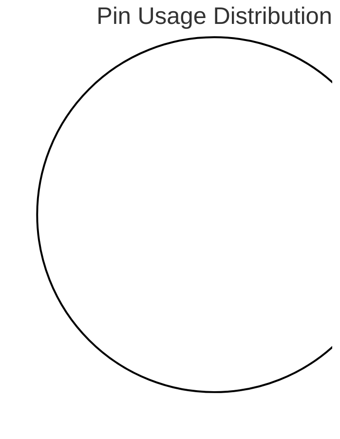
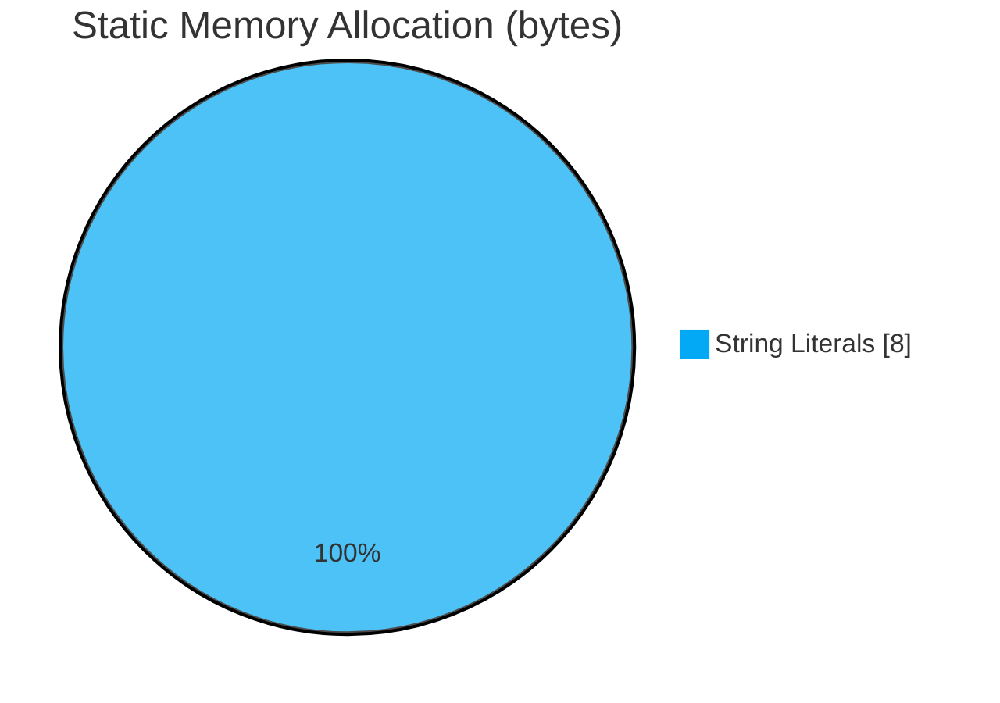
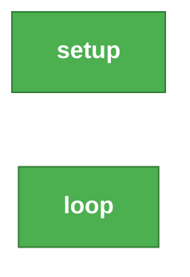
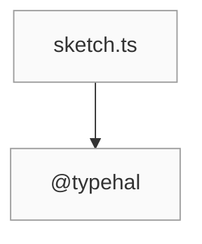

# Build Diagnostics

> **Source:** `sketch.ts` | **Target:** `arduino` | **Generated:** 5/17/2026, 5:57:49 PM
> **Board:** ./.typehal/board | **Framework:** @typehal/framework-arduino

---

## Project Summary

| Metric | Status / Value |
| :--- | :--- |
| **Output File** | `C:\typecad\typecode\demo\src\out\sketch\sketch.ino` |
| **Entry Points** | 0 |
| **Static Memory** | 8 bytes |
| **Async Tasks** | None |
| **Pin Usage** | 0 / 0 pins |

---

## Execution Flow

> This graph shows the relationships between entry points, HAL objects, and Arduino APIs.




## Pin Configuration

> **Tip:** Unused pins are available for connecting additional sensors, actuators, or peripherals.



### 🔌 GPIO Assignments

_No GPIO pins configured._

### 🧩 Peripheral Resource Allocation

| Peripheral | Instance | Pins |
|------------|----------|------|
| Serial | 0 | — |

```mermaid
%%{init: { 'theme': 'base', 'themeVariables': { 'primaryColor': '#f3e5f5', 'edgeColor': '#7b1fa2' } } }%%
flowchart LR
  classDef peri fill:#f3e5f5,stroke:#8e24aa,color:#4a148c,stroke-width:1px;
  classDef pin fill:#ffffff,stroke:#9c27b0,color:#333,stroke-width:1px;
  subgraph Serial[Serial]
    direction LR
  end
  Serial:::peri
```




## Cooperative Multitasking

> _No async tasks registered in this sketch._


## Memory Estimate

> ⚠️ Static estimate only — excludes dynamic heap allocations (malloc/new).
> String literals may be deduplicated by the compiler/linker.
> **Tip:** Compare this static estimate to the total SRAM of your target board.



| Category | Bytes |
|----------|-------|
| Global Variables | 0 |
| Struct/Class Sizes | 0 |
| String Literals | 8 |
| **Total Static** | **8** |
| Est. Max Stack Depth | 1 frames |

### 🧱 SRAM Memory Map

```mermaid
%%{init: { 'theme': 'base', 'themeVariables': { 'primaryColor': '#37474f', 'edgeColor': '#ffffff' } } }%%
flowchart TD
  classDef section fill:#263238,stroke:#eceff1,color:#fff,font-weight:bold;
  classDef item fill:#455a64,stroke:#607d8b,color:#cfd8dc,font-size:12px;
  classDef stack fill:#eceff1,stroke:#b0bec5,color:#455a64,stroke-dasharray: 5 5;
  subgraph SRAM["SRAM Memory Layout"]
    direction TB
    subgraph StackS["ESTIMATED STACK"]
      StackFrame["~1 Recursive Frames"]:::stack
    end
    StackS:::section
    subgraph GlobalsS["GLOBAL VARIABLES"]
      v_test["test (0b)"]:::item
    end
    GlobalsS:::section
    subgraph StringsS["STRING LITERALS"]
      s_0["\"typeHAL\" (8b)"]:::item
    end
    StringsS:::section
  end
```

### Stack Analysis (Deepest Paths)

> The following call sequences represent the maximum stack depth detected.



### Global Variables

| Variable | Type | Est. Bytes |
|----------|------|------------|
| `test` | `std::string` | 0 |


## Module Dependency Graph

> Displays the file import hierarchy and dependencies.




## Tree Shaking Report

> Symbols that were removed by the transpiler because they were unused.

_No symbols were removed by tree shaking._


## Build Timing Breakdown

> Execution time for each transpiler phase.

| Phase | Time (ms) |
|-------|-----------|
| setup:caches#0 | 0.18 |
| setup:load-strategy#1 | 0.57 |
| graph:collect#2 | 2.69 |
| typecheck:full#3 | 735.55 |
| ir:build-all#4 | 36.65 |
| ir:build:sketch.ts#5 | 36.51 |
| ir:build-ir:sketch.ts#6 | 34.62 |
| ir:cross-module-imports#7 | 0.48 |
| tree-shake:sketch.ts#8 | 2.28 |
| tree-shake:call-graph#9 | 1.02 |
| tree-shake:entry-points#10 | 0.37 |
| tree-shake:reachability#11 | 0.56 |
| tree-shake:filter#12 | 0.13 |
| emit:register-enums#13 | 0.04 |
| emit:all#14 | 15.97 |
| emit:file:sketch.ts#15 | 15.96 |
| post:native-modules#16 | 0.01 |
| post:flatten#17 | 0.61 |
| post:save-cache#18 | 0.71 |
| **Total** | **884.91** |
