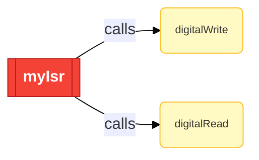
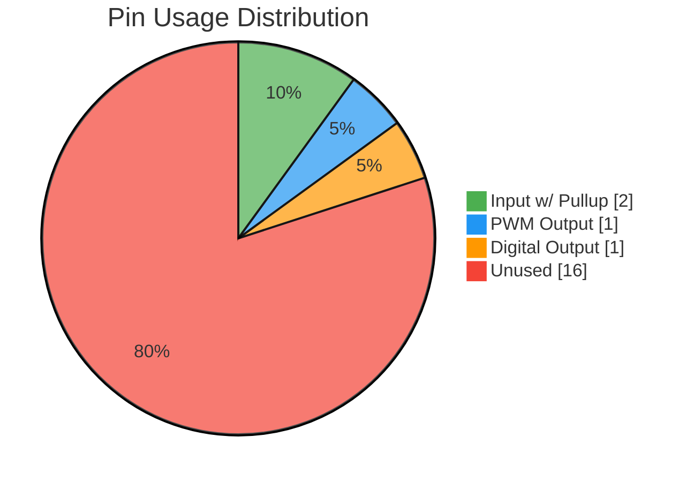
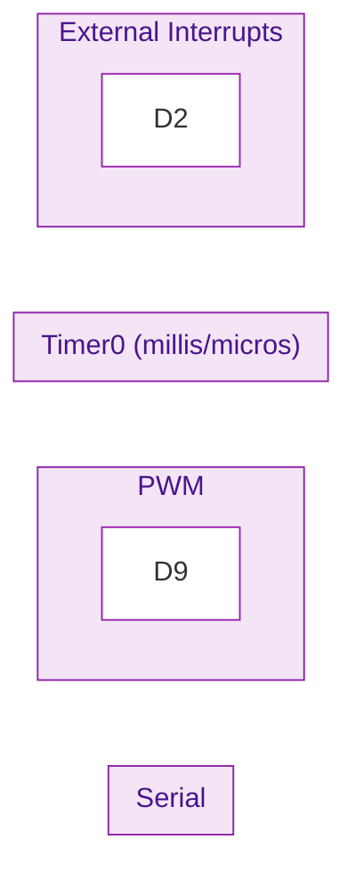
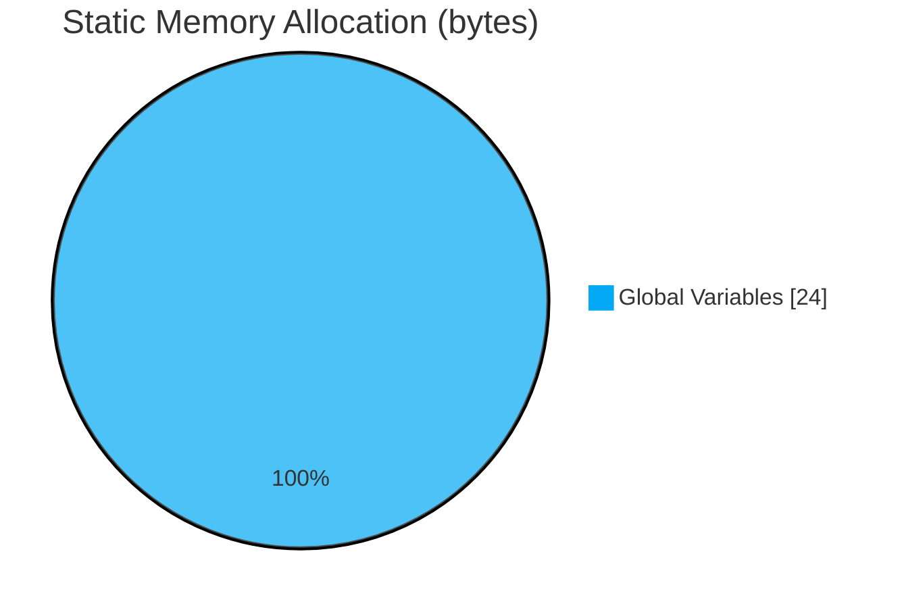
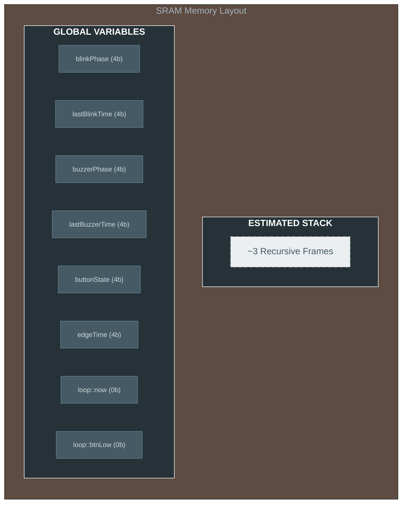
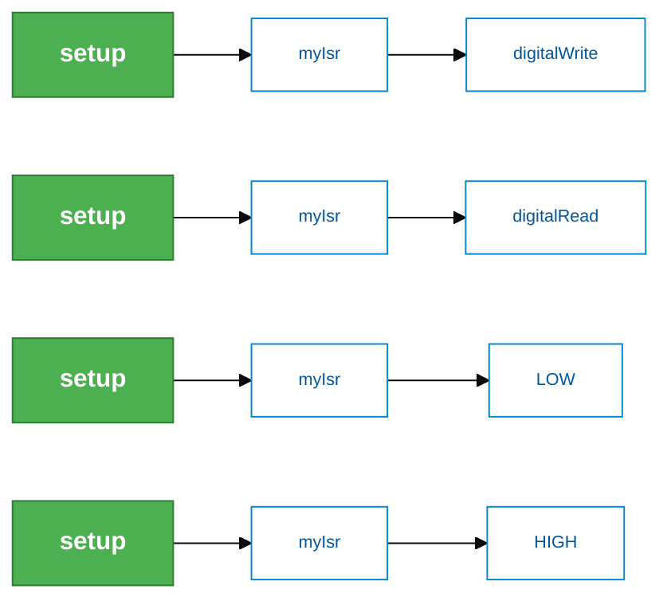
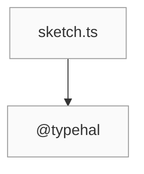

# Build Diagnostics

> **Source:** `sketch.ts` | **Target:** `arduino` | **Generated:** 5/6/2026, 11:17:04 AM
> **Board:** @typehal/board-arduino-uno | **Framework:** @typehal/framework-arduino
> **MCU:** ATmega328P | **Flash:** 32KB | **SRAM:** 2KB | **Clock:** 16MHz

---

## Project Summary

| Metric | Status / Value |
| :--- | :--- |
| **Output File** | `C:\typecad\typecode\demo\src\out\sketch\sketch.ino` |
| **Entry Points** | 2 |
| **Static Memory** | 24 bytes |
| **Async Tasks** | None |
| **Pin Usage** | 4 / 20 pins |

---

## Execution Flow

> This graph shows the relationships between entry points, HAL objects, and Arduino APIs.

```mermaid
%%{init: { 'theme': 'base', 'themeVariables': { 'primaryColor': '#e1f5fe', 'edgeColor': '#546e7a', 'fontFamily': 'Segoe UI, Roboto, Helvetica Neue, sans-serif' } } }%%
flowchart TD
  classDef entry fill:#4caf50,stroke:#2e7d32,color:#fff,stroke-width:2px;
  classDef api fill:#fff9c4,stroke:#fbc02d,color:#333,stroke-width:1px;
  classDef var fill:#e1f5fe,stroke:#0288d1,color:#01579b,stroke-width:1px;
  classDef fn fill:#e8f5e9,stroke:#43a047,color:#1b5e20,stroke-width:1px;
  classDef obj fill:#f3e5f5,stroke:#8e24aa,color:#4a148c,stroke-width:1px;
  classDef board fill:#fafafa,stroke:#9e9e9e,color:#616161,stroke-width:1px,stroke-dasharray: 5 5;
  subgraph Entry["Entry Points"]
    direction LR
    setup([setup]):::entry
    loop([loop]):::entry
    myIsr([ISR: myIsr]):::entry
  end

  subgraph APIs["Arduino APIs"]
    direction LR
    subgraph gpio[GPIO]
      direction LR
      pinMode[pinMode]:::api
      digitalWrite[digitalWrite]:::api
      digitalRead[digitalRead]:::api
    end
    subgraph serial[Serial]
      direction LR
      Serial[Serial]:::api
      println[println]:::api
    end
    subgraph audio[Audio]
      direction LR
      tone[tone]:::api
      noTone[noTone]:::api
    end
    subgraph timing[Timing]
      direction LR
      millis[millis]:::api
    end
    subgraph other["Other"]
      direction LR
      input[input]:::api
      attachInterrupt[attachInterrupt]:::api
      pressed[pressed]:::api
      released[released]:::api
    end
  end

  subgraph Vars["State Variables"]
    direction LR
    lastBlinkTime[(lastBlinkTime)]:::var
    blinkPhase[(blinkPhase)]:::var
    buttonState[(buttonState)]:::var
    edgeTime[(edgeTime)]:::var
    buzzerPhase[(buzzerPhase)]:::var
    lastBuzzerTime[(lastBuzzerTime)]:::var
  end

  subgraph Misc["Other"]
    direction LR
    blink[blink]
    button[button]
    buzzer[buzzer]
    D2[D2]
    interrupt[interrupt]
    digitalPinToInterrupt[digitalPinToInterrupt]
    FALLING[FALLING]
    now[now]
    btnLow[btnLow]
    Button[Button]
  end

  board_collapsed["Board: TypeHAL → Arduino → Uno → Demo → Board → ATmega328P → Features"]:::board

  setup -.-> Serial
  setup -.-> println
  setup -.-> blink
  setup -.-> button
  setup -.-> input
  setup -.-> buzzer
  setup -.-> tone
  setup -.-> D2
  setup -.-> interrupt
  setup -.-> pinMode
  setup -.-> attachInterrupt
  setup -.-> digitalPinToInterrupt
  setup -.-> myIsr
  setup -.-> FALLING
  myIsr -.-> digitalWrite
  myIsr -.-> digitalRead
  loop -.-> now
  loop -.-> millis
  loop -.-> lastBlinkTime
  loop -.-> blinkPhase
  loop -.-> digitalWrite
  loop -.-> btnLow
  loop -.-> digitalRead
  loop -.-> buttonState
  loop -.-> edgeTime
  loop -.-> Serial
  loop -.-> println
  loop -.-> Button
  loop -.-> pressed
  loop -.-> released
  loop -.-> tone
  loop -.-> buzzerPhase
  loop -.-> lastBuzzerTime
  loop -.-> noTone
  setup -.-> board_collapsed
  loop -.-> board_collapsed
```

### Interrupt Logic Map

> Specialized view showing only hardware-triggered event paths.

### Entry Points
- `setup()`
- `loop()`

### ISR Handlers
- `myIsr()` ⚡ (interrupt service routine)

### Resource Access Matrix

> High-level overview of hardware resources accessed by each entry point.

| Entry Point | D13 | D2 | D4 | D9 | External Interrupts | PWM | Serial | Timer0 (millis/micros) |
| :--- | :---: | :---: | :---: | :---: | :---: | :---: | :---: | :---: |
| `setup()` | — | ✅ | — | — | ✅ | — | ✅ | — |
| `loop()` | — | — | — | — | — | — | ✅ | — |
| `myIsr()` | — | — | — | — | — | — | — | — |

## Pin Configuration

> **Tip:** Unused pins are available for connecting additional sensors, actuators, or peripherals.

### 🔌 GPIO Assignments

| Pin | Mode | Peripheral Role |
|-----|------|-----------------|
| `D2` | INPUT_PULLUP | — |
| `D4` | INPUT_PULLUP | — |
| `D9` | PWM | — |
| `D13` | OUTPUT | — |

### 🧩 Peripheral Resource Allocation

| Peripheral | Instance | Pins |
|------------|----------|------|
| Serial | 0 | — |
| PWM | 0 | `D9` |
| Timer0 (millis/micros) | 0 | — |
| External Interrupts | 0 | `D2` |

## Cooperative Multitasking

> _No async tasks registered in this sketch._

## Memory Estimate

> ⚠️ Static estimate only — excludes dynamic heap allocations (malloc/new).
> String literals may be deduplicated by the compiler/linker.
> **Tip:** Compare this static estimate to the total SRAM of your target board.

| Category | Bytes |
|----------|-------|
| Global Variables | 24 |
| Struct/Class Sizes | 0 |
| String Literals | 0 |
| **Total Static** | **24** |
| Est. Max Stack Depth | 3 frames |

### 🧱 SRAM Memory Map

### Stack Analysis (Deepest Paths)

> The following call sequences represent the maximum stack depth detected.

### Global Variables

| Variable | Type | Est. Bytes |
|----------|------|------------|
| `blinkPhase` | `int` | 4 |
| `lastBlinkTime` | `int` | 4 |
| `buzzerPhase` | `int` | 4 |
| `lastBuzzerTime` | `int` | 4 |
| `buttonState` | `int` | 4 |
| `edgeTime` | `int` | 4 |
| `loop::now` | `auto` | 0 |
| `loop::btnLow` | `auto` | 0 |

## Module Dependency Graph

> Displays the file import hierarchy and dependencies.

## Tree Shaking Report

> Symbols that were removed by the transpiler because they were unused.

_No symbols were removed by tree shaking._

## Build Timing Breakdown

> Execution time for each transpiler phase.

| Phase | Time (ms) |
|-------|-----------|
| setup:caches#0 | 0.19 |
| setup:load-strategy#1 | 0.53 |
| graph:collect#2 | 6.16 |
| typecheck:full#3 | 690.32 |
| ir:build-all#4 | 481.16 |
| ir:build:sketch.ts#5 | 480.93 |
| ir:build-ir:sketch.ts#6 | 475.68 |
| ir:cross-module-imports#7 | 0.91 |
| tree-shake:sketch.ts#8 | 3.19 |
| tree-shake:call-graph#9 | 1.95 |
| tree-shake:entry-points#10 | 0.48 |
| tree-shake:reachability#11 | 0.47 |
| tree-shake:filter#12 | 0.13 |
| emit:register-enums#13 | 0.03 |
| emit:all#14 | 18.27 |
| emit:file:sketch.ts#15 | 18.25 |
| post:native-modules#16 | 0.01 |
| post:flatten#17 | 0.60 |
| post:save-cache#18 | 0.59 |
| **Total** | **2179.87** |

## Transpile Diagnostics

> Issues detected during code generation.

| Severity | Message | Location |
| :--- | :--- | :--- |
| 🟡 Warning | 'edgeTimeout' is never reassigned. | — |
| 🟡 Warning | 'unused_variable' is never reassigned. | — |
