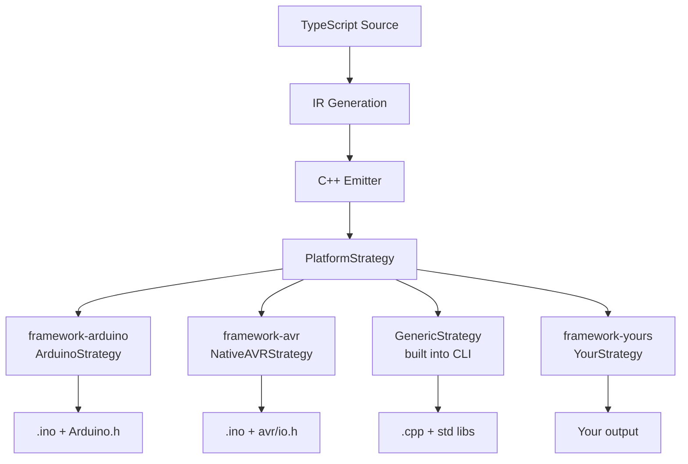
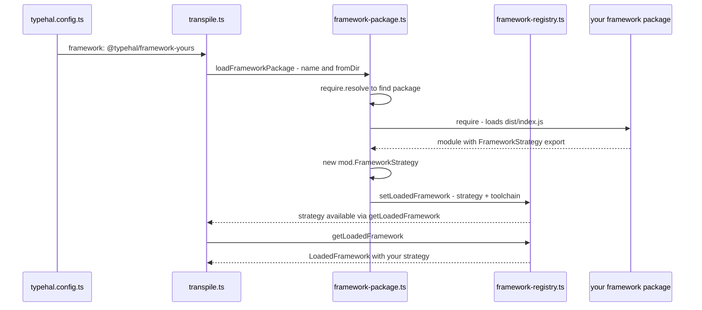

# Framework Package Authoring Guide

This tutorial walks through creating a new `@typehal/framework-{name}` package from scratch. You will learn how the framework loading system works, what the `PlatformStrategy` interface requires, and how to wire everything together so the CLI can use your framework.

---

## Table of Contents

1. [Architecture Overview](#1-architecture-overview)
2. [How the CLI Loads Your Framework](#2-how-the-cli-loads-your-framework)
3. [Step 1 — Scaffold the Package](#3-step-1--scaffold-the-package)
4. [Step 2 — Create the Entry Point](#4-step-2--create-the-entry-point)
5. [Step 3 — Implement PlatformStrategy](#5-step-3--implement-platformstrategy)
6. [Step 4 — Profile and Includes](#6-step-4--profile-and-includes)
7. [Step 5 — File Shape](#7-step-5--file-shape)
8. [Step 6 — Type Normalization](#8-step-6--type-normalization)
9. [Step 7 — Expression Rendering](#9-step-7--expression-rendering)
10. [Step 8 — Statement Rendering](#10-step-8--statement-rendering)
11. [Step 9 — Safety: Name Guards](#11-step-9--safety-name-guards)
12. [Step 10 — Include Flags](#12-step-10--include-flags)
13. [Step 11 — Optional: Polyfill Overrides](#13-step-11--optional-polyfill-overrides)
14. [Step 12 — Optional: Toolchain and Library Resolver](#14-step-12--optional-toolchain-and-library-resolver)
15. [Step 13 — Wire Up and Test](#15-step-13--wire-up-and-test)
16. [Method Reference](#16-method-reference)
17. [Troubleshooting](#17-troubleshooting)

---

## 1. Architecture Overview

TypeHAL uses a **strategy pattern** to decouple the C++ emitter from any specific hardware framework. The emitter produces IR (Intermediate Representation) and then asks a `PlatformStrategy` for target-specific decisions.



There are three existing implementations you can reference:

| Package | Location | Complexity |
|---------|----------|------------|
| **GenericStrategy** | [`packages/transpiler/src/platform/generic-strategy.ts`](../packages/transpiler/src/platform/generic-strategy.ts) | Minimal — good starting point |
| **ArduinoStrategy** | [`packages/framework-arduino/src/strategy.ts`](../packages/framework-arduino/src/strategy.ts) | Medium — profile resolution, Arduino API |
| **NativeAVRStrategy** | [`packages/framework-avr/src/strategy.ts`](../packages/framework-avr/src/strategy.ts) | Full — register-level I/O, native polyfills |

---

## 2. How the CLI Loads Your Framework

Understanding the loading sequence helps you know what to export and when your code runs.



Key points:

1. The CLI calls [`loadFrameworkPackage()`](../packages/transpiler/src/framework-package.ts) with the package name from the user config
2. It uses `require.resolve()` to find your package, then `require()` to load it
3. It looks for a **`FrameworkStrategy`** export — this must be a class constructor
4. It instantiates your strategy via `new mod.FrameworkStrategy()`
5. It stores the instance in the [`LoadedFramework` registry](../packages/transpiler/src/framework-registry.ts)
6. The emitter and other CLI modules access your strategy through the registry

**Your package must export `FrameworkStrategy` as a class.** This is the only hard requirement for the loading mechanism.

---

## 3. Step 1 — Scaffold the Package

Create the package directory structure:

```
packages/framework-{name}/
  package.json
  tsconfig.json
  src/
    index.ts          ← entry point (required)
    strategy.ts       ← your PlatformStrategy class (required)
```

### package.json

```json
{
  "name": "@typehal/framework-{name}",
  "version": "0.1.0",
  "description": "TypeHAL framework package for {description}",
  "type": "commonjs",
  "main": "./dist/index.js",
  "types": "./dist/index.d.ts",
  "exports": {
    ".": {
      "types": "./dist/index.d.ts",
      "default": "./dist/index.js"
    }
  },
  "files": ["dist"],
  "scripts": {
    "build": "tsc"
  },
  "dependencies": {
    "@typehal/core": "*"
  },
  "license": "MIT"
}
```

> **Important:** Only depend on `@typehal/core`. Do NOT depend on `@typehal/framework-arduino` or any other framework package. Your framework must be fully standalone.

### tsconfig.json

```json
{
  "compilerOptions": {
    "composite": true,
    "target": "ES2021",
    "module": "Node16",
    "moduleResolution": "Node16",
    "strict": true,
    "esModuleInterop": true,
    "skipLibCheck": true,
    "forceConsistentCasingInFileNames": true,
    "declaration": true,
    "declarationMap": true,
    "sourceMap": true,
    "rootDir": "src",
    "outDir": "dist",
    "types": ["node"]
  },
  "include": ["src/**/*.ts"],
  "references": [
    { "path": "../core" }
  ]
}
```

---

## 4. Step 2 — Create the Entry Point

The entry point [`src/index.ts`](../packages/framework-avr/src/index.ts) must export your strategy class as `FrameworkStrategy`:

```typescript
// src/index.ts
// ---------------------------------------------------------------------------
// @typehal/framework-{name} — {description}
// ---------------------------------------------------------------------------

// Export your strategy class — this is what the CLI loads
export { YourStrategy as FrameworkStrategy } from './strategy';

// Re-export the PlatformStrategy type for consumer convenience
export type { PlatformStrategy } from '@typehal/core/shared';
```

That is the minimum. You can also export additional utilities specific to your framework:

```typescript
// Export register helpers, pin mappings, etc.
export { getPinInfo, parsePinFromReceiver } from './registers';
```

---

## 5. Step 3 — Implement PlatformStrategy

The [`PlatformStrategy`](../packages/core/src/shared/platform-strategy.ts) interface is composed of six sub-interfaces with **42 required methods** and **7 optional methods**. Start with a skeleton that delegates everything to safe defaults:

```typescript
// src/strategy.ts
import type {
  PlatformStrategy,
  ExpressionIR,
  ProgramIR,
  Diagnostic,
  PlatformContext,
  BoardConstants,
  TypehalReceiverKind,
} from '@typehal/core/shared';

export class YourStrategy implements PlatformStrategy {
  readonly id = '{name}';

  // ... implement all methods below
}
```

> **Tip:** Copy the [`GenericStrategy`](../packages/transpiler/src/platform/generic-strategy.ts) as your starting point — it has the simplest correct implementation of every method. Then customize method by method.

The following steps walk through each group of methods, explaining what they do and when to customize them.

---

## 6. Step 4 — Profile and Includes

These methods control what headers and definitions appear at the top of every emitted file.

### `forcedIncludes(program: ProgramIR, ctx?: PlatformContext): string[]`

System `#include` headers forced at the top of every emitted file.

```typescript
// Example: RP2040 needs pico/stdlib.h
forcedIncludes(_program: ProgramIR, _ctx?: PlatformContext): string[] {
  return ['<pico/stdlib.h>'];
}
```

| Framework | Returns |
|-----------|---------|
| Arduino | `['<Arduino.h>']` (from profile) |
| AVR | `['<avr/io.h>']` |
| Generic | `[]` |

### `symbolAliases(program: ProgramIR, ctx?: PlatformContext): Record<string, string>`

Maps TypeScript names to C++ names. The emitter uses this to rename function calls.

```typescript
symbolAliases(_program: ProgramIR, _ctx?: PlatformContext): Record<string, string> {
  return {
    'delay': 'sleep_ms',        // TypeScript delay() → C++ sleep_ms()
    'millis': 'to_ms_since_boot',
  };
}
```

### `shimLines(program: ProgramIR, ctx?: PlatformContext): string[]`

Extra lines emitted after includes. Use this for `#define` fallbacks, helper function definitions, and inline utility code.

```typescript
shimLines(_program: ProgramIR, _ctx?: PlatformContext): string[] {
  return [
    '#ifndef F_CPU',
    '#define F_CPU 133000000UL',
    '#endif',
    '',
    'static inline void _delay_ms(unsigned long ms) { sleep_ms(ms); }',
    '',
  ];
}
```

> **See also:** The AVR strategy's [`shimLines()`](../packages/framework-avr/src/strategy.ts) generates UART helpers, ADC init, PWM timer init, and ISR vectors — 170+ lines of inline C.

### `profileDiagnostics(program: ProgramIR, ctx?: PlatformContext): Diagnostic[]`

Return diagnostics from profile resolution. Most frameworks return `[]`.

### `setupInitCode?(program: ProgramIR, ctx?: PlatformContext): string[]` *(optional)*

Code inserted at the beginning of `setup()`/`main()`. Use for hardware initialization that must happen before user code runs.

```typescript
setupInitCode(program: ProgramIR, _ctx?: PlatformContext): string[] {
  const lines: string[] = [];
  lines.push('stdio_init_all()');  // Initialize UART/USB stdio
  
  if (program.peripheralUsage?.adc) {
    lines.push('adc_init()');
  }
  return lines;
}
```

---

## 7. Step 5 — File Shape

These methods control the output file structure.

### `sourceExtension(isEntryFile: boolean, isNpmPackage: boolean): string`

File extension for output source files.

| Platform | Entry file | npm package | Other |
|----------|-----------|-------------|-------|
| Arduino/AVR | `.ino` | `.cpp` | `.h` |
| Generic | `.cpp` | `.cpp` | `.cpp` |
| RP2040 | `.cpp` | `.cpp` | `.h` |

### `entrypointFunctionName(): string`

The name of the entry point function. Arduino uses `"setup"`, bare-metal uses `"main"`.

### `requiresLoopFunction(): boolean`

Whether to auto-generate a `loop()` function. Only Arduino-style frameworks need this.

### `overrideBaseName(originalBaseName, outDirBaseName, isEntryFile, isNpmPackage): string`

Arduino `.ino` files must match their directory name, so they override to `outDirBaseName`. Most frameworks return `originalBaseName`.

### `effectiveEmitMode(requestedMode, isNpmPackage): string`

Force a specific emit mode. Arduino forces `"cpp"` for non-npm files. Most frameworks return `requestedMode` unchanged.

---

## 8. Step 6 — Type Normalization

These methods control how TypeScript types map to C++ types on your platform.

### `normalizeCppType(typeName: string): string`

Map C++ types to platform-safe equivalents. Common transforms:

```typescript
normalizeCppType(typeName: string): string {
  if (typeName === 'auto') return 'int';
  if (typeName === 'std::string') return 'const char*';  // embedded: no std::string
  if (typeName === 'IInputModePin' || typeName === 'IOutputModePin') return 'int';
  
  // Convert std::function to function pointer
  const fnTypeMatch = typeName.match(/^std::function<\s*([^()<>]+)\((.*)\)\s*>$/);
  if (fnTypeMatch) {
    return `${fnTypeMatch[1].trim()} (*)(${fnTypeMatch[2].trim()})`;
  }
  return typeName;
}
```

### `mapReturnType(functionName, returnType): string`

Force specific return types for known functions. Arduino forces `setup`/`loop` to `void`.

### `mapFunctionName(originalName): string`

Rename functions. Arduino maps `"void"` and `"__arduino_setup__"` to `"setup"`.

### `renameEnumMember(enumName, memberName): string`

Prefix enum members that conflict with platform macros. If your platform defines `HIGH`/`LOW` as macros, prefix them:

```typescript
private static RESERVED_MEMBERS = new Set(['HIGH', 'LOW', 'OUTPUT', 'INPUT']);

renameEnumMember(_enumName: string, memberName: string): string {
  return YourStrategy.RESERVED_MEMBERS.has(memberName) ? `_${memberName}` : memberName;
}
```

### `enumCastType(enumName): string | undefined`

Return `"int"`, `"long"`, or `undefined` to control how enum values are cast. Return `undefined` for no cast.

### `renameStructField(fieldName): string`

Rename struct fields that conflict with platform-reserved names. Same pattern as `renameEnumMember`.

### `structFieldInitializer(fieldValue, compiletimeVarNames, renderExpr): string | undefined`

Override how struct initializer fields render. Return `"0"` for unknown identifiers, or `undefined` for default rendering.

### `shouldSkipTypeAlias(cppType): boolean`

Skip emitting type aliases that conflict with your platform. Arduino skips `std::string` aliases.

---

## 9. Step 7 — Expression Rendering

This is where you handle platform-specific expression transformations.

### `normalizeRawExpression(value: string): string`

Apply regex transformations to raw expression text. This is the main place for framework-specific syntax rewrites:

```typescript
normalizeRawExpression(value: string): string {
  let v = value;
  // Map Date.now() to your platform's millisecond counter
  v = v.replace(/\bDate\.now\(\)/g, 'to_ms_since_boot(get_absolute_time())');
  // Map undefined/null to your null sentinel
  v = v.replace(/\bundefined\b/g, '0');
  v = v.replace(/\bnull\b/g, '0');
  return v;
}
```

### `nullValue(): string`

How to render `null`/`undefined`. Embedded platforms often use `"0"` or `"TYPEHAL_UNDEFINED"`.

### `mapPeripheralIdentifier?(name): string | undefined` *(optional)*

Map peripheral identifiers to platform names:

```typescript
mapPeripheralIdentifier(name: string): string | undefined {
  if (/^I2C\d+$/.test(name)) {
    const num = name.slice(3);
    return num === '0' ? 'i2c0' : `i2c${num}`;
  }
  if (/^SPI\d+$/.test(name)) {
    const num = name.slice(3);
    return num === '0' ? 'spi0' : `spi${num}`;
  }
  if (/^UART\d+$/.test(name)) {
    const num = name.slice(4);
    return num === '0' ? 'uart0' : `uart${num}`;
  }
  return undefined;
}
```

### `wrapStringConcat(left, right, leftIsString): string | undefined`

Whether string concatenation needs wrapping. Return `undefined` if your platform handles it natively.

### `useSnprintfForStrings(): boolean`

Whether to use `snprintf()` for string formatting. Embedded platforms typically return `true` (avoids Arduino `String` class). Hosted platforms return `false`.

### `floatToSnprintfArg?(renderedExpr, precision, tempId): {...} | undefined` *(optional)*

Convert a float expression to snprintf-compatible argument. Only needed if `useSnprintfForStrings()` is `true`. Arduino uses `dtostrf()`:

```typescript
floatToSnprintfArg(
  renderedExpr: string,
  precision: number | undefined,
  tempId: number,
): { format: string; arg: string; estimatedLength: number; preludeLines: string[] } {
  const effectivePrecision = precision ?? 6;
  const bufferName = `__typehal_float_${tempId}`;
  const estimatedLength = Math.max(16, effectivePrecision + 8);
  return {
    format: '%s',
    arg: bufferName,
    estimatedLength,
    preludeLines: [
      `char ${bufferName}[${estimatedLength}];`,
      `dtostrf(${renderedExpr}, 0, ${effectivePrecision}, ${bufferName});`,
    ],
  };
}
```

### `tryRenderTypehalCall(receiver, receiverKind, method, args, renderArg, boardConstants?, interruptMode?): string | undefined`

**This is the most important method.** It renders TypeHAL SDK calls (pin reads/writes, peripheral calls) to platform C++. Return `undefined` to fall back to default rendering.

```typescript
tryRenderTypehalCall(
  receiver: string,
  receiverKind: string,
  method: string,
  args: ReadonlyArray<any>,
  renderArg: (e: any) => string,
  _boardConstants?: any,
): string | undefined {
  // Handle GPIO operations
  if (receiver.startsWith('D') || receiver.startsWith('A')) {
    const pin = parsePinNumber(receiver);
    
    switch (method) {
      case 'high':
        return `gpio_put(${pin}, 1)`;
      case 'low':
        return `gpio_put(${pin}, 0)`;
      case 'read':
        return `gpio_get(${pin})`;
      case 'toggle':
        return `gpio_xor_mask(1ul << ${pin})`;
    }
  }
  
  // Handle UART
  if (receiver === 'Serial') {
    const a = (i: number) => args[i] !== undefined ? renderArg(args[i]) : '';
    switch (method) {
      case 'println':
        return `printf("${a(0)}\\n")`;
      case 'print':
        return `printf("${a(0)}")`;
    }
  }
  
  // Not handled — let the emitter use default rendering
  return undefined;
}
```

> **See also:** The AVR strategy's [`tryRenderNativeCall()`](../packages/framework-avr/src/strategy.ts) is a comprehensive example that handles digital I/O, analog reads, PWM, Serial, and interrupts using direct register access.

### `renderBoardDefinitionAccess(chain, boardConstants?): string | undefined`

Render `Board.definition.*` property access. If your platform supports board definitions:

```typescript
renderBoardDefinitionAccess(
  chain: string[],
  boardConstants?: any,
): string | undefined {
  if (chain.length < 3) return undefined;
  if (chain[0] !== 'Board' && chain[0] !== 'Pins') return undefined;
  if (chain[1] !== 'definition') return undefined;
  if (!boardConstants) return undefined;
  const dotPath = chain.slice(2).join('.');
  const value = boardConstants.get(dotPath);
  if (value === undefined) return undefined;
  return typeof value === 'string' ? `"${value}"` : `${value}`;
}
```

---

## 10. Step 8 — Statement Rendering

### `tryRenderCallStatement(callee, args, renderArg, boardConstants?): string | undefined`

Render a call statement as platform C++. This handles standalone function calls (not method calls on objects). Return `undefined` for default.

```typescript
tryRenderCallStatement(
  callee: string,
  args: ReadonlyArray<any>,
  renderArg: (e: any) => string,
  _boardConstants?: any,
): string | undefined {
  if (callee === 'delay') {
    return `sleep_ms(${args.map(renderArg).join(', ')})`;
  }
  if (callee === 'noInterrupts') {
    return '__disable_irq()';
  }
  if (callee === 'interrupts') {
    return '__enable_irq()';
  }
  return undefined;
}
```

### `renderThrow(valueExpr: string): string`

How to render `throw`. Embedded platforms without exceptions use an infinite loop:

```typescript
renderThrow(_valueExpr: string): string {
  return 'for (;;) {}';  // No exceptions — halt instead
}
```

### `transformConsoleCall(method, renderedArgs, forHeader): string`

Transform `console.log`/`error`/`warn` to your platform's output mechanism:

```typescript
transformConsoleCall(method: string, renderedArgs: string, forHeader: boolean): string {
  const semi = forHeader ? '' : ';';
  switch (method) {
    case 'log':
      return `printf("%s\\n", ${renderedArgs})${semi}`;
    case 'error':
      return `printf("[ERROR] %s\\n", ${renderedArgs})${semi}`;
    case 'warn':
      return `printf("[WARN] %s\\n", ${renderedArgs})${semi}`;
    default:
      return `printf("%s\\n", ${renderedArgs})${semi}`;
  }
}
```

### `objectFieldInitializer(fieldValue, renderExpr): string | undefined`

Fallback value for object initializer fields. Return `undefined` for default rendering.

### `overrideClassFieldType(fieldName, normalizedType): string`

Override a class field type when platform-specific types differ. For example, if your platform represents interrupt handlers as function pointers:

```typescript
overrideClassFieldType(fieldName: string, normalizedType: string): string {
  if (fieldName === '_interruptHandler' && normalizedType === 'int') {
    return 'void (*)(void)';
  }
  return normalizedType;
}
```

### `asyncLoopInjection(taskVarNames, hasPromiseRuntime): string[]`

Lines to inject into the loop/run function to drive async tasks:

```typescript
asyncLoopInjection(taskVarNames: string[], hasPromiseRuntime: boolean): string[] {
  const lines: string[] = [];
  for (const n of taskVarNames) {
    lines.push(`  ${n}.run();`);
  }
  if (hasPromiseRuntime) lines.push('  typehal_pump_microtasks();');
  return lines;
}
```

### `asyncDriverFunctionName(): string`

The function where async task driving happens. Arduino uses `"loop"`, bare-metal uses `"main"`.

---

## 11. Step 9 — Safety: Name Guards

These methods prevent name collisions between your TypeScript code and platform-defined macros.

### `reservedNames(): ReadonlySet<string>`

Names that must not be re-declared because your platform already defines them:

```typescript
private static RESERVED = new Set([
  'HIGH', 'LOW', 'INPUT', 'OUTPUT',
  'Serial', 'LED_BUILTIN',
  'A0', 'A1', 'A2', 'A3',
]);

reservedNames(): ReadonlySet<string> {
  return YourStrategy.RESERVED;
}
```

### `apiReservedEnumNames(): ReadonlySet<string>`

Enum class names already declared by your platform's C/C++ headers. These get `#if !defined(...)` guards.

### `apiReservedEnumGuard(): string`

The preprocessor guard expression. Return `""` if your platform doesn't need one.

### `isrUnsafeOperations?(): Map<string, { reason, severity }>` *(optional)*

Operations that are unsafe inside interrupt handlers. The emitter uses this to generate warnings:

```typescript
isrUnsafeOperations(): Map<string, { reason: string; severity: 'warning' | 'info' }> {
  return new Map([
    ['delay', { reason: 'delay() blocks the CPU in interrupt context', severity: 'warning' }],
    ['printf', { reason: 'printf() may not work in interrupt context', severity: 'info' }],
  ]);
}
```

---

## 12. Step 10 — Include Flags

These boolean methods control which standard library headers are included. For embedded platforms, most should return `false`:

```typescript
// Embedded platform — no standard library
needsIostream(): boolean { return false; }
needsStdString(): boolean { return false; }
needsStdVector(): boolean { return false; }
needsStdExcept(): boolean { return false; }
needsStdFunction(): boolean { return false; }
mathHeader(): string { return '<math.h>'; }    // C math header, not <cmath>
needsVectorOverload(): boolean { return false; }
needsLargeEnumUnderlying(): boolean { return true; }  // AVR needs explicit underlying types
```

For hosted platforms with full C++ standard library:

```typescript
// Hosted platform — full standard library
needsIostream(): boolean { return true; }
needsStdString(): boolean { return true; }
needsStdVector(): boolean { return true; }
needsStdExcept(): boolean { return true; }
needsStdFunction(): boolean { return true; }
mathHeader(): string { return '<cmath>'; }
needsVectorOverload(): boolean { return true; }
needsLargeEnumUnderlying(): boolean { return false; }
```

---

## 13. Step 11 — Optional: Polyfill Overrides

If your platform provides native implementations for things the CLI normally polyfills (console, string methods, arrays), you can override them.

### `nativePolyfills?(): Set<string>`

Return a set of polyfill IDs your strategy handles natively. The CLI will skip its own polyfills for these:

```typescript
nativePolyfills(): Set<string> {
  return new Set(['console']);  // We provide our own console implementation
}
```

Known polyfill IDs: `'console'`, `'string_methods'`, `'array_methods'`, `'async'`.

### `generateNativePolyfills?(program, ctx?): RuntimePolyfillIR[]`

Return polyfill IR for the polyfills you declared in `nativePolyfills()`:

```typescript
generateNativePolyfills(program: ProgramIR, _ctx?: PlatformContext): RuntimePolyfillIR[] {
  return [{
    id: 'console',
    kind: 'polyfill',
    domain: 'arduino',
    requiredIncludes: [],
    forwardDeclarations: [],
    helperStructs: [],
    helperFunctions: [
      'inline void console_log(const char* msg) { printf("%s\\n", msg); }',
      'inline void console_log(int val) { printf("%d\\n", val); }',
    ],
    shimMacros: [
      '#define console_log(...) console_log(__VA_ARGS__)',
    ],
    dependencies: [],
  }];
}
```

> **See also:** The AVR strategy's [`generateNativePolyfills()`](../packages/framework-avr/src/strategy.ts) generates a complete UART-based console using `_uart_println` overloads.

---

## 14. Step 12 — Optional: Toolchain and Library Resolver

If your framework provides compile/upload/monitor capabilities, export a `Toolchain` object from your `index.ts`. This is how `--compile`, `--upload`, and `--monitor` know what to invoke.

### The `FrameworkToolchain` interface

The CLI delegates all build operations to whatever toolchain the active framework provides. The interface is defined in [`framework-registry.ts`](../packages/transpiler/src/framework-registry.ts):

```typescript
interface FrameworkToolchain {
  /** Optional post-processing before compilation (e.g. merge .cpp files into .ino). */
  prepare?(outputDir: string, entryPoint: string): void;

  /** Compile the generated source code. Required. */
  compile(options: ToolchainOptions): CompileResult;

  /** Upload compiled firmware. Optional — not all targets support upload. */
  upload?(options: ToolchainOptions): UploadResult;

  /** Open an interactive monitor. Optional. */
  monitor?(options: ToolchainOptions): void;
}
```

Only `compile` is required. `prepare`, `upload`, and `monitor` are optional — a native desktop framework that only compiles to an executable does not need upload or monitor.

### `ToolchainOptions`

All toolchain methods receive a generic options bag. Your framework reads what it needs and ignores the rest:

```typescript
interface ToolchainOptions {
  outputDir: string;      // Directory containing generated source files
  sourcePath: string;     // Primary source file (.cpp, .ino, etc.)
  fqbn?: string;          // Fully Qualified Board Name (Arduino only)
  port?: string;          // Serial port (Arduino upload/monitor)
  baud?: number;          // Baud rate (serial monitor)
  optimize?: string;      // Optimization level from config
  extraFlags?: string[];  // Additional compiler flags from config
  defines?: Record<string, string>;  // Compiler defines from config
  frameworkConfig?: Record<string, unknown>;  // Framework-specific config section
}
```

The `frameworkConfig` field carries your framework's dedicated config section from `typehal.config.ts`. This lets users customize framework-specific options without the CLI needing to know about them. See [Framework-Specific Configuration](#framework-specific-configuration) below.

### `CompileResult` and `UploadResult`

```typescript
interface CompileResult {
  success: boolean;
  output: string;        // Combined stdout + stderr
  errors: CompileError[]; // Parsed compiler errors (GCC/Clang format)
}

interface UploadResult {
  success: boolean;
  output: string;
}
```

### Example: Native g++ toolchain

Here is a minimal toolchain that compiles with g++ or clang++:

```typescript
// src/native-compile.ts
import { spawnSync } from "node:child_process";
import type { CompileResult, ToolchainOptions } from "@typehal/core/shared";
import { parseCompileErrors } from "@typehal/core/shared";

export const NativeToolchain = {
  compile(options: ToolchainOptions): CompileResult {
    const compiler = detectCompiler();  // "g++" or "clang++"
    const flags = ["-O2", ...(options.extraFlags ?? [])];

    const cmd = spawnSync(compiler, [...flags, options.sourcePath, "-o", exePath], {
      encoding: "utf8",
      timeout: 120000,
    });

    const output = `${cmd.stdout ?? ""}\n${cmd.stderr ?? ""}`.trim();
    const errors = parseCompileErrors(output, options.outputDir);

    return { success: cmd.status === 0, output, errors };
  },
};
```

No `upload` or `monitor` — native executables don't upload to a board.

### Exporting from `index.ts`

Export your toolchain object as `Toolchain`:

```typescript
// src/index.ts
export { YourStrategy as FrameworkStrategy } from './strategy';
export { NativeToolchain as Toolchain } from './native-compile';
```

The CLI's [`extractToolchain()`](../packages/transpiler/src/framework-package.ts) detects this export and registers it in the [`LoadedFramework`](../packages/transpiler/src/framework-registry.ts) registry.

### How it connects to the CLI

When a user runs `typehal build --compile`:

1. The CLI loads the framework package specified in `typehal.config.ts`
2. It finds the `Toolchain` export and stores it in the framework registry
3. After transpilation, `--compile` calls `compileSource(options)` from [`platform/toolchain.ts`](../packages/transpiler/src/platform/toolchain.ts)
4. That function retrieves the active toolchain and calls its `compile(options)` method
5. The framework's `compile` invokes the actual compiler (g++, arduino-cli, etc.)

Each framework decides what compiler to use and what options to pass — the CLI does not need to know.

### Example: Arduino toolchain

The Arduino framework wraps `arduino-cli` calls behind the same interface:

```typescript
export const ArduinoToolchain = {
  prepare(outputDir: string, entryPoint: string): void {
    // Merge all .cpp files into a single .ino sketch
    flattenGeneratedModulesIntoSketch(outputDir, entryPoint);
  },

  compile(options: ToolchainOptions): CompileResult {
    // options.fqbn is required for Arduino
    return compileArduinoSketch(options.sourcePath, options.fqbn!);
  },

  upload(options: ToolchainOptions): UploadResult {
    return uploadArduinoSketch(options.outputDir, options.fqbn!, options.port!);
  },

  monitor(options: ToolchainOptions): void {
    monitorArduinoSketch(options.port!, options.baud ?? 9600);
  },
};
```

### Framework-Specific Configuration

Your framework can declare its own config section in `typehal.config.ts`. This is how users pass framework-specific options like compiler selection, include paths, or custom flags.

**1. Define a config interface in your framework package:**

```typescript
// src/my-config.ts
export interface MyFrameworkConfig {
  customCompiler?: string;
  includePaths?: string[];
}
```

**2. Export it from `index.ts`:**

```typescript
export type { MyFrameworkConfig } from './my-config';
```

**3. Consume it in your toolchain:**

```typescript
import type { MyFrameworkConfig } from './my-config';

export const MyToolchain = {
  compile(options: ToolchainOptions): CompileResult {
    const config = (options.frameworkConfig ?? {}) as MyFrameworkConfig;
    const flags = config.includePaths?.map(p => `-I${p}`) ?? [];
    // ... build with flags
  },
};
```

**4. Users configure it in `typehal.config.ts`:**

Users add a top-level key matching their framework name. The config loader collects it into `frameworkConfig`:

```typescript
import type { TypehalConfig } from '@typehal/core';

const config: TypehalConfig = {
  framework: '@typehal/framework-mine',
  mine: {
    customCompiler: 'clang++',
    includePaths: ['./vendor'],
  },
};
```

The config loader in `packages/transpiler/src/config-loader.ts` automatically extracts any unrecognized top-level object section and passes it through as `frameworkConfig` on `ToolchainOptions`. Your framework casts it to its own typed interface.

The existing `@typehal/framework-native` package uses this pattern — see `NativeCompileConfig` in [`native-config.ts`](../packages/framework-native/src/native-config.ts) for a concrete example.

### Library discovery

For frameworks that discover external libraries (like Arduino libraries), export these functions from `index.ts`:

```typescript
export function isArduinoLibraryImport(moduleSpecifier: string): boolean { ... }
export function getArduinoLibraryHeaderName(moduleSpecifier: string): string | undefined { ... }
export function tryGenerateArduinoLibDecl(moduleSpecifier: string, fromFile: string): string | undefined { ... }
```

> **Note:** Both toolchain and library resolver are optional. A framework package can provide only the strategy and still be fully functional for code generation. A framework without a toolchain simply cannot use `--compile` / `--upload` / `--monitor`.

---

## 15. Step 13 — Wire Up and Test

### Add to the monorepo

If using a monorepo, add your package to the root `package.json` workspaces and the root `tsconfig.json` references.

### Build

```bash
cd packages/framework-{name}
npm run build
```

### Configure

In your project's `typehal.config.ts`:

```typescript
import { defineConfig } from '@typehal/transpiler';

export default defineConfig({
  target: 'arduino',  // or your custom target
  framework: '@typehal/framework-{name}',
  board: '@typehal/board-{name}',
  fqbn: 'vendor:arch:board',
});
```

### Verify

1. **Compilation**: `cd packages/framework-{name} && npx tsc --noEmit` — must exit with code 0
2. **Loading**: The CLI must be able to `require()` your package and find `FrameworkStrategy`
3. **Strategy**: All 42 required methods must be implemented
4. **Output**: Transpile a test file and verify the generated C++ uses your platform's APIs

---

## 16. Method Reference

### Required Methods (42)

| Category | Method | Signature |
|----------|--------|-----------|
| Identity | `id` | `readonly string` |
| Profile | `forcedIncludes` | `(program, ctx?) => string[]` |
| Profile | `symbolAliases` | `(program, ctx?) => Record<string, string>` |
| Profile | `shimLines` | `(program, ctx?) => string[]` |
| Profile | `profileDiagnostics` | `(program, ctx?) => Diagnostic[]` |
| File Shape | `sourceExtension` | `(isEntryFile, isNpmPackage) => string` |
| File Shape | `entrypointFunctionName` | `() => string` |
| File Shape | `requiresLoopFunction` | `() => boolean` |
| File Shape | `overrideBaseName` | `(original, outDir, isEntry, isNpm) => string` |
| File Shape | `effectiveEmitMode` | `(requested, isNpm) => string` |
| Includes | `needsIostream` | `() => boolean` |
| Includes | `needsStdString` | `() => boolean` |
| Includes | `needsStdVector` | `() => boolean` |
| Includes | `needsStdExcept` | `() => boolean` |
| Includes | `needsStdFunction` | `() => boolean` |
| Includes | `mathHeader` | `() => string` |
| Includes | `needsVectorOverload` | `() => boolean` |
| Includes | `needsLargeEnumUnderlying` | `() => boolean` |
| Includes | `shouldSkipTypeAlias` | `(cppType) => boolean` |
| Includes | `emitDiagnostics` | `(emitMode) => Diagnostic[]` |
| Types | `normalizeCppType` | `(typeName) => string` |
| Types | `mapReturnType` | `(functionName, returnType) => string` |
| Types | `mapFunctionName` | `(originalName) => string` |
| Types | `renameEnumMember` | `(enumName, memberName) => string` |
| Types | `enumCastType` | `(enumName) => string or undefined` |
| Types | `renameStructField` | `(fieldName) => string` |
| Types | `structFieldInitializer` | `(fieldValue, compiletimeVarNames, renderExpr) => string or undefined` |
| Expression | `normalizeRawExpression` | `(value) => string` |
| Expression | `nullValue` | `() => string` |
| Expression | `wrapStringConcat` | `(left, right, leftIsString) => string or undefined` |
| Expression | `useSnprintfForStrings` | `() => boolean` |
| Expression | `tryRenderTypehalCall` | `(receiver, receiverKind, method, args, renderArg, boardConstants?, interruptMode?) => string or undefined` |
| Expression | `renderBoardDefinitionAccess` | `(chain, boardConstants?) => string or undefined` |
| Statement | `tryRenderCallStatement` | `(callee, args, renderArg, boardConstants?) => string or undefined` |
| Statement | `renderThrow` | `(valueExpr) => string` |
| Statement | `transformConsoleCall` | `(method, renderedArgs, forHeader) => string` |
| Statement | `objectFieldInitializer` | `(fieldValue, renderExpr) => string or undefined` |
| Statement | `overrideClassFieldType` | `(fieldName, normalizedType) => string` |
| Statement | `asyncLoopInjection` | `(taskVarNames, hasPromiseRuntime) => string[]` |
| Statement | `asyncDriverFunctionName` | `() => string` |
| Safety | `reservedNames` | `() => ReadonlySet<string>` |
| Safety | `apiReservedEnumNames` | `() => ReadonlySet<string>` |
| Safety | `apiReservedEnumGuard` | `() => string` |

### Optional Methods (7)

| Category | Method | Signature |
|----------|--------|-----------|
| Profile | `setupInitCode` | `(program, ctx?) => string[]` |
| Expression | `mapPeripheralIdentifier` | `(name) => string or undefined` |
| Expression | `floatToSnprintfArg` | `(renderedExpr, precision, tempId) => {...} or undefined` |
| Safety | `isrUnsafeOperations` | `() => Map<string, {reason, severity}>` |
| Polyfill | `nativePolyfills` | `() => Set<string>` |
| Polyfill | `generateNativePolyfills` | `(program, ctx?) => RuntimePolyfillIR[]` |

---

## 17. Troubleshooting

### "Unable to resolve framework package"

The CLI uses `require.resolve()` to find your package. Make sure:
- The package is installed (`npm install` or linked)
- The `main` field in `package.json` points to `./dist/index.js`
- You have run `npm run build` to compile TypeScript to `dist/`

### "Framework not loaded" error

Your package must export `FrameworkStrategy` as a **class** (not an instance, not a function):

```typescript
// ✅ Correct — export a class
export { MyStrategy as FrameworkStrategy } from './strategy';

// ❌ Wrong — export an instance
export const FrameworkStrategy = new MyStrategy();

// ❌ Wrong — export a function
export function FrameworkStrategy() { ... }
```

### Compilation errors about missing methods

TypeScript will tell you exactly which methods are missing. The interface requires all 42 methods. Copy the [`GenericStrategy`](../packages/transpiler/src/platform/generic-strategy.ts) implementation for any method you don't need to customize.

### Generated C++ uses wrong types

Check your `normalizeCppType()` implementation. Common issues:
- Forgetting to map `"auto"` → `"int"`
- Not mapping `"std::string"` → `"const char*"` for embedded platforms
- Not converting `std::function` to function pointers

### Pin operations not rendering

Your `tryRenderTypehalCall()` must handle the receiver/method combinations your users will call. The `receiver` is the pin identifier (e.g., `"D13"`, `"A0"`) and `method` is the operation (e.g., `"high"`, `"read"`, `"toggle"`). Return `undefined` for anything you don't handle — the emitter will fall back to default rendering.

### Console output not working

1. Make sure `transformConsoleCall()` returns valid C++ for your platform
2. If you provide native polyfills via `nativePolyfills()`, make sure `generateNativePolyfills()` returns the matching implementation
3. Check that `shimLines()` includes any helper functions your console implementation needs
