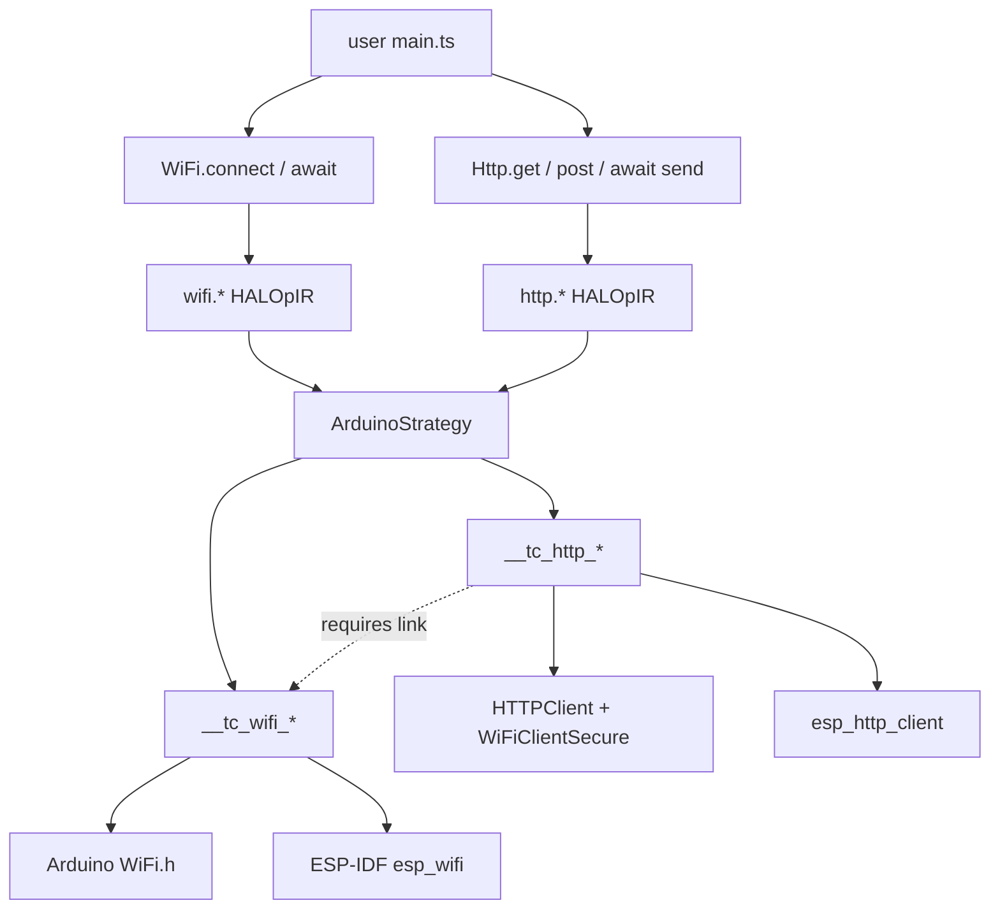

# HAL WiFi Stack (ESP32-first, dual backend)

## Architecture

Follows the established HAL pattern: TypeScript facade whose method bodies are compile-time recipes → semantic `wifi.*` `HALOpIR` ops → platform strategy lowers to C++. The ops are backend-neutral; a `wifiBackend` setting in `frameworkData` selects the lowering:

- `arduino` (default): Arduino-ESP32 `WiFi.h` calls
- `espidf`: raw `esp_wifi.h` / `esp_netif` / `esp_event` C API — the transpiler synthesizes the ~80 lines of IDF boilerplate (nvs init, netif, event loop, handlers) that users normally hand-write. Still compiles under arduino-cli since arduino-esp32 bundles ESP-IDF.

Both backends emit a small `__tc_wifi_*` C++ shim (same function signatures, different bodies) so the op-lowering layer stays uniform and both backends agree on normalized status codes. This mirrors the existing `__tc_WDT` / `Timing` shim pattern. Non-WiFi architectures (AVR) get not-supported comments plus a compile-time diagnostic — same gating style as `power.deep_sleep` / `wdt.enable` in [packages/framework-arduino/src/strategy.ts](packages/framework-arduino/src/strategy.ts).



Layering: **WiFi** owns the radio/link; **Http** (and later MQTT) are application clients that assume a connected interface. They do not re-implement association — they call through the same `__tc_wifi_is_connected()` / status surface when validating or waiting for a link. Headers follow the Preferences lesson (method-local `include`, no unconditional `__includes`).

Transpiler advantages leveraged: one TS source targets both backends; IDF/HTTP boilerplate emitted only when used (whole-program knowledge); board-data validation at edit time; unused features emit zero code; `await WiFi.connect()` / `await Http.get(...).send()` compile to heap-free cooperative poll states.

## Async/await as a first-class abstraction (verified against the transpiler)

`connect()`, `untilConnected()`, and `scanAsync()` return `Promise<...>` and are designed to be awaited inside `async` functions. Every pattern used is confirmed supported by existing machinery:

- `**async function` + `await` → cooperative state machines.** `generateAsyncTaskClass` in [packages/cuttlefish/src/emit/utils/async-state-machine.ts](packages/cuttlefish/src/emit/utils/async-state-machine.ts) splits the body at awaited calls into `STATE_N` segments (both linear and `while(true)` cyclic bodies), emits a class polled from `loop()` via `asyncLoopInjection` (`function-emitter-impl.ts` lines 341-350). Task classes are instantiated in the preamble and run automatically. Verified by the "Async/Await Lowering" suite in [tests/functions.test.ts](tests/functions.test.ts).
- **Awaited marker calls with custom poll states — the exact pattern WiFi reuses.** `await ui.onTap()` produces `{ kind: "call", callee: "__UI_TAP__", args: [...], isAwaited: true }` ([packages/cuttlefish/src/ir/transformers/ui-call-resolver.ts](packages/cuttlefish/src/ir/transformers/ui-call-resolver.ts) line 1282), and the state machine generates a dedicated condition-poll state for it (`tapInfoMap`, async-state-machine.ts lines 129-146). WiFi adds a parallel `__WIFI_WAIT__` marker and `wifiInfoMap` branch whose poll state checks `__tc_wifi_status()` / `__tc_wifi_scan_done()` with a `millis()` timeout deadline (timeout handling mirrors the existing edge-marker parse at async-state-machine.ts line 372).
- `**isAwaited` plumbing exists.** Awaited call statements get `isAwaited: true` in [packages/cuttlefish/src/ir/transformers/expressions.ts](packages/cuttlefish/src/ir/transformers/expressions.ts) lines 33-37. The WiFi resolver hook lives beside the HAL resolution in `call-statement.ts`: when an awaited call resolves to a wifi awaitable, emit the start `hal-op` (e.g. `wifi.connect_start`) followed by the awaited `__WIFI_WAIT__` marker call.
- **Heap-free.** Poll states are plain C (`digitalRead`/`millis()` style); no std::function, matching the static async runtime constraint in [packages/cuttlefish/src/api/shared/async-runtime-static.ts](packages/cuttlefish/src/api/shared/async-runtime-static.ts). The Promise microtask runtime is not required for WiFi awaits.

Context-dependent lowering (a transpiler-only trick — same API, two emissions):

- Inside an `async` function: `await WiFi.connect(...)` → non-blocking `__tc_wifi_connect_start(...)` + cooperative `STATE_N` poll until Connected/Failed/timeout. Other async tasks keep running.
- At top level (setup) or in a sync function: the same call lowers to the blocking `__tc_wifi_connect(...)` shim. This is consistent with how the transpiler already treats awaited sync calls — `const v = await getValue()` strips the await and inlines (tests/functions.test.ts lines 253-266) — and blocking during setup is the desired semantic anyway.

Known limits, stated up front and worked around in the API:

- Value-position awaits (`const ok = await WiFi.connect(...)`) cannot suspend — the initializer transformer inlines them, so that form falls back to the blocking shim. Statement-position `await WiFi.connect(...)` followed by `WiFi.isConnected()` is the cooperative form; demos and docs use it.
- `Async.sleepUntil(condition)` in the existing HAL does not actually plumb its condition into C++ (`packages/hal/src/async.ts` line 48 passes only the poll interval) — WiFi does not build on it; the `__WIFI_WAIT__` marker is self-contained.
- Top-level `await` gets no state machine (top-level code lands in `setup()`), so it is blocking by definition; documented, not diagnosed.

## Public API (`packages/hal/src/wifi.ts`)

Singleton `WiFiClass` with `static __instance_name = "WiFi"`, **no `__includes`** (ESP32-only header — same lesson as `Preferences`); method-local `include("<WiFi.h>")` as the canonical marker, swapped to IDF headers by the espidf backend via `filterRequiredIncludes`.

Advanced options are fluent setters called before `connect` (each setter is its own semantic op) — this matches HAL style (`I2C0.begin().setClock()`) and avoids object-literal resolution limits in the HAL recipe resolver. Defaults: STA mode, blocking connect with 15 s timeout, DHCP, auto-reconnect on.

```ts
export enum WiFiStatus { Idle = 0, Connecting = 1, Connected = 2, ConnectFailed = 3, Disconnected = 4 }
export enum WiFiEncryption { Open = 0, WEP = 1, WPA = 2, WPA2 = 3, WPA3 = 4, Enterprise = 5 }

class WiFiClass {
  static readonly __instance_name = "WiFi";
  // Station — minimal path is one line. Awaitable: inside an async function,
  // `await WiFi.connect(...)` suspends cooperatively; at top level it blocks.
  connect(ssid: string, password?: string, timeoutMs?: number): Promise<boolean>; // default timeout 15000
  connectAsync(ssid: string, password?: string): void;      // fire-and-forget begin, poll status()
  untilConnected(timeoutMs?: number): Promise<boolean>;     // await an in-progress/reconnecting link
  untilDisconnected(): Promise<void>;
  disconnect(): void;
  isConnected(): boolean;
  status(): WiFiStatus;
  localIP(): string;  rssi(): number;  macAddress(): string;
  // Pre-connect configuration (fluent)
  hostname(name: string): this;
  staticIP(ip: string, gateway: string, subnet: string, dns?: string): this;
  autoReconnect(enabled: boolean): this;      // default true
  powerSave(mode: 'default' | 'none'): this;  // 'none' = min latency
  txPower(dbm: number): this;
  // Saved credentials (NVS-backed, namespace "tc_wifi")
  saveCredentials(ssid: string, password: string): void;
  connectSaved(timeoutMs?: number): boolean;
  clearCredentials(): void;
  // Events (handlers extracted to named C functions via existing callback machinery)
  onConnect(handler: () => void): void;
  onDisconnect(handler: () => void): void;
  onGotIP(handler: () => void): void;
  // Access point
  startAP(ssid: string, password?: string): boolean;   // open AP if no password, channel 1
  apChannel(ch: number): this;  apHidden(hidden: boolean): this;  apMaxClients(n: number): this;
  stopAP(): void;  apClientCount(): number;  apIP(): string;
  // Scanning
  scan(): number;                       // blocking, returns count
  scanAsync(): Promise<void>;           // awaitable: cooperative poll until scan completes
  scanCount(): number;                  // result count from the last scan
  scanSSID(i: number): string;  scanRSSI(i: number): number;
  scanEncryption(i: number): WiFiEncryption;  scanChannel(i: number): number;
}
export const WiFi = new WiFiClass();
```

Board packages re-export all of `@typecad/hal`, so `import { WiFi } from '@typecad/board-esp32-devkit'` works with no board-package changes.

## Semantic ops

New stubs in [packages/hal/src/emit.ts](packages/hal/src/emit.ts), IR types in [packages/cuttlefish/src/api/shared/hal-op-ir.ts](packages/cuttlefish/src/api/shared/hal-op-ir.ts), resolution cases in `tryResolveSemanticCall` in [packages/cuttlefish/src/ir/hal/hal-plugins.ts](packages/cuttlefish/src/ir/hal/hal-plugins.ts):

- `wifi.connect { ssid, password, timeoutMs, blocking }` / `wifi.connect_start { ssid, password }` / `wifi.disconnect`
- Awaitable markers (not HAL ops — awaited `__WIFI_WAIT__` call statements consumed by the async state machine): `WIFI_CONNECTED__T<ms>`, `WIFI_DISCONNECTED`, `WIFI_SCAN_DONE`. Produced only when the call site is awaited inside an async function; otherwise the blocking op is used.
- `wifi.status` / `wifi.is_connected` / `wifi.local_ip` / `wifi.rssi` / `wifi.mac` (expression ops)
- `wifi.set_hostname` / `wifi.set_static_ip` / `wifi.set_auto_reconnect` / `wifi.set_power_save` / `wifi.set_tx_power`
- `wifi.on_event { event: "connect" | "disconnect" | "got_ip", handler }` — handler is the extracted callback name (existing `callback()` + top-level-prep lambda extraction; no `std::function`)
- `wifi.ap_start { ssid, password, channel, hidden, maxClients }` / `wifi.ap_stop` / `wifi.ap_client_count` / `wifi.ap_ip`
- `wifi.scan` / `wifi.scan_ssid` / `wifi.scan_rssi` / `wifi.scan_encryption` / `wifi.scan_channel`
- `wifi.save_credentials` / `wifi.connect_saved` / `wifi.clear_credentials`

## Backend lowering (`packages/framework-arduino/src/wifi-lowering.ts`, new)

`resolveWifiOp(op, arch, backend)` called from `resolveHALOperation` in [packages/framework-arduino/src/strategy.ts](packages/framework-arduino/src/strategy.ts) for any `wifi.*` op. Strategy caches `_cachedWifiBackend` from `frameworkData.wifiBackend` alongside the existing `_cachedArch`.

**Shared shim contract** (emitted once via the existing polyfill/shim mechanism, gated by a `programUsesWifi(program)` scan of HAL ops, like the async-runtime gating):

- `bool __tc_wifi_connect(const char* ssid, const char* pass, unsigned long timeoutMs)` — mode STA, begin, wait loop, returns success
- `void __tc_wifi_connect_start(const char* ssid, const char* pass)` — non-blocking begin (used by both `connectAsync()` and awaited `connect()`)
- `uint8_t __tc_wifi_status()` — normalized `WiFiStatus` codes so TS comparisons and `__WIFI_WAIT__` poll states work identically on both backends
- `void __tc_wifi_scan_start()` / `bool __tc_wifi_scan_done()` / `int16_t __tc_wifi_scan_count()` — async scan trio polled by the awaited-scan state (Arduino: `WiFi.scanNetworks(true)` + `scanComplete()`; espidf: `esp_wifi_scan_start(..., false)` + done flag from `WIFI_EVENT_SCAN_DONE`)
- `String/char* __tc_wifi_local_ip(buf)`, `__tc_wifi_mac(buf)`, `int __tc_wifi_rssi()`
- `bool __tc_wifi_ap_start(ssid, pass, channel, hidden, maxClients)`, `__tc_wifi_ap_stop`, `__tc_wifi_ap_count`, `__tc_wifi_ap_ip`
- `int16_t __tc_wifi_scan()` + per-result getters (espidf keeps a static `wifi_ap_record_t` array, capped ~20)
- `__tc_wifi_save_credentials` / `__tc_wifi_connect_saved` / `__tc_wifi_clear_credentials` — Preferences (arduino) / raw `nvs_*` (espidf), namespace `tc_wifi`

**Arduino backend**: shim wraps `WiFi.begin/status/softAP/scanNetworks/...`; events lower to a single statement using a captureless C++ lambda so no global wrapper is needed:
`WiFi.onEvent([](WiFiEvent_t e, WiFiEventInfo_t i){ main_isr_0(); }, ARDUINO_EVENT_WIFI_STA_GOT_IP);`

**ESP-IDF backend**: shim contains the synthesized boilerplate — `nvs_flash_init`, `esp_netif_init`, `esp_event_loop_create_default`, `esp_netif_create_default_wifi_sta/ap`, `esp_wifi_init/set_config/start/connect`, event handlers driving a status flag and auto-reconnect-on-disconnect (default on). User event callbacks register through `esp_event_handler_instance_register` with captureless lambdas. Init runs lazily on first `__tc_wifi_`* call so ordering is safe. `filterRequiredIncludes` swaps `<WiFi.h>` → `<esp_wifi.h>, <esp_event.h>, <esp_netif.h>, <nvs_flash.h>` (+ scan/AP headers).

**Other architectures**: ops return `// wifi not supported on <arch>` comments (WDT pattern). Future chips (Pico W, ESP8266) slot in by extending the arch→header/API table in `wifi-lowering.ts`; the HAL and op layers don't change.

## Compile-time validation (`packages/cuttlefish/src/ir/wifi-validation.ts`, new)

Wired into `runProgramValidations` in [packages/cuttlefish/src/ir/validation-orchestrator.ts](packages/cuttlefish/src/ir/validation-orchestrator.ts). Board-data-driven (returns nothing when board data is absent, per repo convention):

- Any `wifi.*` op but board constants lack `peripherals.wifi` → error "board has no WiFi radio"
- `wifi.ap_start` but `peripherals.wifi.supportsAp` is false → error
- `wifi.connect` (blocking) appearing inside `loop()` → warning (reconnect storm; suggest an `isConnected()` guard, `connectAsync`, or `await WiFi.connect()` in an async task)

Requires confirming the `peripherals.wifi.*` keys survive board-constants flattening in the board resolver (the schema `WiFiDefinition` and MCU data already exist in `packages/mcu-esp32*`); add flattening support if numeric/boolean wifi keys are currently dropped.

## Config

Backend selection in `cuttlefish.config.ts`, read through the existing `arduinoCtx(ctx)?.frameworkData` seam:

```ts
frameworkData: {
  buildTarget: 'esp32:esp32:esp32',
  wifiBackend: 'espidf', // default 'arduino'
  httpBackend: 'espidf', // default follows wifiBackend when omitted
}
```

---

## Accompanying HTTP/S client (`packages/hal/src/http.ts`)

Primary purpose: prove the WiFi link is usable end-to-end with a minimal, familiar API. Follows the same HAL recipe → `http.*` ops → dual-backend `__tc_http_*` shim pattern as WiFi. HTTPS is first-class (URL scheme or fluent `.insecure()` / `.caCert()`), not a separate type.

### Design principles

- **Minimal happy path:** `Http.get("https://example.com/api").send()` — one chain, sensible defaults (15 s timeout, follow redirects on Arduino backend, response body capped at a compile-time buffer).
- **Fluent request builder** (not a singleton with sticky state): `Http.get/post/put/del(url)` returns `HttpRequest`; each request is independent. Matches I2C's `device(addr)` factory style more than Preferences' sticky singleton.
- **Plugs into WiFi, does not own it:** no `Http.begin(ssid, pass)`. Validation warns if any `http.*` op appears with no `wifi.*` connect in the program. Optional `await WiFi.untilConnected()` in demos before requests.
- **Async/await first-class:** `send()` returns `Promise<boolean>` and uses `__HTTP_WAIT__` (same marker pattern as `__WIFI_WAIT__`). Blocking at top level / sync context. Response fields are read from the request after send — mirrors `await WiFi.connect(); WiFi.localIP()` and avoids value-position await.
- **Response shape is fixed and embedded-friendly:** status code + body as `string` (Arduino `String` / fixed char buffer on espidf) + content-length. No streaming iterators in v1 (keeps IR simple). Default body cap `CUTTLEFISH_HTTP_BODY_MAX` (4096); fluent `.maxBody(n)` overrides per request.
- **JSON helper, not a JSON library:** `.jsonBody(text)` sets `Content-Type: application/json` and body — user builds the string (template literals already lower to snprintf). Parsing responses is left to the user or a future JSON helper.

### Public API

```ts
export enum HttpMethod { GET = 0, POST = 1, PUT = 2, DELETE = 3, HEAD = 4, PATCH = 5 }

export class HttpRequest {
  header(name: string, value: string): this;
  timeout(ms: number): this;              // default 15000
  maxBody(bytes: number): this;           // default 4096
  body(data: string): this;
  jsonBody(json: string): this;           // Content-Type + body
  // TLS
  insecure(): this;                       // skip cert verify (dev only; default secure for https)
  caCert(pem: string): this;              // optional custom CA (arduino: setCACert)
  // Execute — awaitable; true if transport finished with an HTTP status
  send(): Promise<boolean>;
  // Populated after send()
  status(): number;          // HTTP status, or 0 / negative on transport error
  ok(): boolean;             // 200–299
  body(): string;            // response body (may be truncated)
  contentLength(): number;
  responseHeader(name: string): string;
}

export class HttpClass {
  static readonly __instance_name = "Http";
  get(url: string): HttpRequest;
  post(url: string): HttpRequest;
  put(url: string): HttpRequest;
  del(url: string): HttpRequest;          // "delete" is a TS keyword
  head(url: string): HttpRequest;
  patch(url: string): HttpRequest;
  request(method: HttpMethod, url: string): HttpRequest;
}
export const Http = new HttpClass();
```

Minimal usage:

```ts
await WiFi.connect("HomeNet", "hunter22");
const req = Http.get("https://httpbin.org/get");
await req.send();
if (req.ok()) { UART0.println(req.body()); }
```

### Semantic ops

Stubs in `emit.ts`, IR in `hal-op-ir.ts`, resolution in `hal-plugins.ts`:

- `http.begin { method, url }` — open request (factory methods emit this + return request identity)
- `http.set_header { name, value }` / `http.set_timeout` / `http.set_max_body` / `http.set_body` / `http.set_insecure` / `http.set_ca_cert`
- `http.send { blocking }` / `http.send_start` — execute; async path pairs with `__HTTP_WAIT__`
- Expression ops for the last completed response (single outstanding request buffer in the shim — ESP32 typically does one client request at a time in firmware sketches): `http.status` / `http.ok` / `http.body` / `http.content_length` / `http.response_header`

**Request identity:** HAL field tracking on `HttpRequest` (like `I2CDevice._address`) holds method + url; fluent setters accumulate into instance fields resolved at `send()`. The shim keeps one active request slot (`__tc_http_req`) — concurrent overlapping `send()` from two async tasks is unsupported in v1 and diagnosed if detected.

### Awaited marker (`__HTTP_WAIT__`)

Mirrors WiFi:

1. Awaited `send()` in an async function → emit `http.send_start` then `{ callee: "__HTTP_WAIT__", isAwaited: true }`.
2. State-machine poll state checks `__tc_http_done()` (and timeout via `millis()`).
3. Sync/top-level `send()` → blocking `__tc_http_send()` that returns when complete.

Arduino path: `HTTPClient` GET/POST is already blocking; async shim starts the request on a FreeRTOS task or uses non-blocking write + poll of `connected()`/`available()` — prefer **poll of a worker flag**: `__tc_http_send_start` kicks a short FreeRTOS task (ESP32 has FreeRTOS) that runs the blocking `HTTPClient` call and sets `done` + status/body. That keeps the cooperative state machine honest without rewriting HTTPClient as non-blocking. ESP-IDF path: `esp_http_client` event handler sets the done flag natively (better fit).

### Backend lowering (`packages/framework-arduino/src/http-lowering.ts`)

Shared shim (emitted when `programUsesHttp`):

- `__tc_http_begin(method, url)` / `__tc_http_header` / `__tc_http_timeout` / `__tc_http_body` / `__tc_http_insecure` / `__tc_http_ca_cert`
- `bool __tc_http_send()` — blocking; `void __tc_http_send_start()` + `bool __tc_http_done()` + getters
- `int __tc_http_status()` / `const char* __tc_http_body()` / `int __tc_http_content_length()` / `const char* __tc_http_response_header(name)`

**Arduino backend:** `#include <HTTPClient.h>`, `<WiFiClientSecure.h>` for https. Map `https://` to secure client; `.insecure()` → `setInsecure()`. Body into a static/`String` buffer capped by maxBody.

**ESP-IDF backend:** `esp_http_client` with event handler collecting body into a static buffer; TLS via default esp-tls bundle (arduino-esp32 ships this). `filterRequiredIncludes` swaps Arduino HTTP headers for `<esp_http_client.h>`, `<esp_crt_bundle.h>` as needed.

**httpBackend** defaults to `wifiBackend` so one config flip switches the whole network stack; can be overridden independently for experiments.

### Validation (`packages/cuttlefish/src/ir/http-validation.ts`)

- Any `http.*` with no `wifi.connect` / `wifi.connect_start` / `wifi.connect_saved` in the program → warning "Http used without WiFi.connect — request will fail until the link is up"
- `http.*` on board without `peripherals.wifi` → error (same as wifi ops)
- `.maxBody` / default body > e.g. 64KB → warning (heap pressure on ESP32)
- Overlapping concurrent `http.send` from multiple async tasks → warning (v1 single-slot limit)

### Sibling protocol sketch: MQTT (not in v1 implementation todos)

Same plug-in shape for a later PR — documents the intended family so HTTP is not a one-off:

```ts
// Future: packages/hal/src/mqtt.ts
Mqtt.connect("mqtt://broker.local:1883");           // or mqtts://
Mqtt.connect("mqtts://broker", { user, pass });     // fluent alternatives preferred
await Mqtt.untilConnected();
Mqtt.subscribe("sensors/#", (topic, payload) => { ... });  // callback() extraction
Mqtt.publish("sensors/temp", "21.5");
```

Backend: Arduino `PubSubClient` / esp-idf `esp-mqtt`. Reuses `__tc_wifi_*` for link readiness; needs `Mqtt.loop()` pump injected into `loop()` via strategy `asyncLoopInjection` (or a dedicated `networkLoopInjection`) — note this when scheduling the follow-on. **Out of scope for this plan's implementation todos**; HTTP is the v1 proof that the WiFi stack is usable.

---

## Demos (`demos/wifi-demo/`, esp32-devkit config; same sources transpile under both backends)

Simple → advanced, each a standalone entry:

```ts
// 01 — minimal: connect and print IP (one line of WiFi code)
import { WiFi, UART0 } from '@typecad/board-esp32-devkit';
UART0.begin(115200);
WiFi.connect("HomeNet", "hunter22");
UART0.println(WiFi.localIP());
```

```ts
// 02 — configured connect: hostname, static IP, custom timeout, failure handling
WiFi.hostname("sensor-01")
    .staticIP("192.168.1.50", "192.168.1.1", "255.255.255.0")
    .powerSave('none');
if (!WiFi.connect("HomeNet", "hunter22", 30000)) {
  UART0.println("connect failed");
}
```

```ts
// 03 — async/await: cooperative connect while another task keeps running.
// Both async functions become state-machine tasks driven from loop();
// the LED keeps blinking while WiFi.connect() waits for the link.
import { WiFi, UART0, LED } from '@typecad/board-esp32-devkit';
const led = LED.asOutput();
async function network() {
  await WiFi.connect("HomeNet", "hunter22", 30000);   // suspends, does not block
  if (WiFi.isConnected()) { UART0.println(WiFi.localIP()); }
  while (true) {
    await WiFi.untilDisconnected();
    UART0.println("link lost");
    await WiFi.untilConnected();                       // auto-reconnect completes
    UART0.println("link restored");
  }
}
async function heartbeat() {
  while (true) { led.toggle(); await delay(500); }
}
```

```ts
// 03b — event-callback style (same behavior, no async functions)
WiFi.onGotIP(() => { UART0.println("online"); });
WiFi.onDisconnect(() => { UART0.println("link lost, auto-reconnecting"); });
WiFi.connectAsync("HomeNet", "hunter22");
function loop() {
  if (WiFi.isConnected()) { /* do work */ }
  delay(250);
}
```

```ts
// 04 — network scanner: blocking form at top level, awaitable form in a task
const n = WiFi.scan();
for (let i = 0; i < n; i++) {
  UART0.printf("%s  %d dBm  ch%d  enc=%d\n",
    WiFi.scanSSID(i), WiFi.scanRSSI(i), WiFi.scanChannel(i), WiFi.scanEncryption(i));
}

async function rescan() {
  while (true) {
    await WiFi.scanAsync();                 // radio scans while other tasks run
    UART0.printf("%d networks\n", WiFi.scanCount());
    await delay(30000);
  }
}
```

```ts
// 05 — access point with options
WiFi.apChannel(6).apMaxClients(4);
WiFi.startAP("cuttlefish-setup", "config123");
UART0.println(WiFi.apIP());
function loop() { UART0.printf("clients: %d\n", WiFi.apClientCount()); delay(5000); }
```

```ts
// 06 — saved credentials with AP fallback (provisioning-lite)
if (!WiFi.connectSaved()) {
  WiFi.startAP("device-setup");   // operator connects, device saves creds via saveCredentials()
}
```

Demo 07 is 01–03 re-transpiled with `wifiBackend: 'espidf'` (and matching `httpBackend`) to show identical source emitting raw ESP-IDF C.

```ts
// 08 — HTTP GET over the WiFi link (the smoke test that WiFi is usable)
WiFi.connect("HomeNet", "hunter22");
const req = Http.get("http://httpbin.org/get").timeout(10000);
req.send();   // top-level: blocking
UART0.printf("status=%d\n%s\n", req.status(), req.body());
```

```ts
// 09 — HTTPS GET + JSON POST
WiFi.connect("HomeNet", "hunter22");
const get = Http.get("https://httpbin.org/get").header("X-Device", "cuttlefish");
get.send();
const post = Http.post("https://httpbin.org/post")
  .jsonBody(`{"temp":21.5,"rssi":${WiFi.rssi()}}`);
post.send();
UART0.println(post.body());
```

```ts
// 10 — async HTTP while heartbeat continues (cooperative send)
async function pollCloud() {
  await WiFi.connect("HomeNet", "hunter22");
  while (true) {
    const req = Http.get("https://httpbin.org/get");
    await req.send();                       // suspends; heartbeat keeps running
    UART0.printf("%d %s\n", req.status(), req.body());
    await delay(5000);
  }
}
async function heartbeat() {
  while (true) { led.toggle(); await delay(500); }
}
```

```ts
// 11 — HTTPS with insecure() for lab devices that lack a proper CA chain
const req = Http.get("https://self-signed.local/status").insecure();
req.send();
UART0.println(req.status());
```

## Files touched

- New: `packages/hal/src/wifi.ts`, `packages/hal/src/http.ts`, `packages/framework-arduino/src/wifi-lowering.ts`, `packages/framework-arduino/src/http-lowering.ts`, `packages/cuttlefish/src/ir/wifi-validation.ts`, `packages/cuttlefish/src/ir/http-validation.ts`, `demos/wifi-demo/`
- Modified: `packages/hal/src/emit.ts`, `packages/hal/src/index.ts`, `packages/cuttlefish/src/api/shared/hal-op-ir.ts`, `packages/cuttlefish/src/ir/hal/hal-plugins.ts`, `packages/cuttlefish/src/ir/validation-orchestrator.ts`, `packages/framework-arduino/src/strategy.ts` (+ `profile.ts` for usage detection/shim gating)
- Async support: `packages/cuttlefish/src/emit/utils/async-state-machine.ts` (`__WIFI_WAIT__` + `__HTTP_WAIT__` marker branches beside `tapInfoMap`), `packages/cuttlefish/src/ir/transformers/call-statement.ts` (awaited WiFi/Http calls → start op + marker)

## Verification

Rebuild `@typecad/hal`, `@typecad/cuttlefish`, `@typecad/framework-arduino`, then transpile each demo under both backends and inspect emitted `.ino` (correct includes, wifi+http shims present once when used, ops lowered, AVR target produces the diagnostic instead). For demo 03/10, confirm state-machine poll states for `__tc_wifi_status()` / `__tc_http_done()`. Demo 08–09 must show `HTTPClient` or `esp_http_client` calls and a successful request path after `WiFi.connect`. No new test files per workspace rule unless requested.