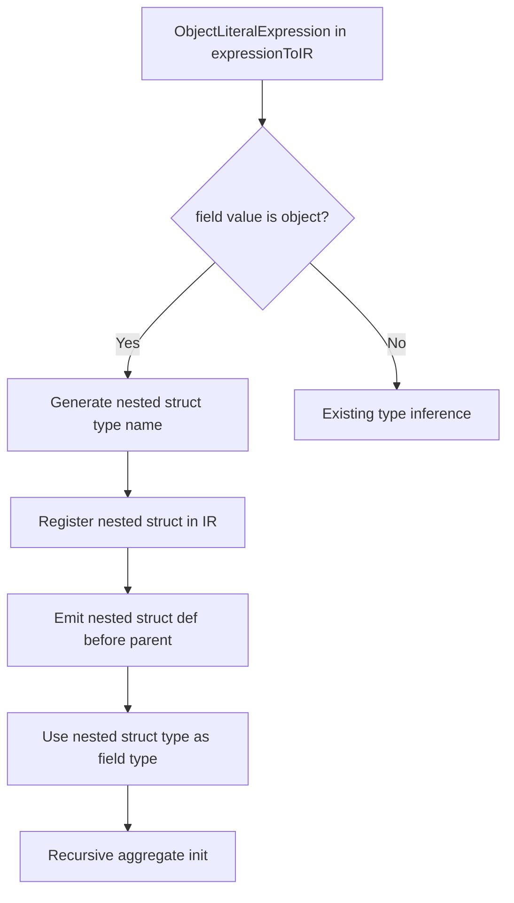
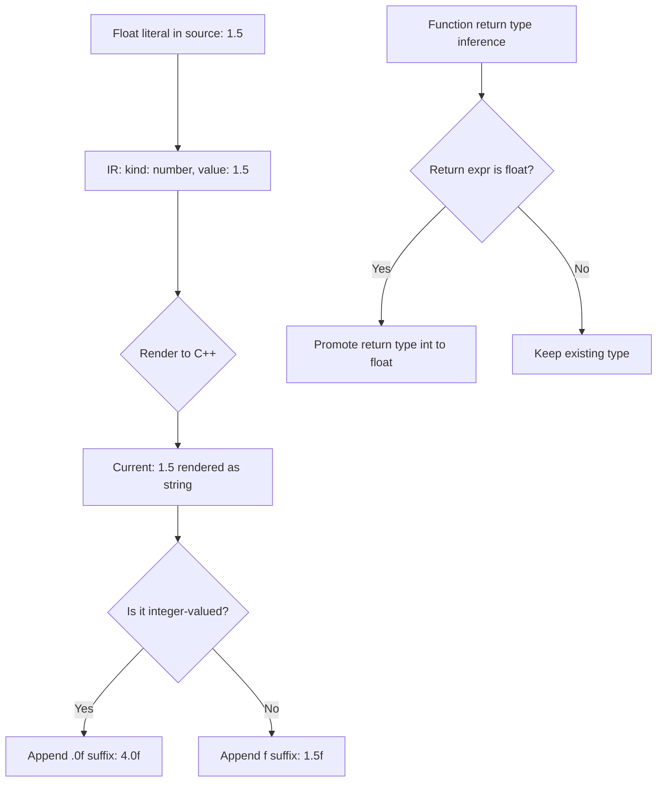
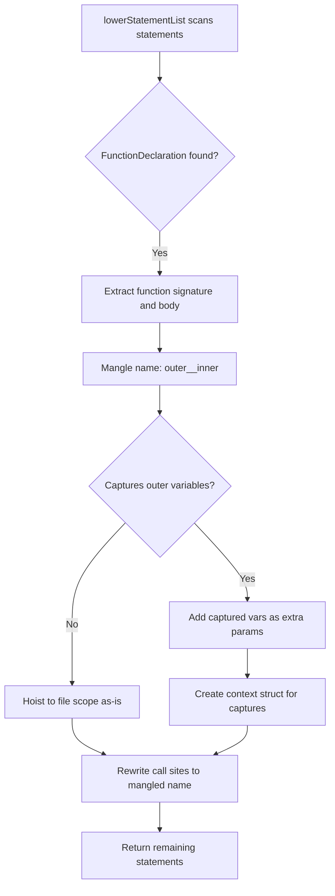
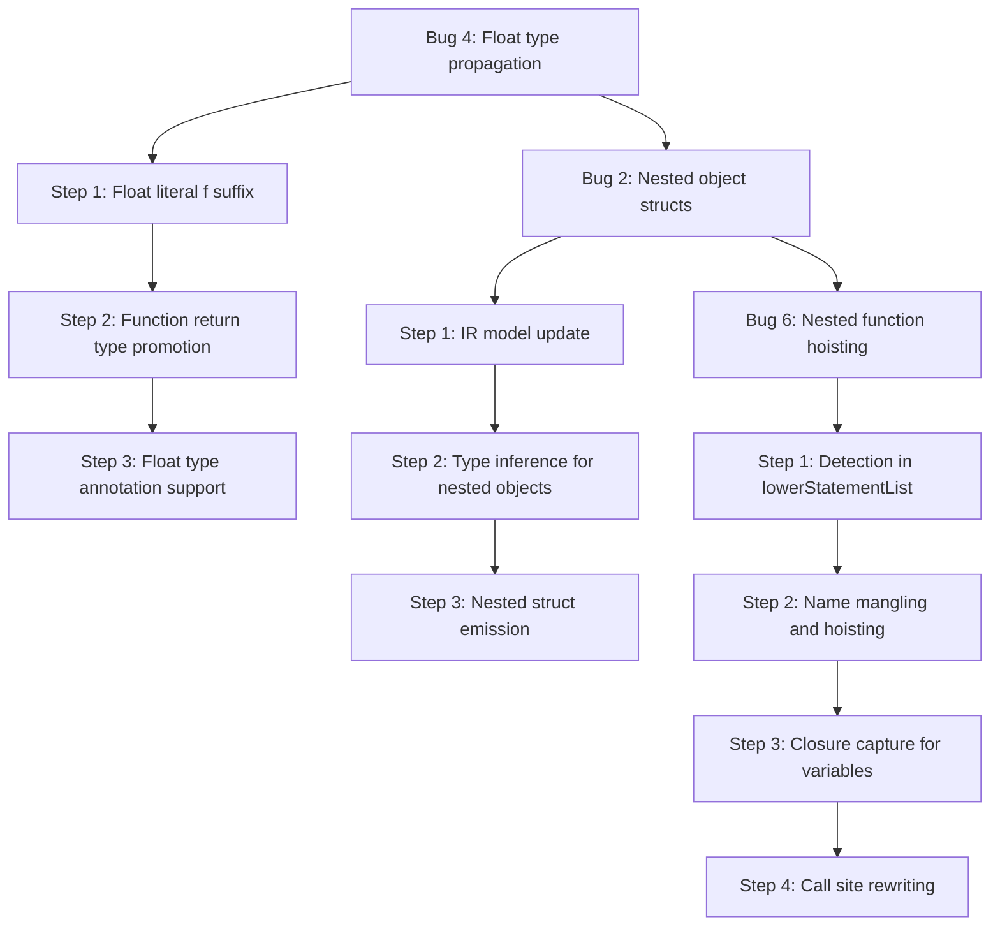

# Architectural Bug Fix Plan — Bugs 2, 4, 6

## Overview

Three transpiler bugs were previously classified as "architectural limitations" because they require significant changes to the IR model, type system, or code generation pipeline. This document provides a comprehensive fix plan for each, accepting large changes.

---

## Bug 2: Nested Object Struct Generation

### Problem

TypeScript nested object literals like:

```typescript
const sensor = {
  calibration: { offset: 10, gain: 2 },
  name: "temp"
};
```

Produce incorrect C++ because the inner object `{ offset: 10, gain: 2 }` is flattened. The field `calibration` gets inferred type `int` (the fallback in [`inferObjectFieldType()`](packages/cli/src/emit/utils/type-inference.ts:116)) and its value renders as `{ 10, 2 }` — a bare aggregate initializer with no struct definition.

### Root Cause Analysis

The issue spans three layers:

1. **Type inference** — [`inferObjectFieldType()`](packages/cli/src/emit/utils/type-inference.ts:19) has no case for `value.kind === "object"`. It falls through to `return "int"` at line 116.

2. **Struct emission** — Both [`renderVarDecl()`](packages/cli/src/emit/statement-renderer.ts:336) and the top-level object emitter in [`cpp-emitter.ts`](packages/cli/src/emit/cpp-emitter.ts:3116) generate a single flat `struct _name_t { ... }`. They do not recurse into nested object fields.

3. **Expression rendering** — [`renderObject()`](packages/cli/src/emit/expression-renderer.ts:319) renders `{ value1, value2 }` without field names. C++ designated initializers `{ .field = value }` would be more robust but aren't needed if struct field order matches.

### Design



### Implementation Steps

#### Step 1: Add nested struct tracking to the IR

**File:** [`packages/core/src/shared/ir.ts`](packages/core/src/shared/ir.ts:55)

Add a `nestedStructs` field to the `object` ExpressionIR kind:

```typescript
| {
    kind: "object";
    fields: { name: string; value: ExpressionIR }[];
    /** Nested struct definitions collected during IR building */
    nestedStructs?: { structName: string; fields: { type: string; name: string }[] }[];
  }
```

#### Step 2: Update `inferObjectFieldType()` for nested objects

**File:** [`packages/cli/src/emit/utils/type-inference.ts`](packages/cli/src/emit/utils/type-inference.ts:19)

Add a case before the final `return "int"`:

```typescript
if (value.kind === "object") {
  // Nested object — generate a struct type name
  // The caller provides context (parent variable name + field name)
  // to create a unique struct name like _sensor_calibration_t
  return `_${parentName}_${fieldName}_t`;
}
```

This requires threading `parentName` and `fieldName` through the function signature. Since `inferObjectFieldType()` is called from multiple places, add optional parameters:

```typescript
export function inferObjectFieldType(
  value: ExpressionIR,
  pointerVarTypes?: Map<string, string>,
  knownFunctionReturnTypes?: Map<string, string>,
  knownObjectTypes?: Map<string, string>,
  knownObjectFieldTypes?: Map<string, Map<string, string>>,
  largeEnumNames?: Set<string>,
  parentName?: string,       // NEW
  fieldName?: string,        // NEW
): string
```

#### Step 3: Collect nested struct definitions during IR building

**File:** [`packages/cli/src/ir/build-ir.ts`](packages/cli/src/ir/build-ir.ts:56)

In `expressionToIR()`, when handling `ObjectLiteralExpression`, recursively scan fields for nested objects. For each nested object field:

1. Generate a struct type name: `_${varName}_${fieldName}_t`
2. Recursively infer types for the nested object's fields
3. Store the nested struct definition on the IR node's `nestedStructs` array
4. Handle deeply nested objects (objects within objects) recursively

#### Step 4: Emit nested struct definitions before parent struct

**File:** [`packages/cli/src/emit/statement-renderer.ts`](packages/cli/src/emit/statement-renderer.ts:336)

In `renderVarDecl()` for object initializers:

1. Before emitting the parent struct, iterate `nestedStructs`
2. Emit each nested struct definition: `struct _sensor_calibration_t { int offset; int gain; };`
3. Use the nested struct type for the field in the parent: `struct _sensor_t { _sensor_calibration_t calibration; const char* name; }`

**File:** [`packages/cli/src/emit/cpp-emitter.ts`](packages/cli/src/emit/cpp-emitter.ts:3116)

Same logic for top-level split-mode emission. Emit nested struct forward declarations in the header, definitions in the source.

#### Step 5: Handle nested object access expressions

Property chains like `sensor.calibration.offset` already work because [`renderMemberAccessText()`](packages/cli/src/ir/build-ir.ts:73) renders `object.property` recursively. The C++ struct field access `sensor.calibration.offset` is valid once the structs are defined.

#### Step 6: Handle nested object assignment

Assignment to nested fields like `sensor.calibration.offset = 20` already works after the Bug 1 fix (PropertyAccessExpression assignment handling). The target text renders as `sensor.calibration.offset`.

### Files to Modify

| File | Change |
|------|--------|
| [`packages/core/src/shared/ir.ts`](packages/core/src/shared/ir.ts:55) | Add `nestedStructs` to object ExpressionIR |
| [`packages/cli/src/ir/build-ir.ts`](packages/cli/src/ir/build-ir.ts:56) | Collect nested struct info during object literal IR building |
| [`packages/cli/src/emit/utils/type-inference.ts`](packages/cli/src/emit/utils/type-inference.ts:19) | Handle `kind: "object"` in `inferObjectFieldType()` |
| [`packages/cli/src/emit/statement-renderer.ts`](packages/cli/src/emit/statement-renderer.ts:336) | Emit nested struct defs in `renderVarDecl()` |
| [`packages/cli/src/emit/cpp-emitter.ts`](packages/cli/src/emit/cpp-emitter.ts:3116) | Emit nested struct defs in top-level object emission |
| [`packages/cli/src/emit/expression-renderer.ts`](packages/cli/src/emit/expression-renderer.ts:319) | Handle nested object rendering in `renderObject()` |

### Test Cases

```typescript
// Test 1: Two-level nested object
const sensor = { calibration: { offset: 10, gain: 2 }, name: "temp" };
// Expected C++:
// struct _sensor_calibration_t { int offset; int gain; };
// struct _sensor_t { _sensor_calibration_t calibration; const char* name; } sensor = { { 10, 2 }, "temp" };

// Test 2: Three-level nesting
const config = { display: { size: { w: 128, h: 64 }, inverted: false } };
// Expected: three nested structs

// Test 3: Nested object field access
sensor.calibration.offset  // → sensor.calibration.offset (already works)

// Test 4: Nested object field assignment
sensor.calibration.offset = 20;  // → sensor.calibration.offset = 20; (already works after Bug 1 fix)
```

---

## Bug 4: Float Type Propagation

### Problem

Float arithmetic on AVR produces incorrect results. For example:

```typescript
function floatMath(): number {
  return 1.5 + 2.5;  // Expected: 4.0, Actual: 4 (or wrong)
}
```

### Root Cause Analysis

The issue has multiple contributing factors:

1. **`number` → `int` mapping** — [`typeNodeToCppType()`](packages/cli/src/ir/type-resolution.ts:207) maps `NumberKeyword` → `"int"`. So `function f(): number` gets return type `int`.

2. **Float literal rendering** — [`render()`](packages/cli/src/emit/expression-renderer.ts:110) for `kind: "number"` renders `${expr.value}`. JavaScript's template literal for `4.0` produces `"4"`, not `"4.0"`. In C++, `4` is an `int` literal, not `float`.

3. **Function return type not promoted** — [`resolveDeclarationType()`](packages/cli/src/ir/type-resolution.ts:504) promotes `int` → `float` for variable declarations when the inferred type is float. But function return types use [`buildFunctionReturnTypeMap()`](packages/cli/src/ir/build-ir.ts) which calls `typeNodeToCppType()` directly without this promotion logic.

4. **Arduino strategy normalizes `auto` → `int`** — [`normalizeCppType()`](packages/framework-arduino/src/strategy.ts:165) maps `"auto"` → `"int"`, so any unresolved type becomes int.

### Design



### Implementation Steps

#### Step 1: Render float number literals with `f` suffix

**File:** [`packages/cli/src/emit/expression-renderer.ts`](packages/cli/src/emit/expression-renderer.ts:110)

In the `render()` method, case `"number"`:

```typescript
case "number": {
  if (Number.isInteger(expr.value) && !expr._forceFloat) {
    return `${expr.value}`;
  }
  // Ensure float literals always have a decimal point and f suffix
  const str = `${expr.value}`;
  if (str.includes('.') || str.includes('e') || str.includes('E')) {
    return `${str}f`;  // e.g., "1.5f", "2.5f"
  }
  return `${str}.0f`;  // e.g., "4.0f" for integer-valued floats
}
```

Add a `_forceFloat` flag to the number ExpressionIR to mark values that were inferred as float type even if they happen to be integer-valued (e.g., `const x: float = 4`).

**Alternative (simpler):** Add a `cppType` field to number IR nodes so the renderer knows whether to emit the `f` suffix:

```typescript
// In ir.ts
| { kind: "number"; value: number; cppType?: "int" | "float" }
```

Then in the renderer:
```typescript
case "number": {
  if (expr.cppType === "float" || (!Number.isInteger(expr.value))) {
    const str = `${expr.value}`;
    return str.includes('.') || str.includes('e') || str.includes('E')
      ? `${str}f`
      : `${str}.0f`;
  }
  return `${expr.value}`;
}
```

#### Step 2: Promote function return types when body returns float

**File:** [`packages/cli/src/ir/build-ir.ts`](packages/cli/src/ir/build-ir.ts:3061)

After building the function IR, check if the return type should be promoted:

```typescript
// After: functions.push({ ... returnType: resolveFunctionReturnType(...) ... })
// Add promotion logic:
if (resolvedReturnType === "int") {
  const hasFloatReturn = bodyStatements.some(stmt => 
    stmt.kind === "return" && stmt.value && isFloatExpression(stmt.value)
  );
  if (hasFloatReturn) {
    resolvedReturnType = "float";
  }
}
```

Where `isFloatExpression()` checks if an ExpressionIR represents a float-typed value:

```typescript
function isFloatExpression(expr: ExpressionIR): boolean {
  if (expr.kind === "number" && !Number.isInteger(expr.value)) return true;
  if (expr.kind === "binary" && (isFloatExpression(expr.left) || isFloatExpression(expr.right))) return true;
  if (expr.kind === "ternary" && (isFloatExpression(expr.whenTrue) || isFloatExpression(expr.whenFalse))) return true;
  if (expr.kind === "identifier") return false; // would need type context
  return false;
}
```

#### Step 3: Add float type annotation support

**File:** [`packages/cli/src/ir/type-resolution.ts`](packages/cli/src/ir/type-resolution.ts:207)

Allow explicit `float` type annotations in TypeScript. Add a mapping for a `float` type alias or recognize `number` in float context:

Option A: Support `float` as a built-in type name:
```typescript
// In DIRECT_CPP_TYPE_MAP
["float", "float"],  // already present
```

Users would write: `const x: float = 1.5;` — but `float` isn't a TypeScript type.

Option B: Use declaration type inference (already works for variables):
```typescript
const x = 1.5;  // inferred as float — already works
```

Option C: Add a `/* @type float */` comment annotation or use `as float` cast pattern.

**Recommended:** Option B is already working for variables. The main fix is Step 2 (function return type promotion) and Step 1 (float literal rendering).

#### Step 4: Ensure float binary expressions propagate correctly

**File:** [`packages/cli/src/ir/build-ir.ts`](packages/cli/src/ir/build-ir.ts:56)

When building binary expression IR, tag the result with the inferred type:

```typescript
// In expressionToIR() for BinaryExpression
const leftIR = expressionToIR(expr.left, ...);
const rightIR = expressionToIR(expr.right, ...);
const result = { kind: "binary", left: leftIR, operator, right: rightIR };
// If either operand is a float literal, mark the result
// This information flows to the statement renderer for type inference
```

#### Step 5: Update Arduino strategy for float-aware type normalization

**File:** [`packages/framework-arduino/src/strategy.ts`](packages/framework-arduino/src/strategy.ts:164)

No changes needed — `normalizeCppType("float")` already returns `"float"`. The strategy correctly preserves float types.

### Files to Modify

| File | Change |
|------|--------|
| [`packages/core/src/shared/ir.ts`](packages/core/src/shared/ir.ts:45) | Add `cppType` field to number ExpressionIR |
| [`packages/cli/src/ir/build-ir.ts`](packages/cli/src/ir/build-ir.ts:56) | Tag float number literals with cppType; promote function return types |
| [`packages/cli/src/ir/type-resolution.ts`](packages/cli/src/ir/type-resolution.ts:111) | Ensure `inferNumericCppType()` is used consistently |
| [`packages/cli/src/emit/expression-renderer.ts`](packages/cli/src/emit/expression-renderer.ts:110) | Render float numbers with `f` suffix |

### Test Cases

```typescript
// Test 1: Float literal rendering
const x = 1.5;
// Expected: float x = 1.5f;

// Test 2: Float arithmetic
const sum = 1.5 + 2.5;
// Expected: float sum = 1.5f + 2.5f;  → evaluates to 4.0f

// Test 3: Function returning float
function half(n: number): number { return n / 2.0; }
// Expected: float half(int n) { return n / 2.0f; }
// Note: return type promoted from int to float

// Test 4: Integer-valued float
const y = 4.0;
// Expected: float y = 4.0f;  (not just "4")

// Test 5: Mixed int/float arithmetic
const z = 10 + 0.5;
// Expected: float z = 10 + 0.5f;
```

---

## Bug 6: Nested Function Hoisting

### Problem

Functions declared inside other functions are silently dropped:

```typescript
function outer() {
  function inner(x: number): number {
    return x * 2;
  }
  return inner(5);
}
```

The inner function declaration is not handled by [`lowerStatement()`](packages/cli/src/ir/build-ir.ts:1602) — it only handles expression statements, variable statements, return, control flow, etc. `FunctionDeclaration` inside a function body falls through and returns `undefined`.

### Root Cause Analysis

1. **No handler in `lowerStatement()`** — The function at line 1602 has cases for `ExpressionStatement`, `VariableStatement`, `ReturnStatement`, `WhileStatement`, `IfStatement`, `ForStatement`, etc. but no case for `FunctionDeclaration`.

2. **C++ doesn't support local functions** — C++ does not allow defining a function inside another function (unless using lambdas). The transpiler must hoist nested functions to file scope.

3. **Closure capture** — If the inner function references variables from the outer function's scope, those variables must be passed as additional parameters (closure conversion).

### Design



### Implementation Steps

#### Step 1: Add nested function detection in `lowerStatementList()`

**File:** [`packages/cli/src/ir/build-ir.ts`](packages/cli/src/ir/build-ir.ts:2142)

Before the main loop, scan for `FunctionDeclaration` nodes:

```typescript
function lowerStatementList(
  statements: ts.NodeArray<ts.Statement> | ts.Statement[],
  fileName: string,
  sourceText: string,
  diagnostics: Diagnostic[],
  functionReturnTypes: Map<string, CppTypeHint>,
  localVariableTypes: Map<string, CppTypeHint>,
  functionNameForDiagnostics: string,
  typeAliases?: Map<string, ts.TypeNode>,
): StatementIR[] {
  const lowered: StatementIR[] = [];
  const hoistedFunctions: FunctionIR[] = [];  // NEW

  for (const statement of statements) {
    // NEW: Handle nested function declarations
    if (ts.isFunctionDeclaration(statement) && statement.name) {
      const hoisted = hoistNestedFunction(
        statement,
        fileName,
        sourceText,
        diagnostics,
        functionReturnTypes,
        localVariableTypes,
        functionNameForDiagnostics,
        typeAliases,
      );
      if (hoisted) {
        hoistedFunctions.push(hoisted.functionIR);
        // Replace the function declaration with a comment placeholder
        // (or nothing if the function is only called within the body)
        continue;
      }
    }

    // ... existing lowering logic ...
  }

  // Store hoisted functions for the caller to collect
  // This requires changing the return type or using a side channel
  return lowered;
}
```

#### Step 2: Implement `hoistNestedFunction()`

**File:** [`packages/cli/src/ir/build-ir.ts`](packages/cli/src/ir/build-ir.ts) (new function)

```typescript
function hoistNestedFunction(
  statement: ts.FunctionDeclaration,
  fileName: string,
  sourceText: string,
  diagnostics: Diagnostic[],
  functionReturnTypes: Map<string, CppTypeHint>,
  localVariableTypes: Map<string, CppTypeHint>,
  parentFunctionName: string,
  typeAliases?: Map<string, ts.TypeNode>,
): { functionIR: FunctionIR; mangledName: string } | undefined {
  const originalName = statement.name!.text;
  const mangledName = `${parentFunctionName}__${originalName}`;
  
  // Build parameters
  const localTypes = new Map(localVariableTypes); // inherit parent scope
  const parameters: ParameterIR[] = [];
  for (const param of statement.parameters) {
    if (ts.isIdentifier(param.name)) {
      const paramType = typeNodeToCppType(param.type, typeAliases);
      localTypes.set(param.name.text, paramType);
      parameters.push({
        name: param.name.text,
        cppType: (paramType === "void" ? "auto" : paramType) as any,
        defaultValue: param.initializer
          ? expressionToIR(param.initializer, sourceText, diagnostics)
          : undefined,
        isRest: false,
      });
    }
  }
  
  // Detect captured variables
  const capturedVars = detectCapturedVariables(statement, localVariableTypes);
  
  // Add captured variables as extra parameters
  for (const [varName, varType] of capturedVars) {
    parameters.push({
      name: `_cap_${varName}`,
      cppType: varType as any,
      isRest: false,
    });
  }
  
  // Lower body
  const bodyStatements = lowerStatementList(
    statement.body?.statements ?? [],
    fileName,
    sourceText,
    diagnostics,
    functionReturnTypes,
    localTypes,
    mangledName,
    typeAliases,
  );
  
  // Rewrite internal calls to use captured parameter names
  rewriteCapturedVarAccess(bodyStatements, capturedVars);
  
  return {
    functionIR: {
      originalName: mangledName,
      isAsync: false,
      returnType: resolveFunctionReturnType(originalName, functionReturnTypes),
      sourceSpan: makeSourceSpan(statement, fileName, sourceText),
      parameters,
      statements: bodyStatements,
    },
    mangledName,
  };
}
```

#### Step 3: Implement `detectCapturedVariables()`

Scan the function body for identifiers that reference variables from the enclosing scope (not the function's own parameters/locals):

```typescript
function detectCapturedVariables(
  fn: ts.FunctionDeclaration,
  parentLocalTypes: Map<string, CppTypeHint>,
): Map<string, string> {
  const captured = new Map<string, string>();
  const fnScope = new Set<string>();
  
  // Collect function's own parameter names
  for (const param of fn.parameters) {
    if (ts.isIdentifier(param.name)) {
      fnScope.add(param.name.text);
    }
  }
  
  // Walk body for identifier references
  const walk = (node: ts.Node) => {
    if (ts.isIdentifier(node)) {
      const name = node.text;
      if (!fnScope.has(name) && parentLocalTypes.has(name)) {
        captured.set(name, parentLocalTypes.get(name)!);
      }
    }
    node.forEachChild(walk);
  };
  
  if (fn.body) walk(fn.body);
  return captured;
}
```

#### Step 4: Rewrite call sites in the parent function

When the parent function calls the nested function, rewrite the call to use the mangled name and pass captured variables:

```typescript
// Before: inner(5)
// After: outer__inner(_cap_x, 5)  where x is captured
```

This can be done during `expressionToIR()` by maintaining a map of nested function names to their mangled names and captured variable lists. Add a module-level map:

```typescript
let activeNestedFunctionMap: Map<string, { mangledName: string; capturedVars: Map<string, string> }> = new Map();
```

In `expressionToIR()`, when handling `CallExpression` with an `Identifier` callee, check if the name is in the nested function map:

```typescript
if (ts.isIdentifier(expr.expression)) {
  const nestedInfo = activeNestedFunctionMap.get(expr.expression.text);
  if (nestedInfo) {
    // Rewrite call: prepend captured variable arguments
    const capturedArgs = [...nestedInfo.capturedVars.keys()].map(
      name => ({ kind: "identifier" as const, value: name })
    );
    const originalArgs = expr.arguments.map(arg => expressionToIR(arg, ...));
    return {
      kind: "call",
      callee: nestedInfo.mangledName,
      args: [...capturedArgs, ...originalArgs],
      ...
    };
  }
}
```

#### Step 5: Propagate hoisted functions to `buildProgramIR()`

Change `lowerStatementList()` to return both lowered statements AND hoisted functions. Options:

**Option A:** Return an object:
```typescript
interface LoweredBlock {
  statements: StatementIR[];
  hoistedFunctions: FunctionIR[];
}
```

**Option B:** Use a side channel (mutate a passed-in array):
```typescript
function lowerStatementList(
  ...,
  hoistedFunctions?: FunctionIR[],  // NEW optional accumulator
): StatementIR[]
```

**Recommended:** Option B is less disruptive. Add an optional `hoistedFunctions` parameter that `buildProgramIR()` passes in. When `lowerStatementList()` encounters a nested function, it pushes it to this array.

In `buildProgramIR()`, after processing all top-level function declarations, add the hoisted functions to the `functions` array:

```typescript
const hoistedFunctions: FunctionIR[] = [];

// When calling lowerStatementList for function bodies:
const bodyStatements = lowerStatementList(
  node.body?.statements ?? [],
  ...,
  hoistedFunctions,  // accumulator
);

// After all top-level processing:
functions.push(...hoistedFunctions);
```

#### Step 6: Handle edge cases

- **Recursive nested functions** — The mangled name must be used for self-references
- **Nested functions in control flow** — e.g., `if (cond) { function inner() {} }` — hoist regardless of control flow
- **Nested functions in classes** — Methods don't have this issue (they're already class members), but function expressions assigned to fields might
- **Arrow functions / function expressions** — Already handled as `const fn = () => {}` which becomes a top-level function. Only `function decl() {}` inside another function is the issue.

### Files to Modify

| File | Change |
|------|--------|
| [`packages/cli/src/ir/build-ir.ts`](packages/cli/src/ir/build-ir.ts:2142) | Add nested function detection in `lowerStatementList()` |
| [`packages/cli/src/ir/build-ir.ts`](packages/cli/src/ir/build-ir.ts:2560) | Collect hoisted functions in `buildProgramIR()` |
| [`packages/cli/src/ir/build-ir.ts`](packages/cli/src/ir/build-ir.ts:56) | Rewrite call sites for nested functions in `expressionToIR()` |

### Test Cases

```typescript
// Test 1: Simple nested function (no captures)
function outer(): number {
  function inner(x: number): number { return x * 2; }
  return inner(5);
}
// Expected C++:
// int outer__inner(int x) { return x * 2; }
// int outer() { return outer__inner(5); }

// Test 2: Nested function with captured variable
function makeAdder(base: number): number {
  function add(x: number): number { return base + x; }
  return add(3);
}
// Expected C++:
// int makeAdder__add(int _cap_base, int x) { return _cap_base + x; }
// int makeAdder(int base) { return makeAdder__add(base, 3); }

// Test 3: Multiple nested functions
function compute(a: number): number {
  function double(x: number): number { return x * 2; }
  function square(x: number): number { return x * x; }
  return double(square(a));
}
// Expected: both functions hoisted with mangled names

// Test 4: Nested function calling another nested function
function chain(): number {
  function step1(x: number): number { return x + 1; }
  function step2(x: number): number { return step1(x) * 2; }
  return step2(5);
}
// Expected: both hoisted, step2 calls step1 by mangled name
```

---

## Implementation Order



**Recommended order:**

1. **Bug 4 first** — Float type propagation is the most self-contained fix. It touches expression rendering and type resolution but doesn't change the IR model significantly. It also has the most direct impact on hardware test correctness.

2. **Bug 2 second** — Nested object structs require IR model changes and recursive struct emission. The changes are localized to the object handling path and don't affect other features.

3. **Bug 6 last** — Nested function hoisting is the most complex change. It requires modifying the statement lowering pipeline, adding name mangling, closure capture, and call site rewriting. It benefits from being implemented last because it needs to compose correctly with all other fixes.

---

## Risk Assessment

| Bug | Risk | Mitigation |
|-----|------|------------|
| Bug 2 | Medium — recursive struct generation could produce invalid C++ if types are wrong | Add validation pass that checks all struct field types are valid C++ types |
| Bug 4 | Low — float suffix is straightforward; return type promotion needs careful testing | Comprehensive unit tests for float literal rendering, mixed arithmetic, and function returns |
| Bug 6 | High — closure capture is complex; name mangling could collide; recursive nesting needs limits | Limit nesting depth to 3 levels; add collision detection for mangled names; extensive edge case tests |
