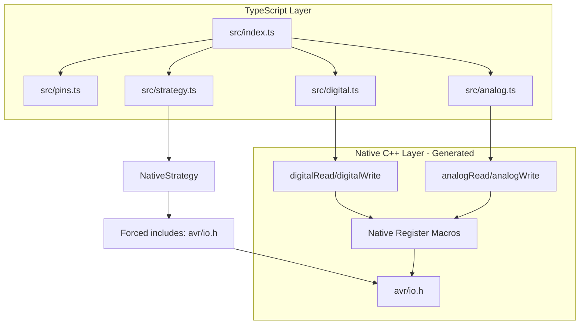

# Implementation Plan: board-native-atmega328p

## Overview

Create a new TypeCode board package that provides Arduino-equivalent functions (`digitalRead`, `digitalWrite`, `analogRead`, `analogWrite`) for the ATmega328P microcontroller using **native C/AVR assembly** instead of the Arduino framework.

## Goals

1. Provide the same Arduino-style API (pin numbers 0-19, matching function signatures)
2. Use direct AVR register manipulation for maximum performance and minimal code size
3. Auto-include `<avr/io.h>` for register definitions
4. Work with the existing TypeCode transpilation pipeline

## Architecture



## ATmega328P Pin Mapping

The ATmega328P has three 8-bit GPIO ports:

| Port | Pins | Arduino Mapping |
|------|------|-----------------|
| PORTB | PB0-PB5 | D8-D13 |
| PORTC | PC0-PC5 | A0-A5 (D14-D19) |
| PORTD | PD0-PD7 | D0-D7 |

### Pin to Port/Bit Mapping Table

```
Arduino Pin  |  AVR Port  |  Bit  |  PWM  |  ADC
-------------|------------|-------|-------|------
D0           |  PORTD     |  PD0  |  -    |  -
D1           |  PORTD     |  PD1  |  -    |  -
D2           |  PORTD     |  PD2  |  -    |  -
D3           |  PORTD     |  PD3  |  OC2B |  -
D4           |  PORTD     |  PD4  |  -    |  -
D5           |  PORTD     |  PD5  |  OC0B |  -
D6           |  PORTD     |  PD6  |  OC0A |  -
D7           |  PORTD     |  PD7  |  -    |  -
D8           |  PORTB     |  PB0  |  -    |  -
D9           |  PORTB     |  PB1  |  OC1A |  -
D10          |  PORTB     |  PB2  |  OC1B |  -
D11          |  PORTB     |  PB3  |  OC2A |  -
D12          |  PORTB     |  PB4  |  -    |  -
D13          |  PORTB     |  PB5  |  -    |  -
A0 (D14)     |  PORTC     |  PC0  |  -    |  ADC0
A1 (D15)     |  PORTC     |  PC1  |  -    |  ADC1
A2 (D16)     |  PORTC     |  PC2  |  -    |  ADC2
A3 (D17)     |  PORTC     |  PC3  |  -    |  ADC3
A4 (D18)     |  PORTC     |  PC4  |  -    |  ADC4
A5 (D19)     |  PORTC     |  PC5  |  -    |  ADC5
```

## File Structure

```
packages/board-native-atmega328p/
├── package.json
├── tsconfig.json
├── src/
│   ├── index.ts          # Board definition manifest + exports
│   ├── pins.ts           # Pin definitions with typed interfaces
│   ├── digital.ts        # digitalRead/digitalWrite declarations
│   ├── analog.ts         # analogRead/analogWrite declarations
│   ├── native.ts         # Native AVR register mapping constants
│   ├── strategy.ts       # Custom NativeStrategy class
│   ├── board.ts          # Optional Board namespace facade
│   └── USAGE.md          # Usage documentation
```

## Implementation Details

### 1. package.json

```json
{
  "name": "@typecode/board-native-atmega328p",
  "version": "0.1.0",
  "description": "TypeCode ATmega328P board definition with native AVR register access",
  "type": "commonjs",
  "main": "./dist/index.js",
  "types": "./dist/index.d.ts",
  "exports": {
    ".": {
      "types": "./dist/index.d.ts",
      "default": "./dist/index.js"
    }
  },
  "files": ["dist"],
  "scripts": {
    "build": "tsc"
  },
  "dependencies": {
    "@typecode/core": "^0.1.0"
  },
  "peerDependencies": {
    "typecode": "^0.1.0"
  },
  "license": "MIT"
}
```

### 2. src/native.ts - AVR Register Mapping

This module provides compile-time constants that map Arduino pin numbers to AVR port registers. The transpiler uses these to generate efficient C++ code.

```typescript
// Port register addresses for each pin
export const PIN_PORT: Record<number, string> = {
  0: 'PORTD', 1: 'PORTD', 2: 'PORTD', 3: 'PORTD', 4: 'PORTD', 
  5: 'PORTD', 6: 'PORTD', 7: 'PORTD',
  8: 'PORTB', 9: 'PORTB', 10: 'PORTB', 11: 'PORTB', 12: 'PORTB', 13: 'PORTB',
  14: 'PORTC', 15: 'PORTC', 16: 'PORTC', 17: 'PORTC', 18: 'PORTC', 19: 'PORTC'
};

export const PIN_DDR: Record<number, string> = {
  0: 'DDRD', 1: 'DDRD', 2: 'DDRD', 3: 'DDRD', 4: 'DDRD',
  5: 'DDRD', 6: 'DDRD', 7: 'DDRD',
  8: 'DDRB', 9: 'DDRB', 10: 'DDRB', 11: 'DDRB', 12: 'DDRB', 13: 'DDRB',
  14: 'DDRC', 15: 'DDRC', 16: 'DDRC', 17: 'DDRC', 18: 'DDRC', 19: 'DDRC'
};

export const PIN_BIT: Record<number, number> = {
  0: 0, 1: 1, 2: 2, 3: 3, 4: 4, 5: 5, 6: 6, 7: 7,
  8: 0, 9: 1, 10: 2, 11: 3, 12: 4, 13: 5,
  14: 0, 15: 1, 16: 2, 17: 3, 18: 4, 19: 5
};

// PWM timer output compare registers
export const PWM_OCR: Record<number, string> = {
  3: 'OCR2B', 5: 'OCR0B', 6: 'OCR0A', 9: 'OCR1A', 10: 'OCR1B', 11: 'OCR2A'
};

// ADC channels for analog pins
export const ADC_CHANNEL: Record<number, number> = {
  14: 0, 15: 1, 16: 2, 17: 3, 18: 4, 19: 5
};
```

### 3. src/digital.ts - Digital I/O Functions

Declare functions that will be polyfilled with native AVR code:

```typescript
import type { PinNumber, DigitalValue } from '@typecode/core';

/**
 * Read the digital value from a pin using direct register access.
 * Equivalent to Arduino digitalRead() but with native AVR registers.
 */
export declare function digitalRead(pin: PinNumber): DigitalValue;

/**
 * Write a digital value to a pin using direct register access.
 * Equivalent to Arduino digitalWrite() but with native AVR registers.
 */
export declare function digitalWrite(pin: PinNumber, value: DigitalValue): void;

/**
 * Set the pin mode using direct register access.
 * Equivalent to Arduino pinMode() but with native AVR registers.
 */
export declare function pinMode(pin: PinNumber, mode: 'INPUT' | 'OUTPUT' | 'INPUT_PULLUP'): void;
```

### 4. src/analog.ts - Analog I/O Functions

```typescript
import type { PinNumber, AnalogValue } from '@typecode/core';

/**
 * Read analog value from ADC using native AVR ADC registers.
 * Returns 0-1023 for 0-5V input on ATmega328P.
 */
export declare function analogRead(pin: PinNumber): AnalogValue;

/**
 * Write PWM value using native AVR timer registers.
 * Only works on PWM-capable pins: D3, D5, D6, D9, D10, D11.
 * Value range: 0-255 for 8-bit PWM.
 */
export declare function analogWrite(pin: PinNumber, value: AnalogValue): void;

/**
 * Set ADC reference voltage source.
 */
export enum AnalogReference {
  DEFAULT = 0,   // AVcc (5V)
  INTERNAL = 3,  // 1.1V internal reference
  EXTERNAL = 1   // AREF pin
}

export declare function analogReference(ref: AnalogReference): void;
```

### 5. src/strategy.ts - Native Strategy

Custom platform strategy that generates native AVR code instead of Arduino calls:

```typescript
import { ArduinoStrategy } from 'typecode/platform';

/**
 * NativeStrategy extends ArduinoStrategy but overrides the
 * typecode-to-C++ mapping to use direct AVR register access
 * instead of Arduino framework functions.
 */
export class NativeStrategy extends ArduinoStrategy {
  readonly id = 'native-atmega328p';

  // Override forcedIncludes to ensure avr/io.h is included
  forcedIncludes(): string[] {
    return ['<avr/io.h>'];
  }

  // Override the builtin translation to emit native register operations
  // This will be used by the typecode-map.ts translation layer
}
```

### 6. Generated C++ Output

The strategy should generate C++ code like this:

```cpp
#include <avr/io.h>

// pinMode(13, OUTPUT) becomes:
DDRB |= (1 << PB5);

// digitalWrite(13, HIGH) becomes:
PORTB |= (1 << PB5);

// digitalWrite(13, LOW) becomes:
PORTB &= ~(1 << PB5);

// digitalRead(2) becomes:
(PIND & (1 << PD2)) ? HIGH : LOW

// analogRead(A0) becomes:
// Start conversion on ADC0 with prescaler
ADMUX = (1 << REFS0) | 0;  // AVcc ref, channel 0
ADCSRA |= (1 << ADSC);
while (ADCSRA & (1 << ADSC));
ADC;

// analogWrite(9, 128) becomes:
// Configure Timer1 for PWM on OC1A (PB1/D9)
TCCR1A |= (1 << COM1A1) | (1 << WGM10);
TCCR1B |= (1 << CS10);  // No prescaler
OCR1A = 128;
```

### 7. Native Code Polyfill

Create a polyfill module that emits the native AVR implementations:

```typescript
// In the strategy or a custom polyfill, emit these helper macros/functions:

#define NATIVE_PIN_MODE(pin, mode) do { \
  if (pin <= 7) { if (mode == OUTPUT) DDRD |= (1 << pin); else DDRD &= ~(1 << pin); } \
  else if (pin <= 13) { if (mode == OUTPUT) DDRB |= (1 << (pin - 8)); else DDRB &= ~(1 << (pin - 8)); } \
  else { if (mode == OUTPUT) DDRC |= (1 << (pin - 14)); else DDRC &= ~(1 << (pin - 14)); } \
} while(0)

#define NATIVE_DIGITAL_WRITE(pin, val) do { \
  if (pin <= 7) { if (val) PORTD |= (1 << pin); else PORTD &= ~(1 << pin); } \
  else if (pin <= 13) { if (val) PORTB |= (1 << (pin - 8)); else PORTB &= ~(1 << (pin - 8)); } \
  else { if (val) PORTC |= (1 << (pin - 14)); else PORTC &= ~(1 << (pin - 14)); } \
} while(0)

#define NATIVE_DIGITAL_READ(pin) ( \
  (pin <= 7) ? ((PIND >> pin) & 1) : \
  (pin <= 13) ? ((PINB >> (pin - 8)) & 1) : \
  ((PINC >> (pin - 14)) & 1) \
)
```

## Key Differences from board-arduino-uno

| Aspect | board-arduino-uno | board-native-atmega328p |
|--------|-------------------|-------------------------|
| Framework | Arduino core library | Direct AVR registers |
| Overhead | ~1-2KB Arduino core | Minimal runtime |
| Speed | Function call overhead | Direct register access |
| Size | Larger binary | Smaller binary |
| Includes | Arduino.h | avr/io.h |
| Strategy | ArduinoStrategy | NativeStrategy |

## Implementation Order

1. Create package structure (package.json, tsconfig.json)
2. Implement src/index.ts with board definition
3. Implement src/pins.ts with pin exports
4. Implement src/native.ts with register mappings
5. Implement src/digital.ts with function declarations
6. Implement src/analog.ts with function declarations
7. Implement src/strategy.ts with NativeStrategy class
8. Update typecode-map.ts or create custom polyfill for native code generation
9. Create USAGE.md documentation
10. Test with example code

## Testing Strategy

Create a test example that exercises all four functions:

```typescript
import { D13, A0, D9 } from '@typecode/board-native-atmega328p';
import { digitalWrite, digitalRead, analogWrite, analogRead } from '@typecode/board-native-atmega328p';

// Blink LED
digitalWrite(13, true);
delay(500);
digitalWrite(13, false);

// Read analog
const value = analogRead(14); // A0

// PWM output
analogWrite(9, 128); // 50% duty cycle on D9
```

Expected C++ output should use direct register access without Arduino framework calls.
