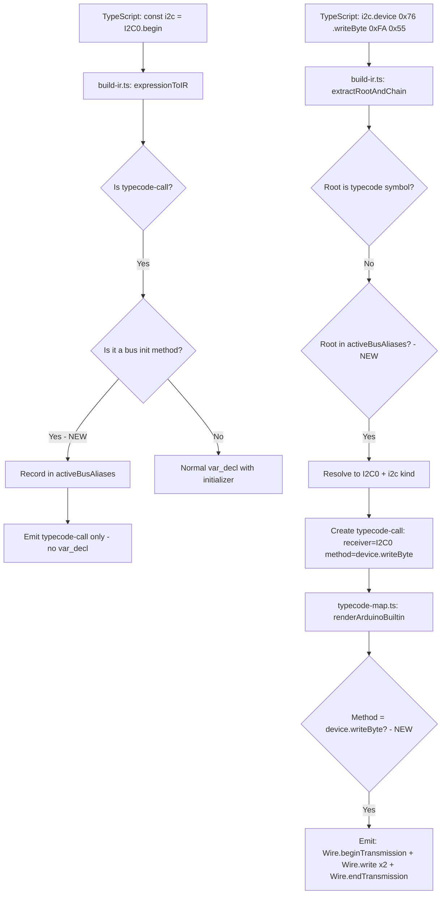

# Fix: I2C `device().writeByte()` Transpilation & Test Gap

## Problem Statement

**Input** ([`demo/src/sketch.ts`](demo/src/sketch.ts:9)):
```typescript
const i2c = I2C0.begin();
i2c.device(0x76).writeByte(0xFA, 0x55);
```

**Actual Output** ([`demo/src/out/sketch/sketch.ino`](demo/src/out/sketch/sketch.ino:11)):
```cpp
const int i2c = Wire.begin();
i2c.device(0x76).writeByte(250, 85);
```

**Expected Output:**
```cpp
Wire.begin();
Wire.beginTransmission(118);
Wire.write(250);
Wire.write(85);
Wire.endTransmission();
```

---

## Root Cause Analysis

There are **two distinct bugs** and **one test gap**:

### Bug 1: Peripheral bus variable aliasing not tracked

When `const i2c = I2C0.begin()` is transpiled:

1. [`build-ir.ts`](packages/cli/src/ir/build-ir.ts:2609) detects pin aliases like `const led = LED.asOutput()` and records them in `activePinAliases`, emitting only the `typecode-call` statement without a C++ variable declaration.
2. **No equivalent exists for peripheral bus aliases.** The `const i2c = I2C0.begin()` pattern falls through to a normal `var_decl`, producing `const int i2c = Wire.begin();` — which is invalid because `Wire.begin()` returns `void` in Arduino C++.

The alias tracking at [line 2614-2630](packages/cli/src/ir/build-ir.ts:2614) only handles `asOutput`/`asInput`/`asInputPullUp` methods on pins.

### Bug 2: `device().writeByte()` fluent chain not handled

The call `i2c.device(0x76).writeByte(0xFA, 0x55)` fails because:

1. **`i2c` is not recognized as a typecode symbol.** The [`extractRootAndChain`](packages/cli/src/ir/build-ir.ts:1029) helper extracts `i2c` as the root, and [`inferKindByName("i2c")`](packages/cli/src/ir/typecode-symbols.ts:116) returns `'unknown'` since `i2c` is a local variable, not `I2C0`.
2. **Even with direct `I2C0.device(0x76).writeByte(...)`**, the [`renderArduinoBuiltin`](packages/framework-arduino/src/typecode-map.ts:109) function in `typecode-map.ts` has no handler for the `device.writeByte` method chain. It only handles direct bus methods like `beginTransmission`, `write`, `endTransmission`.

The [`II2CDeviceAccessor`](packages/core/src/bus/i2c.ts:37) interface defines `writeByte(register, value)`, `writeBytes(register, data)`, `readByte(register)`, `readBytes(register, count)` as convenience methods that should expand to `Wire.beginTransmission(addr); Wire.write(reg); Wire.write(data); Wire.endTransmission()`.

### Test Gap: No coverage for bus aliasing or device accessor patterns

The existing tests in [`tests/hal-i2c.test.ts`](tests/hal-i2c.test.ts) only test:
- Direct `I2C0.begin()`, `I2C0.beginTransmission()`, `I2C0.write()`, `I2C0.endTransmission()` calls
- No test uses `const i2c = I2C0.begin()` variable aliasing
- No test uses `I2C0.device(addr).writeByte()` or any device accessor method
- The test in [`tests/units.test.ts`](tests/units.test.ts:75) does use `const i2c = I2C0.begin()` but only asserts `Wire.begin()` appears — it does not verify the variable declaration is omitted or that subsequent calls on `i2c` work

---

## Fix Plan

### Fix 1: Add peripheral bus alias tracking in `build-ir.ts`

**File:** [`packages/cli/src/ir/build-ir.ts`](packages/cli/src/ir/build-ir.ts)

Add a new `activeBusAliases` map alongside the existing `activePinAliases`:

```typescript
// Map<localVarName, { receiver: string, kind: TypecodeReceiverKind }>
const activeBusAliases = new Map<string, { receiver: string; kind: TypecodeReceiverKind }>();
```

At the pin alias detection block (~line 2614), extend the condition to also handle peripheral bus init methods:

```typescript
// Bus alias: const i2c = I2C0.begin() or const serial = UART0.begin(9600)
if (initIR?.kind === 'typecode-call' &&
    typeof initIR.method === 'string' &&
    (initIR.method === 'begin' || initIR.method === 'configBegin' || initIR.method === 'take') &&
    (initIR.receiverKind === 'i2c' || initIR.receiverKind === 'spi' || initIR.receiverKind === 'serial')) {
  activeBusAliases.set(declaration.name.text, { receiver: initIR.receiver, kind: initIR.receiverKind });
  // Emit just the typecode-call, skip the var_decl
  lowered.push({ kind: "typecode-call", ... });
  continue;
}
```

### Fix 2: Resolve bus aliases in typecode detection

**File:** [`packages/cli/src/ir/build-ir.ts`](packages/cli/src/ir/build-ir.ts) (~line 1060)

After the pin alias resolution block, add bus alias resolution:

```typescript
// Bus alias resolution: i2c.device() → I2C0.device()
const busAlias = activeBusAliases.get(chainInfo.root);
if (busAlias) {
  const fullMethod = chainInfo.chain.length > 0
    ? chainInfo.chain.join('.')
    : method;
  return {
    kind: "typecode-call",
    receiver: busAlias.receiver,
    receiverKind: busAlias.kind,
    method: fullMethod,
    args: expr.arguments.map(a => expressionToIR(a, sourceText, diagnostics, pointerVars)),
  };
}
```

### Fix 3: Add `device.*` method handlers in `typecode-map.ts`

**File:** [`packages/framework-arduino/src/typecode-map.ts`](packages/framework-arduino/src/typecode-map.ts) (in the `i2c` case, ~line 318)

Add handlers for the device accessor convenience methods. These arrive as compound method names like `device.writeByte`:

```typescript
case 'device.writeByte': {
  // I2C0.device(addr).writeByte(register, value)
  // → Wire.beginTransmission(addr); Wire.write(reg); Wire.write(val); Wire.endTransmission()
  const addr = a(0);
  const register = a(1);
  const value = a(2);
  return `${wireInstance}.beginTransmission(${addr}); ${wireInstance}.write(${register}); ${wireInstance}.write(${value}); ${wireInstance}.endTransmission()`;
}
case 'device.writeBytes': {
  // I2C0.device(addr).writeBytes(register, data)
  const addr = a(0);
  const register = a(1);
  const data = a(2);
  return `${wireInstance}.beginTransmission(${addr}); ${wireInstance}.write(${register}); ${wireInstance}.write(${data}); ${wireInstance}.endTransmission()`;
}
case 'device.readByte': {
  // I2C0.device(addr).readByte(register)
  const addr = a(0);
  const register = a(1);
  return `${wireInstance}.beginTransmission(${addr}); ${wireInstance}.write(${register}); ${wireInstance}.endTransmission(false); ${wireInstance}.requestFrom(${addr}, 1); ${wireInstance}.read()`;
}
case 'device.readBytes': {
  // I2C0.device(addr).readBytes(register, count)
  const addr = a(0);
  const register = a(1);
  const count = a(2);
  return `${wireInstance}.beginTransmission(${addr}); ${wireInstance}.write(${register}); ${wireInstance}.endTransmission(false); ${wireInstance}.requestFrom(${addr}, ${count})`;
}
```

**Note:** The `device()` call itself returns an accessor object. When used as a standalone expression like `I2C0.device(0x76)`, it should be a no-op or comment. The compound methods (`device.writeByte`, etc.) are the ones that produce actual Wire calls.

Also add a handler for the bare `device` method to handle the case where `.device(addr)` is called but the result is not chained:

```typescript
case 'device': {
  // I2C0.device(addr) — returns accessor, no direct C++ equivalent
  return `/* I2C0.device(${a(0)}) */`;
}
```

### Fix 4: Add comprehensive tests

**File:** [`tests/hal-i2c.test.ts`](tests/hal-i2c.test.ts)

Add a new `describe` block for the device accessor and bus aliasing:

```typescript
describe('Device accessor pattern', () => {
  it('transpiles I2C0.device(addr).writeByte(reg, val)', () => {
    const result = transpile(`
      import { I2C0 } from '@typecode/board-arduino-uno/arduino';
      I2C0.begin();
      I2C0.device(0x76).writeByte(0xFA, 0x55);
    `, { target: 'arduino' });
    expect(result.cpp).toContain('Wire.begin()');
    expect(result.cpp).toContain('Wire.beginTransmission(118)');
    expect(result.cpp).toContain('Wire.write(250)');
    expect(result.cpp).toContain('Wire.write(85)');
    expect(result.cpp).toContain('Wire.endTransmission()');
    expect(result.cpp).not.toContain('.device(');
    expect(result.cpp).not.toContain('.writeByte(');
  });

  it('transpiles bus variable alias: const i2c = I2C0.begin()', () => {
    const result = transpile(`
      import { I2C0 } from '@typecode/board-arduino-uno/arduino';
      const i2c = I2C0.begin();
      i2c.device(0x76).writeByte(0xFA, 0x55);
    `, { target: 'arduino' });
    expect(result.cpp).toContain('Wire.begin()');
    expect(result.cpp).not.toContain('const int i2c');
    expect(result.cpp).toContain('Wire.beginTransmission(118)');
    expect(result.cpp).toContain('Wire.write(250)');
    expect(result.cpp).toContain('Wire.write(85)');
  });

  it('transpiles I2C0.device(addr).readByte(reg)', () => {
    const result = transpile(`
      import { I2C0 } from '@typecode/board-arduino-uno/arduino';
      I2C0.begin();
      const val = I2C0.device(0x76).readByte(0xFA);
    `, { target: 'arduino' });
    expect(result.cpp).toContain('Wire.beginTransmission(118)');
    expect(result.cpp).toContain('Wire.write(250)');
    expect(result.cpp).toContain('Wire.endTransmission(false)');
    expect(result.cpp).toContain('Wire.requestFrom(118, 1)');
    expect(result.cpp).toContain('Wire.read()');
  });

  it('transpiles bus alias with setClock', () => {
    const result = transpile(`
      import { I2C0 } from '@typecode/board-arduino-uno/arduino';
      const i2c = I2C0.begin();
      i2c.setClock(400000);
    `, { target: 'arduino' });
    expect(result.cpp).toContain('Wire.begin()');
    expect(result.cpp).toContain('Wire.setClock(400000)');
    expect(result.cpp).not.toContain('const int i2c');
  });
});
```

Also add UART/SPI alias tests in their respective test files.

### Fix 5: Re-transpile the demo

After the fixes, re-transpile [`demo/src/sketch.ts`](demo/src/sketch.ts) and verify the output matches expected Arduino C++.

---

## Architecture Diagram



## Files to Modify

| File | Change |
|------|--------|
| [`packages/cli/src/ir/build-ir.ts`](packages/cli/src/ir/build-ir.ts) | Add `activeBusAliases` map + bus alias detection in var_decl + bus alias resolution in typecode detection |
| [`packages/framework-arduino/src/typecode-map.ts`](packages/framework-arduino/src/typecode-map.ts) | Add `device.writeByte`, `device.writeBytes`, `device.readByte`, `device.readBytes`, `device` handlers in i2c case |
| [`tests/hal-i2c.test.ts`](tests/hal-i2c.test.ts) | Add device accessor and bus aliasing tests |
| [`demo/src/sketch.ts`](demo/src/sketch.ts) | No change needed - input is correct |
| [`demo/src/out/sketch/sketch.ino`](demo/src/out/sketch/sketch.ino) | Will be regenerated with correct output |
