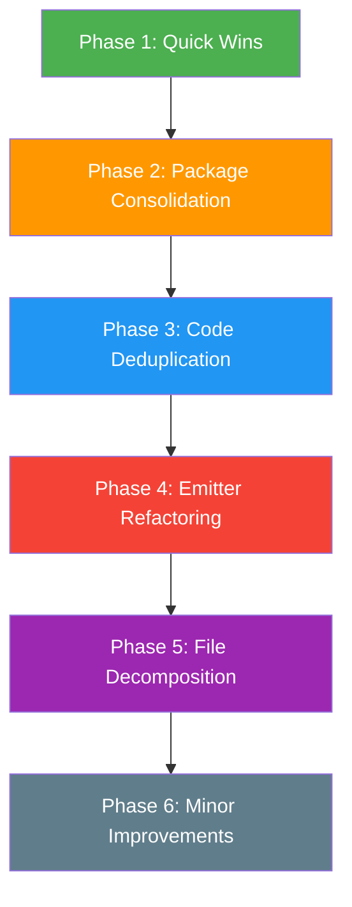

# TypeHAL Maintainability Fix Plan

**Source:** [`plans/maintainability-review.md`](maintainability-review.md)
**Date:** 2026-04-28

---

## Completed: Dead Code Audit (2026-04-28)

All items from the dead code audit have been fixed. 815 tests pass, type check clean.

### What was done

**Deleted files:**
- `packages/transpiler/src/scaffold/index.ts` (dead barrel)
- `packages/transpiler/src/emit/utils/index.ts` (recreated with only used exports)
- `packages/core/src/bus/result.ts` (comment-only stub)
- `packages/core/src/types/units.ts` (comment-only stub)

**Removed dead exports from transpiler:**
- `utils/toolchain.ts` — removed `GCC_STYLE`, `ARDUINO_ERROR`, `CLANG_ERROR`, `CompileError`, `parseCompileErrors`, `collectCppFiles` (all duplicated in `@typehal/core`)
- `utils/strings.ts` — un-exported `stripExtension` (only used internally)
- `utils/logger.ts` — removed `warn()`, `error()`
- `emit/utils/cpp-helpers.ts` — removed `isPrimitiveCppType`, `renderFloatLiteral`, `extractRootAndChain` (dead code)
- `emit/utils/type-inference.ts` — removed `hasArrayInObjectLiteral`, `hasThrowStatements`, `hasStdMathCalls` (duplicated in program-analysis.ts)
- `emit/cpp-emitter.ts` — removed dead `collectDeclaredTypes` import
- `ir/peripheral-validation.ts` — un-exported `PeripheralCapacity`, `getPeripheralCapacity`, `validatePeripheralUsage`
- `ir/peripheral-pin-conflict.ts` — removed `getPeripheralPinMapFromBoard`
- `ir/entry-points.ts` — un-exported `DEFAULT_ENTRY_POINT_CONFIG`, removed `getTargetEntryPoints`
- `ir/reachability.ts` — un-exported `ReachabilityOptions`, removed `hasUnreachableCode`
- `ir/type-resolution.ts` — un-exported `FunctionTypeSignature`, `isStructuredTypeAnnotation`, `isKnownCompileTimeType`
- `ir/peripheral-symbols.ts` — un-exported `PeripheralReceiverKind`
- `ir/statement-to-ir.ts` — un-exported `callToStatement`
- `platform/arduino-compile.ts` — removed `flattenGeneratedModulesIntoSketch`
- `platform/async-runtime.ts` — un-exported `generatePromiseRuntime`
- `platform/toolchain.ts` — removed `prepareOutput`
- `framework-package.ts` — removed all exports except `loadFrameworkPackage`
- `framework-registry.ts` — removed `FrameworkLibraryResolver`, `clearLoadedFramework`
- `scaffold/board-scaffold.ts` — un-exported `normalizeBoardName`, `isValidArchitecture`, `ScaffoldOptions`
- `watch.ts` — un-exported `WatchOptions`
- `debug/breakpoint-loader.ts` — removed `normalizeFilePath`
- `mapping/source-map.ts` — un-exported `toSourceMapPath`
- `types.ts` — un-exported `ArduinoCompileError`, `LibraryDefinitionVariant`
- `transpile.ts` — removed re-exports of `ResolvedNpmPackage`, `NativeCppModule`, `TranspileGraphResult`; un-exported `TypeCheckResult`

**Removed dead exports from core barrel:**
- `types/capabilities.ts`: `SupportsCapabilities`, `DigitalOnlyCapabilities`, `TouchCapabilities`, `PWMCapabilities`, `AnalogInputCapabilities`, `hasPWM`, `hasAnalogInput`, `hasInterrupt`
- `types/gpio.ts`: `IGPIOPinFactory`, `createParallelPort`
- `types/pin.ts`: `IPinGroupOptions`
- `types/num.ts`: `INumMapChain`, `INumClampChain`
- `types/shift.ts`: `IShiftReadChain`, `IShiftWriteChain`
- `types/peripheral-enums.ts`: `AnalogRef`
- `types/ownership.ts`: `extractOwnershipKind`, `unwrapOwnershipType`
- `bus/spi.ts`: `spiModeToCpolCpha`, `cpolCphaToSpiMode`
- `bus/uart.ts`: `IDebugSerial`, `LogLevel`
- `config.ts`: `OutputFramework`, `OptimizationLevel`, `TypehalOutputConfig`, `ToolchainType`, `ArduinoCliOptions`, `TypehalToolchainConfig`, `TypehalConsoleConfig`
- Entire `concurrency/*` module re-exports
- Entire `memory/*` module re-exports (decorators, register, buffer)

**Package consolidation:**
- `packages/hal` turned into a thin re-export wrapper: `export * from '@typehal/schema'`
- `ArchitectureIdentifier` consolidated — schema and create now import from `@typehal/core` instead of redefining
- `ShiftBitOrder` / `SPIBitOrder` consolidated — spi.ts imports from types/shift.ts
- `capabilities.ts` / `pin.ts` naming conflicts resolved — removed duplicate guards from barrel, kept canonical versions from pin.ts

**Other fixes:**
- Extracted `'10819'` Arduino version constant to `ARDUINO_CORE_VERSION` in schema/builder.ts
- Removed unused imports (`PeripheralInstance`, `ADCDefinition`, `PWMDefinition`) from schema/builder.ts
- Removed unused `resolution` parameter from `PinCapabilityBuilder.analog()`
- Fixed `ResolvedNpmPackage` import paths in cpp-emitter.ts and include-resolver.ts
- Added backward-compat comments to `I2CErrorPolicy`/`SPIErrorPolicy`/`UARTErrorPolicy` aliases

---

## Phase 1 — Quick Wins (Low Risk, High Impact)

These are safe, isolated changes that can be done independently without affecting other work.

### 1.1 Remove committed build artifacts from `packages/core/src/shared/`

**Problem:** 40+ `.js`, `.d.ts`, and `.map` files are tracked in git alongside their `.ts` sources.

**Steps:**
- [ ] Add `packages/core/src/shared/*.js`, `packages/core/src/shared/*.d.ts`, `packages/core/src/shared/*.map` to `.gitignore`
- [ ] Run `git rm --cached packages/core/src/shared/*.js packages/core/src/shared/*.d.ts packages/core/src/shared/*.map`
- [ ] Verify `pnpm --filter @typehal/core build` still produces the expected output in `dist/`
- [ ] Verify `pnpm tsc -b` still passes

### 1.2 Delete temporary/debug files from `packages/transpiler/`

**Problem:** 4 `tmp-*.txt` files are committed.

**Steps:**
- [ ] Delete `packages/transpiler/tmp-arduino-helper-usage.txt`
- [ ] Delete `packages/transpiler/tmp-board-type-refs.txt`
- [ ] Delete `packages/transpiler/tmp-core-from.txt`
- [ ] Delete `packages/transpiler/tmp-wrapper-imports.txt`
- [ ] Add `tmp-*.txt` to `.gitignore`

### 1.3 Clean up the zombie `packages/cli` package

**Problem:** `packages/cli/src/` is empty — no source files exist — but `package.json` still declares `bin`, `exports`, `main`, and `types` pointing to `./dist/*` files that cannot be built. The package is a broken shell.

**Steps:**
- [ ] Decide: is `@typehal/cli` the published CLI name, or is it `@typehal/transpiler`?
- [ ] If `@typehal/cli` is the published name: rename `packages/transpiler` to `packages/cli`, update `package.json` name to `@typehal/cli`, update all workspace references
- [ ] If `@typehal/transpiler` is the published name: delete `packages/cli/` entirely, remove it from root `package.json` workspaces, remove any `@typehal/cli` references in docs
- [ ] Update `CLAUDE.md` repo structure to reflect the change
- [ ] Verify all tests still pass with `pnpm vitest run`

### 1.4 Remove duplicate regex constant

**Problem:** `DOUBLE_QUOTE_PATTERN` and `DOUBLE_QUOTE_ESCAPE_PATTERN` in [`cpp-emitter.ts:49-50`](packages/transpiler/src/emit/cpp-emitter.ts:49) are identical.

**Steps:**
- [ ] Remove `DOUBLE_QUOTE_ESCAPE_PATTERN` from `cpp-emitter.ts`
- [ ] Replace all references to `DOUBLE_QUOTE_ESCAPE_PATTERN` with `DOUBLE_QUOTE_PATTERN`

### 1.5 Type `SnprintfExpressionRenderer` properly

**Problem:** [`snprintf-types.ts:34`](packages/core/src/shared/snprintf-types.ts:34) uses `any`.

**Steps:**
- [ ] Import `ExpressionIR` in `packages/core/src/shared/snprintf-types.ts`
- [ ] Change `SnprintfExpressionRenderer` from `(expr: any) => string` to `(expr: ExpressionIR) => string`

---

## Phase 2 — Package Consolidation (Medium Risk, High Impact)

### 2.1 Consolidate `packages/hal` and `packages/schema`

**Problem:** Both packages export identical types and builder code (797-line builder, identical `types.ts`).

**Steps:**
- [ ] Pick one package to keep (recommend `@typehal/hal` since the name is more descriptive)
- [ ] Update the surviving package to also export anything unique from the other
- [ ] Update the deprecated package to re-export everything from the survivor: `export * from '@typehal/hal'`
- [ ] Update all `package.json` files that depend on `@typehal/schema` to depend on `@typehal/hal` instead
- [ ] Update `CLAUDE.md` and any docs referencing `@typehal/schema`
- [ ] Run full test suite to verify

### 2.2 Consolidate shared types into `@typehal/core`

**Problem:** `Diagnostic`, `SourceSpan`, `PlatformContext`, `TargetProfile`, `BoardConstants`, `TypehalReceiverKind`, and `PeripheralUsage` are each defined 2–3 times.

**Steps:**
- [ ] Audit all type definitions in `packages/transpiler/src/types.ts` — identify which already exist in `@typehal/core/shared`
- [ ] Replace local `Diagnostic` in `packages/transpiler/src/types.ts` with import from `@typehal/core`
- [ ] Replace local `SourceSpan` in `packages/transpiler/src/types.ts` with import from `@typehal/core`
- [ ] Replace local `PlatformContext` in `packages/transpiler/src/types.ts` with import from `@typehal/core`
- [ ] Replace local `TargetProfile` in `packages/transpiler/src/types.ts` with import from `@typehal/core`
- [ ] Remove `BoardConstants` type from `packages/transpiler/src/ir/board-resolver.ts` — import from `@typehal/core`
- [ ] Remove `TypehalReceiverKind` type from `packages/transpiler/src/ir/typehal-symbols.ts` — import from `@typehal/core`
- [ ] Unify `PeripheralUsage` interface and `PeripheralUsageIR` type into a single definition in `@typehal/core`
- [ ] Remove the unsafe cast in `validation-orchestrator.ts:23`
- [ ] Remove `TargetProfile` duplicate from `packages/core/src/shared/polyfill-types.ts` — import from `packages/core/src/shared/types.ts`
- [ ] Run full test suite to verify

---

## Phase 3 — Code Deduplication (Low Risk, Medium Impact)

### 3.1 Extract shared `isPrimitiveCppType()` utility

**Problem:** Identical function in 3 files, each allocating a new `Set` on every call.

**Steps:**
- [ ] Create `packages/transpiler/src/utils/cpp-type-utils.ts`
- [ ] Move `isPrimitiveCppType()` there with a module-level memoized `Set`
- [ ] Replace implementation in `packages/transpiler/src/emit/cpp-emitter.ts` with import
- [ ] Replace implementation in `packages/transpiler/src/emit/statement-renderer.ts` with import
- [ ] Replace implementation in `packages/transpiler/src/ir/ownership-analysis.ts` with import
- [ ] Run full test suite

### 3.2 Extract shared AST scalar parsing utilities

**Problem:** `getStringLiteral()`, `getScalarValue()`, `walkObjectLiteral()` are duplicated in `config-loader.ts` and `board-resolver.ts`.

**Steps:**
- [ ] Create `packages/transpiler/src/ast/scalar-extraction.ts`
- [ ] Move `getStringLiteral()`, `getScalarValue()`, `walkObjectLiteral()` there
- [ ] Update `packages/transpiler/src/config-loader.ts` to import from new module
- [ ] Update `packages/transpiler/src/ir/board-resolver.ts` to import from new module
- [ ] Run full test suite

### 3.3 Freeze `createEmptyPeripheralUsage()` as a singleton

**Problem:** Allocates a new object on every call.

**Steps:**
- [ ] Create a frozen constant `EMPTY_PERIPHERAL_USAGE` in `packages/transpiler/src/ir/peripheral-usage.ts`
- [ ] Replace `createEmptyPeripheralUsage()` calls with the constant where mutation is not needed
- [ ] Keep the factory function for cases where mutation is required
- [ ] Run full test suite

---

## Phase 4 — Emitter Refactoring (High Risk, High Impact)

### 4.1 Complete the class-based renderer migration

**Problem:** `ExpressionRenderer` and `StatementRenderer` classes exist but `emitCpp()` still uses the legacy `renderExpression()` function. Both paths coexist.

**Steps:**
- [ ] Audit all call sites of legacy `renderExpression()` in `cpp-emitter.ts`
- [ ] Wire `ExpressionRenderer` into `emitCpp()` as the primary expression renderer
- [ ] Wire `StatementRenderer` into `emitCpp()` as the primary statement renderer
- [ ] Verify all existing tests pass with the new renderers
- [ ] Remove the legacy `renderExpression()` function from `cpp-emitter.ts`
- [ ] Remove the legacy inline statement rendering code from `cpp-emitter.ts`
- [ ] Run full test suite

### 4.2 Eliminate module-level mutable state in the emitter

**Problem:** 13 module-level `let`/`const` variables in `cpp-emitter.ts` create hidden coupling.

**Steps:**
- [ ] Create an `EmitContext` class that holds all 13 state variables currently at module level
- [ ] Add a factory function `createEmitContext(program, options): EmitContext`
- [ ] Thread `EmitContext` through `emitCpp()` and all helper functions
- [ ] Move `registerAllEnumNames()` logic into `EmitContext` constructor or init method
- [ ] Update `ExpressionRenderer` and `StatementRenderer` to accept `EmitContext`
- [ ] Remove all module-level mutable state from `cpp-emitter.ts`
- [ ] Run full test suite

### 4.3 Eliminate module-level mutable state in the IR builder

**Problem:** 20+ module-level mutable maps/sets/arrays in `build-ir-state.ts`.

**Steps:**
- [ ] Create a `BuildIRContext` class that holds all state from `build-ir-state.ts`
- [ ] Add `reset()` and `resetFunctionScope()` methods to the class
- [ ] Thread `BuildIRContext` through `buildProgramIR()` and all functions that import from `build-ir-state.ts`
- [ ] Update `statement-to-ir.ts` to accept `BuildIRContext` parameter
- [ ] Update `expression-to-ir.ts` to accept `BuildIRContext` parameter
- [ ] Update all validation files that read from `build-ir-state.ts`
- [ ] Remove all module-level mutable exports from `build-ir-state.ts`
- [ ] Run full test suite

---

## Phase 5 — File Decomposition (Medium Risk, Medium Impact)

### 5.1 Break down `cpp-emitter.ts` (3,172 lines)

**Steps:**
- [ ] Extract boilerplate generation into `packages/transpiler/src/emit/boilerplate.ts`
- [ ] Extract file I/O and output writing into `packages/transpiler/src/emit/output-writer.ts`
- [ ] Extract enum registration into `packages/transpiler/src/emit/enum-registry.ts`
- [ ] Extract `renderTypedName()`, `mapFunctionName()`, `normalizeCppTypeForTarget()`, `mapReturnType()` into `packages/transpiler/src/emit/render-helpers.ts`
- [ ] Extract `resolveTemplateReturnType()` into `packages/transpiler/src/emit/template-utils.ts`
- [ ] The remaining `cpp-emitter.ts` should only contain the `emitCpp()` orchestration function
- [ ] Run full test suite

### 5.2 Break down `statement-to-ir.ts` (2,591 lines)

**Steps:**
- [ ] Extract typehal-call detection into `packages/transpiler/src/ir/typehal-call-builder.ts`
- [ ] Extract device accessor pattern detection into `packages/transpiler/src/ir/device-accessor-builder.ts`
- [ ] Extract variable declaration handling into `packages/transpiler/src/ir/variable-builder.ts`
- [ ] Extract control flow statement handling into `packages/transpiler/src/ir/control-flow-builder.ts`
- [ ] Run full test suite

---

## Phase 6 — Minor Improvements (Low Risk, Low Impact)

### 6.1 Fix `renderBoilerplate()` feature detection

**Problem:** Uses `JSON.stringify(program)` to check for string substrings.

**Steps:**
- [ ] Add boolean flags to `ProgramIR` for `hasExistsHelper`, `hasNullishHelper`, `hasUndefinedSentinel`
- [ ] Set these flags during IR building or program analysis
- [ ] Replace `serializedProgram.includes()` checks with the boolean flags
- [ ] Run full test suite

### 6.2 Use `ReadonlySet` in `PeripheralUsage` interface

**Problem:** Mutable `Set` fields in the interface allow accidental mutation.

**Steps:**
- [ ] Change `PeripheralUsage` interface fields from `Set<T>` to `ReadonlySet<T>`
- [ ] Keep the concrete implementation using mutable `Set` internally
- [ ] Run full test suite

---

## Dependency Graph of Phases

Each phase should be completed and all tests passing before moving to the next. Phases can be worked on in parallel branches as long as they don't touch the same files.

---

## Risk Mitigation

- **Every step includes running the full test suite** (`pnpm vitest run`) before proceeding
- **Phase 1 changes are independent** and can be done in any order, even in parallel
- **Phase 4 is the highest-risk phase** — consider creating a feature branch and running it through CI before merging
- **Phase 2 and 3 are prerequisite for Phase 4** — type consolidation must happen before the emitter refactoring to avoid further duplication
