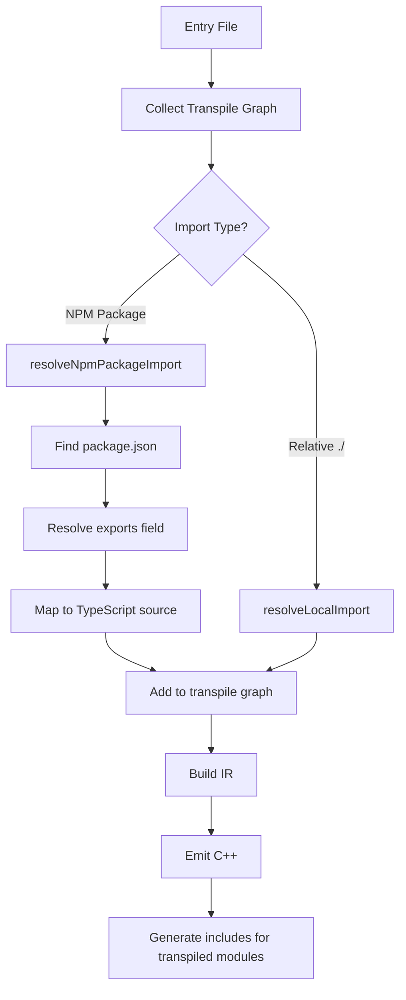

# NPM Package Resolution Plan

## User Requirements

- **Transpile everything** that is `import`ed
- **Follow imports recursively** from all imported files
- **Create individual .cpp and .h files** for each module
- **Ensure source mapping** is completed for all files

## Problem Statement

The transpiler cannot follow npm-installed packages. When `example.ts` imports from `typecode-implementation/board-arduino-uno`, the transpiler:

1. Does not resolve the npm package path to its TypeScript source files
2. Does not include the npm package sources in the transpilation graph
3. Generates a fallback include `<BoardArduinoUno.h>` instead of transpiling the actual code

### Current Behavior

**Input** - [`example.ts`](example.ts:1):
```ts
import { Board } from "typecode-implementation/board-arduino-uno";
var x = Board.A0.read();
```

**Output** - [`.build/example.ino`](.build/example.ino:1):
```cpp
#include <Arduino.h>
#include <BoardArduinoUno.h>  // <-- Fallback include, file doesn't exist

void setup() {
  auto x = Board.A0.read();  // <-- Board is undefined
}
```

## Root Cause Analysis

### 1. Import Resolution Limitation

The [`resolveLocalImport`](src/transpile.ts:47) function only handles relative imports:

```ts
function resolveLocalImport(fromFile: string, moduleSpecifier: string): string | undefined {
  if (!moduleSpecifier.startsWith(".")) {
    return undefined;  // <-- npm packages are skipped here
  }
  // ... resolves ./foo to ./foo.ts
}
```

### 2. Transpile Graph Collection

The [`collectTranspileGraph`](src/transpile.ts:75) function only follows relative imports:

```ts
const resolved = resolveLocalImport(filePath, moduleSpecifier);
if (resolved && !visited.has(resolved)) {
  pending.push(resolved);  // <-- npm packages never added
}
```

### 3. Fallback Include Generation

When no libdef exists, [`fallbackInclude`](src/libdef/registry.ts:29) generates a guessed include path:

```ts
function fallbackInclude(moduleSpecifier: string): string {
  const key = toModuleKey(moduleSpecifier);  // "board-arduino-uno"
  const include = `${toPascalCase(key)}.h`;  // "BoardArduinoUno.h"
  return `<${include}>`;
}
```

## Solution Design

### Overview



### Implementation Steps

#### Step 1: Create NPM Package Resolver

Create a new function `resolveNpmPackageImport` in [`src/transpile.ts`](src/transpile.ts:1):

```ts
interface ResolvedNpmPackage {
  packagePath: string;       // node_modules/typecode-implementation
  sourcePath: string;        // node_modules/typecode-implementation/packages/board-arduino-uno/src/index.ts
  subpath: string;           // board-arduino-uno
  packageName: string;       // typecode-implementation
}

function resolveNpmPackageImport(
  fromFile: string,
  moduleSpecifier: string
): ResolvedNpmPackage | undefined {
  // 1. Parse package name and subpath from module specifier
  // 2. Find package.json in node_modules hierarchy
  // 3. Resolve using exports field if present
  // 4. Return resolved TypeScript source path
}
```

#### Step 2: Implement Package.json Exports Resolution

Handle the `exports` field resolution per Node.js ESM spec:

```ts
function resolvePackageExports(
  packageJsonPath: string,
  subpath: string
): string | undefined {
  // Read package.json
  // Match subpath against exports patterns
  // Handle conditional exports for types/ESM
  // Return source file path
}
```

For `typecode-implementation/package.json`:
```json
{
  "exports": {
    "./core": "./dist/core/src/index.js",
    "./board-arduino-uno": "./dist/board-arduino-uno/src/index.js"
  }
}
```

Map `./dist/*/src/index.js` to `./packages/*/src/index.ts` for source transpilation.

#### Step 3: Update Transpile Graph Collection

Modify [`collectTranspileGraph`](src/transpile.ts:75) to include npm packages:

```ts
function collectTranspileGraph(entryFile: string): string[] {
  // ... existing code ...
  
  for (const statement of source.statements) {
    // ... existing import detection ...
    
    // Try relative import first
    const localResolved = resolveLocalImport(filePath, moduleSpecifier);
    if (localResolved && !visited.has(localResolved)) {
      pending.push(localResolved);
      continue;
    }
    
    // Try npm package import
    const npmResolved = resolveNpmPackageImport(filePath, moduleSpecifier);
    if (npmResolved && !visited.has(npmResolved.sourcePath)) {
      pending.push(npmResolved.sourcePath);
      npmPackages.set(npmResolved.sourcePath, npmResolved);
    }
  }
}
```

#### Step 4: Generate Proper C++ Includes

For npm package sources that are transpiled, generate local includes instead of system includes:

```ts
// In cpp-emitter.ts
function emitIncludesForNpmPackage(npmPackage: ResolvedNpmPackage): string {
  // Generate: "board-arduino-uno.h" instead of <BoardArduinoUno.h>
  const headerName = `${npmPackage.subpath}.h`;
  return `"${headerName}"`;
}
```

#### Step 5: Emit Separate Header Files for NPM Packages

Each npm package module should emit its own header file:

```
.build/
├── example.ino           # Main sketch
├── board-arduino-uno.h   # Transpiled npm package header
├── board-arduino-uno.cpp # Transpiled npm package implementation
└── core.h                # Transpiled core dependency
```

### File Changes Summary

| File | Changes |
|------|---------|
| [`src/transpile.ts`](src/transpile.ts:1) | Add `resolveNpmPackageImport`, update `collectTranspileGraph` |
| [`src/libdef/registry.ts`](src/libdef/registry.ts:1) | Update `resolveImport` to handle transpiled npm modules |
| [`src/emit/cpp-emitter.ts`](src/emit/cpp-emitter.ts:1) | Generate proper includes for transpiled npm packages |
| [`src/types.ts`](src/types.ts:1) | Add `ResolvedNpmPackage` interface |

### Edge Cases to Handle

1. **Monorepo workspaces** - Packages like `typecode-implementation` use workspaces; need to resolve internal package dependencies
2. **Circular dependencies** - npm packages may have circular imports
3. **Missing source files** - Package may only ship compiled JS, not TypeScript
4. **Multiple node_modules** - Need to walk up directory tree to find correct node_modules
5. **Type-only imports** - Some imports are type-only and shouldn't generate runtime code

### Alternative Approach: Library Definitions

Instead of transpiling npm packages, we could require users to create `.libdef.json` files:

```json
{
  "module": "typecode-implementation/board-arduino-uno",
  "include": "\"BoardArduinoUno.h\"",
  "symbols": {
    "Board": "Board"
  }
}
```

This is simpler but requires manual configuration for each npm package.

## Recommended Approach

**Transpile npm packages** is the recommended approach because:

1. Type safety - Full TypeScript type information is preserved
2. No manual configuration - Works automatically with npm packages
3. Tree shaking - Unused code can be eliminated
4. Source maps - Errors map back to original TypeScript

## Final Design Decisions

Based on user requirements:

1. **Transpile ALL imports** - No opt-in required, all `import` statements are followed
2. **Emit separate .h/.cpp files** - Each module gets its own header and implementation file
3. **Full source mapping** - Source maps generated for all transpiled files
4. **Recursive import following** - Imports in imported files are also followed and transpiled

## Expected Output Structure

After transpiling [`example.ts`](example.ts:1):

```
.build/
├── example.ino                    # Main Arduino sketch
├── example.tscppmap.json          # Source map for main sketch
├── board-arduino-uno.h            # Header for npm package
├── board-arduino-uno.cpp          # Implementation for npm package
├── board-arduino-uno.tscppmap.json
├── pins.h                         # Header for pins.ts
├── pins.cpp                       # Implementation for pins.ts
├── pins.tscppmap.json
├── manifest.h                     # Header for manifest.ts
├── manifest.cpp                   # Implementation for manifest.ts
├── manifest.tscppmap.json
├── core.h                         # Header for @typecode/core
├── core.cpp                       # Implementation for @typecode/core
└── core.tscppmap.json
```

## Implementation Checklist

- [ ] Create `resolveNpmPackageImport` function in [`src/transpile.ts`](src/transpile.ts:1)
- [ ] Implement package.json exports field resolution
- [ ] Update `collectTranspileGraph` to follow npm imports
- [ ] Modify emit phase to create separate .h/.cpp files per module
- [ ] Generate source maps for each emitted file
- [ ] Update include paths to use local headers for transpiled modules
- [ ] Handle circular import detection
- [ ] Test with `typecode-implementation/board-arduino-uno` package
