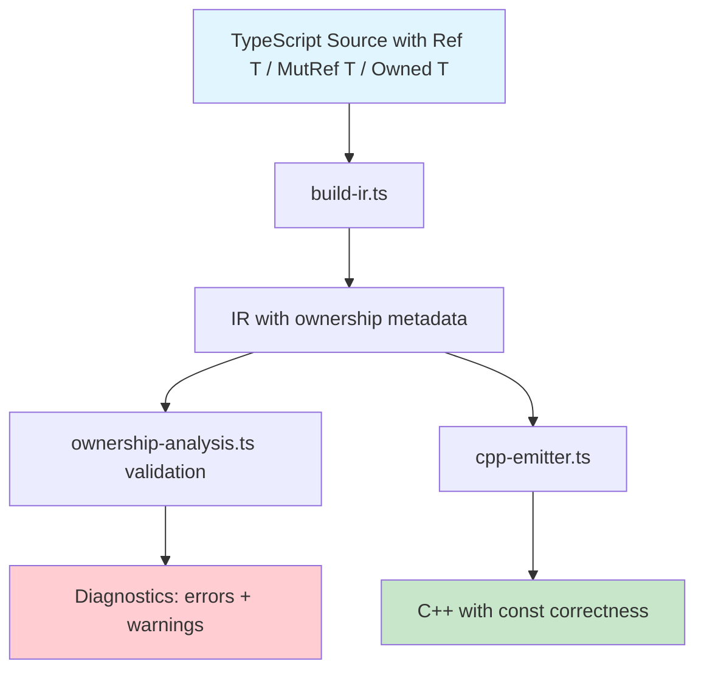

# Ownership & Borrowing Safety System

## Overview

A Rust-inspired variable handling feature that provides memory safety for embedded systems at **compile time** via transpiler validation — with zero runtime cost. The system uses TypeScript phantom types (`Ref<T>`, `MutRef<T>`, `Owned<T>`) that are erased during transpilation but leveraged for static analysis and C++ const-correctness emission.

## Design Principles

1. **Zero-cost abstraction** — All checks happen at transpile time. No runtime overhead. Emitted C++ is identical or better (const annotations) than without ownership types.
2. **Opt-in** — If you never use `Ref<T>` / `MutRef<T>` / `Owned<T>`, no diagnostics are generated and behavior is unchanged.
3. **Low cognitive load** — Familiar TypeScript generics. No new syntax. Clear error messages.
4. **Forward knowledge** — The transpiler sees the whole program and can validate ownership rules across function boundaries.

## Architecture



## Core Type System

### TypeScript Types — compile-time only phantom wrappers

```typescript
// All defined in @typecode/core — erased during transpilation

/**
 * Marks a value as exclusively owned. Assignment transfers ownership.
 * Source variable becomes invalid after move.
 */
type Owned<T> = T;

/**
 * Immutable borrow — read-only access. Multiple Ref borrows can coexist.
 * Emits as 'const T&' or 'const T*' in C++ for const-correctness.
 */
type Ref<T> = T;

/**
 * Mutable borrow — read-write access. Only one MutRef can exist at a time.
 * Emits as 'T&' or 'T*' in C++.
 */
type MutRef<T> = T;
```

### C++ Emission Mapping

| TypeScript | C++ | Const? |
|---|---|---|
| `let x: Owned<uint8[]> = ...` | `uint8_t x[] = ...` | No |
| `const x: Owned<uint8[]> = ...` | `const uint8_t x[] = ...` | Yes |
| `let x: Ref<uint8[]>` | `const uint8_t x[]` | Yes |
| `function f(param: Ref<uint8[]>)` | `void f(const uint8_t param[])` | Yes |
| `function f(param: MutRef<uint8[]>)` | `void f(uint8_t param[])` | No |
| `function f(param: Owned<uint8[]>)` | `void f(uint8_t param[])` | No |

The key insight: **`Ref<T>` automatically adds `const` to the C++ emission**, giving you compiler-enforced immutability at the C++ level for free.

## Validation Rules

### Rule 1: Use-After-Move — Error

When an `Owned<T>` variable is assigned to another variable, the source is *moved* and cannot be used again.

```typescript
let buffer: Owned<Uint8Array> = new Uint8Array(32);
let moved = buffer;           // OK — ownership transferred
// buffer[0] = 0xFF;          // ERROR: use of moved value 'buffer'
```

**Detection**: Track variable state in a `Set<string>` of moved variables. On assignment where source is `Owned`, add source to moved set. On any subsequent identifier reference to a moved variable, emit error.

### Rule 2: Assignment to Ref — Error

`Ref<T>` variables are immutable borrows. Assignment to them is forbidden.

```typescript
const data: Ref<Uint8Array> = getBuffer();
// data[0] = 0x42;  // ERROR: cannot assign to immutable borrow
```

**Detection**: When an `assign` or `update` IR statement targets a variable declared as `Ref<T>`, emit error.

### Rule 3: MutRef Exclusivity — Warning

Only one `MutRef` to the same underlying data should exist at a time. This is a simplified check — we track MutRef variables and warn if two are derived from the same source without scoping.

```typescript
let buf = new Uint8Array(16);
let ref1: MutRef<Uint8Array> = buf;  // OK
let ref2: MutRef<Uint8Array> = buf;  // WARNING: multiple mutable borrows
```

**Detection**: Track `MutRef` variables and their source. If two `MutRef` variables point to the same source and are both in scope, emit warning.

### Rule 4: Const Suggestion — Warning

`let` variables that are never reassigned should use `const`.

```typescript
let threshold = 100;  // WARNING: 'threshold' is never reassigned, use 'const'
threshold = 200;      // (if this doesn't exist, trigger the warning)
```

**Detection**: Track all `let` variable declarations. After full traversal, any `let` variable with no `assign` or `update` targeting it gets a warning.

### Rule 5: Borrow Kind Mismatch — Error

Passing a `Ref<T>` where `MutRef<T>` is expected is forbidden.

```typescript
function writeBuffer(buf: MutRef<Uint8Array>): void { ... }

const data: Ref<Uint8Array> = getBuffer();
writeBuffer(data);  // ERROR: cannot pass immutable borrow as mutable borrow
```

**Detection**: At call sites, compare the ownership kind of the argument with the parameter's declared ownership kind.

## Phased Implementation

### Phase 1: Type Wrappers + Const Emission — Foundation

The most impactful piece: `Ref<T>` → `const` in C++. This gives real C++ const-correctness.

- Define phantom types in core
- Extend IR with ownership metadata
- Update type-resolution to detect wrappers
- Update emitter to add `const` for `Ref<T>`
- Basic validation: assignment to `Ref` is an error

### Phase 2: Move Semantics

Track variable moves and detect use-after-move.

- Track moved variables per scope
- Validate identifier references against moved set
- Clear moved set at scope boundaries

### Phase 3: Borrow Conflict Detection

Detect multiple mutable borrows and Ref/MutRef conflicts.

- Track borrow sources
- Validate at function call boundaries
- Simplified scope-based analysis

## Files to Create/Modify

### New Files

| File | Purpose |
|---|---|
| `packages/core/src/types/ownership.ts` | Phantom type definitions: `Owned<T>`, `Ref<T>`, `MutRef<T>` |
| `packages/cli/src/ir/ownership-analysis.ts` | Validation pass for all ownership rules |
| `tests/ownership-analysis.test.ts` | Test suite for ownership validation |
| `examples/22-ownership-safety.ts` | Example demonstrating the feature |
| `docs/transpiler/ownership.md` | User-facing documentation |

### Modified Files

| File | Change |
|---|---|
| `packages/core/src/shared/ir.ts` | Add `ownershipKind` field to `VariableDeclarationIR` and `ParameterIR` |
| `packages/core/src/shared/index.ts` | Export new IR types |
| `packages/core/src/index.ts` | Export `Owned`, `Ref`, `MutRef` types |
| `packages/cli/src/ir/model.ts` | Re-export new types |
| `packages/cli/src/ir/type-resolution.ts` | Detect `Ref<T>`, `MutRef<T>`, `Owned<T>` wrapper types, extract inner type + ownership kind |
| `packages/cli/src/ir/build-ir.ts` | Propagate ownership metadata from type annotations to IR nodes |
| `packages/cli/src/ir/validation-orchestrator.ts` | Register `validateOwnership` pass |
| `packages/cli/src/emit/statement-renderer.ts` | Emit `const` for `Ref<T>` parameters and variables |
| `packages/cli/src/emit/expression-renderer.ts` | Handle ownership-wrapped expressions if needed |

## IR Model Extensions

### VariableDeclarationIR Addition

```typescript
interface VariableDeclarationIR {
  kind: 'var_decl';
  // ... existing fields ...
  
  /** Ownership kind inferred from type annotation. */
  ownershipKind?: 'owned' | 'ref' | 'mut_ref';
  
  /** The unwrapped inner C++ type (e.g., Ref<uint8[]> → uint8_t[] with ownershipKind='ref'). */
  // cppType already stores the unwrapped type
}
```

### ParameterIR Addition

```typescript
interface ParameterIR {
  name: string;
  cppType: string;
  defaultValue?: ExpressionIR;
  isRest: boolean;
  
  /** Ownership kind inferred from type annotation. */
  ownershipKind?: 'owned' | 'ref' | 'mut_ref';
}
```

## Example Usage

```typescript
import { Ref, MutRef, Owned, I2C0, delay } from '@typecode';

// --- Const correctness via Ref ---
function readSensorData(buf: Ref<Uint8Array>, address: uint8): uint8 {
  // buf is const — cannot modify it
  return buf[address];  // OK: read access
}

function writeSensorData(buf: MutRef<Uint8Array>, value: uint8): void {
  buf[0] = value;  // OK: mutable borrow allows writes
}

// --- Ownership transfer ---
let txBuffer: Owned<Uint8Array> = new Uint8Array(32);
txBuffer[0] = 0x55;              // OK: we own it

writeSensorData(txBuffer, 0x42); // OK: mutable borrow
const byte0 = readSensorData(txBuffer, 0); // OK: immutable borrow

// --- Const suggestion ---
let counter = 0;     // WARNING: never reassigned, use 'const'
const limit = 100;   // OK
```

## Diagnostic Codes

| Code | Severity | Message Template |
|---|---|---|
| `ownership-use-after-move` | error | `Variable '{name}' was moved to '{target}' and cannot be used` |
| `ownership-assign-to-ref` | error | `Cannot assign to immutable borrow '{name}'` |
| `ownership-multiple-mut-ref` | warning | `Multiple mutable borrows of '{source}' exist simultaneously` |
| `ownership-ref-as-mut-ref` | error | `Cannot pass immutable borrow as mutable borrow parameter` |
| `ownership-suggest-const` | warning | `Variable '{name}' is never reassigned, consider using 'const'` |

## Relationship to Existing Features

- **Bus Ownership** (`peripheral-ownership.ts`): Complementary. Bus ownership handles peripheral exclusivity at runtime. This feature handles variable-level memory safety at compile time.
- **Interrupt Safety** (`interrupt-analysis.ts`): Complementary. Ownership types can enhance ISR safety by marking shared buffers as `Ref<T>` in ISR context.
- **Pin Validation** (`pin-safety.ts`): Same validation pattern — IR traversal producing diagnostics.

## Testing Strategy

Tests follow the existing pattern in `tests/bus-ownership.test.ts`:

```typescript
describe('Ownership Analysis', () => {
  it('emits const for Ref<T> parameter', () => { ... });
  it('errors on use-after-move', () => { ... });
  it('errors on assignment to Ref<T>', () => { ... });
  it('warns on multiple MutRef borrows', () => { ... });
  it('warns on let that should be const', () => { ... });
  it('produces no diagnostics when feature is not used', () => { ... });
});
```
