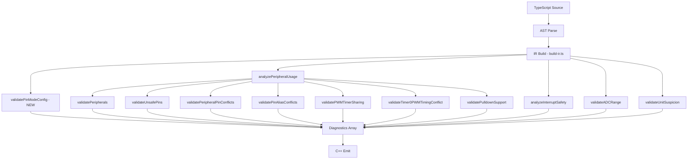

# Pin Mode State Machine & GPIO Mode Detection

## Overview

Two complementary features that prevent a common class of embedded bugs:
using GPIO pins for I/O without configuring their mode first.

1. **Type System: Mode-Specific Pin Interfaces** — After calling `asOutput()` or `asInput()`, only the appropriate I/O methods are available on the returned type.
2. **Transpiler Diagnostic: `pin-mode-not-set`** — Warns when I/O methods are called on a pin that has no prior mode configuration in the same scope.

---

## Part A: Type System — Mode-Specific Pin Interfaces

### Design

The existing `BasePin` interface exposes ALL methods regardless of mode. The existing branded `Pin<Mode>` type exists but doesn't restrict method availability. We add new mode-specific interfaces that restrict which I/O operations are available, and update the fluent `as*()` methods to return them.

**Key principle:** Mode-switching methods are always available on every mode type, so you can transition between modes. Only I/O methods are restricted.

```
┌──────────────┐     .asOutput()     ┌───────────────┐
│  BasePin     │ ──────────────────► │ IOutputModePin │
│  unconfigured│ ◄────────────────── │  write, high,  │
│              │     .asInput()      │  low, toggle,  │
│              │ ──────────────────► │  pulse, pwm    │
│              │ ◄────────────────── │                │
│              │     .asInputPullUp()│                │
│              │ ──────────────────► └───────────────┘
│              │                     ┌───────────────┐
│              │                     │ IInputModePin  │
│              │                     │  read, isHigh, │
│              │                     │  isLow,        │
│              │                     │  readAnalog    │
│              │                     └───────────────┘
└──────────────┘
```

### Files to Modify

#### 1. `packages/core/src/types/pin.ts`

Add three new interfaces after the existing `BasePin`:

```typescript
// ---------------------------------------------------------------------------
// Mode-restricted pin interfaces
// ---------------------------------------------------------------------------

/** Properties shared by all pin mode types. */
interface IPinCore {
  readonly number: number;
  readonly gpio: number;
  readonly capabilities: ReadonlySet<PinCapability>;
}

/** Methods available on ALL mode types for switching modes. */
interface IPinModeSwitching {
  /** Switch to OUTPUT mode. Returns output-typed pin. */
  asOutput(initial?: DigitalValue): IOutputModePin;
  /** Switch to INPUT mode. Returns input-typed pin. */
  asInput(): IInputModePin;
  /** Switch to INPUT_PULLUP mode. Returns input-typed pin. */
  asInputPullUp(): IInputModePin;

  // Non-fluent mode setters (void return, for backward compat)
  output(initial?: DigitalValue): void;
  input(): void;
  inputPullUp(): void;
  inputPullDown?(): void;
  outputOpenDrain(initial?: DigitalValue): void;
}

/** Pin in OUTPUT mode — only write operations available. */
export interface IOutputModePin extends IPinCore, IPinModeSwitching {
  write(value: DigitalValue): void;
  high(): void;
  low(): void;
  toggle(): void;
  pulse(duration: number): void;
  tone(frequency: number): IToneAttachment;
  noTone(): void;

  // Capability-dependent (optional, same as BasePin)
  pwm?(percent: number): void;
  getPwmFrequency?(): number;
  getPwmResolution?(): number;
}

/** Pin in INPUT mode — only read operations available. */
export interface IInputModePin extends IPinCore, IPinModeSwitching {
  read(): DigitalValue;
  isHigh(): boolean;
  isLow(): boolean;

  // Capability-dependent (optional, same as BasePin)
  readAnalog?(): AnalogValue;
  readVoltage?(): number;
  setAnalogReference?(voltage: number): void;
  getAnalogResolution?(): number;

  // Interrupts (input-mode only)
  onRising?(handler: InterruptHandler, options?: InterruptOptions): void;
  onFalling?(handler: InterruptHandler, options?: InterruptOptions): void;
  onChange?(handler: InterruptHandler, options?: InterruptOptions): void;
  offInterrupts?(): void;

  // Wait operations (input-mode only)
  waitForRising(timeout?: number): Promise<void>;
  waitForFalling(timeout?: number): Promise<void>;
}
```

Update the `asOutput()`, `asInput()`, `asInputPullUp()` methods on `BasePin` to return the new types:

```typescript
// In BasePin, change:
asOutput(initial?: DigitalValue): Pin<PinMode.OUTPUT>;
// To:
asOutput(initial?: DigitalValue): IOutputModePin;

// Similarly for asInput and asInputPullUp
asInput(): IInputModePin;
asInputPullUp(): IInputModePin;
```

#### 2. `packages/core/src/index.ts`

Export the new types:

```typescript
export {
  // ... existing exports ...
  IOutputModePin,
  IInputModePin,
} from './types/pin';
```

#### 3. `packages/board-arduino-uno/src/pin-types.ts`

Add board-specific mode types that omit `inputPullDown` (AVR has no hardware pulldown):

```typescript
/** Output-mode pin on Arduino Uno — no hardware pulldown. */
export type IUnoOutputModePin = Omit<IOutputModePin, 'inputPullDown'>;

/** Input-mode pin on Arduino Uno — no hardware pulldown. */
export type IUnoInputModePin = Omit<IInputModePin, 'inputPullDown'>;
```

### Usage Examples

```typescript
import { D4, LED } from '@typecode/board-arduino-uno';

// BEFORE (still works, but no mode enforcement):
LED.output(HIGH);
LED.toggle(); // OK — BasePin has all methods

// AFTER (opt-in mode safety via fluent API):
const led = LED.asOutput(HIGH);  // returns IOutputModePin
led.toggle();                     // OK — toggle is on IOutputModePin
led.read();                       // TYPE ERROR — read not on IOutputModePin

const btn = D4.asInputPullUp();   // returns IInputModePin
btn.read();                       // OK — read is on IInputModePin
btn.high();                       // TYPE ERROR — high not on IInputModePin

// Mode switching is always available:
const switched = led.asInput();   // OK — switch output to input
switched.read();                  // OK
```

### Backward Compatibility

- `BasePin` is unchanged — all existing code continues to work
- The `Pin<Mode>` branded type still exists for backward compat
- Legacy aliases (`IPin`, `IDigitalPin`, etc.) unchanged
- Board pin exports (`D4: IUnoDigitalPin`) unchanged
- Only the `as*()` fluent methods get improved return types

---

## Part B: Transpiler Diagnostic — `pin-mode-not-set`

### Design

A new IR analysis pass that scans statements in order, tracking per-pin whether a mode-setting call has been seen before any I/O call. Follows the exact pattern of existing passes like `interrupt-analysis.ts` and `adc-range-validation.ts`.

### Mode-Setting Methods (configure the pin)

- `output`, `input`, `inputPullUp`, `inputPullDown`, `outputOpenDrain`
- `asOutput`, `asInput`, `asInputPullUp`
- `config.output`, `config.input`, `config.inputPullUp`, `config.inputPullDown`

### I/O Methods (require prior mode configuration)

**Read operations** (severity: `warning`):
- `read`, `isHigh`, `isLow`, `readAnalog`, `readVoltage`

**Write operations** (severity: `info` — Arduino implicitly sets OUTPUT):
- `write`, `high`, `low`, `toggle`, `pulse`, `pwm`, `tone`

### Files to Create

#### 1. `packages/cli/src/ir/pin-mode-validation.ts`

```typescript
// ---------------------------------------------------------------------------
// Pin Mode Configuration Validation
//
// Detects when GPIO I/O operations are used on pins without prior mode
// configuration. Generates warnings for reads and info for writes.
// ---------------------------------------------------------------------------

import type { ProgramIR, StatementIR } from './model';
import type { Diagnostic } from '../types';

const MODE_SET_METHODS = new Set([
  'output', 'input', 'inputPullUp', 'inputPullDown', 'outputOpenDrain',
  'asOutput', 'asInput', 'asInputPullUp',
  'config.output', 'config.input', 'config.inputPullUp', 'config.inputPullDown',
]);

const READ_METHODS = new Set([
  'read', 'isHigh', 'isLow', 'readAnalog', 'readVoltage',
]);

const WRITE_METHODS = new Set([
  'write', 'high', 'low', 'toggle', 'pulse', 'pwm', 'tone',
]);

const PIN_RECEIVER_KINDS = new Set([
  'digital', 'pwm', 'analog-input', 'interrupt',
]);

export function validatePinModeConfig(
  program: ProgramIR,
): Diagnostic[] {
  const diagnostics: Diagnostic[] = [];
  const pinModeSet = new Map<string, boolean>();

  const checkStatement = (stmt: StatementIR) => {
    if (!stmt || typeof stmt !== 'object') return;

    if (stmt.kind === 'typecode-call') {
      const tc = stmt as any;
      if (!tc.receiver || !tc.receiverKind) return;
      if (!PIN_RECEIVER_KINDS.has(tc.receiverKind)) return;

      const { receiver, method } = tc;

      if (MODE_SET_METHODS.has(method)) {
        pinModeSet.set(receiver, true);
      } else if (READ_METHODS.has(method) && !pinModeSet.get(receiver)) {
        diagnostics.push({
          severity: 'warning',
          message: `Pin '${receiver}' read via '${method}()' without prior mode configuration. ` +
                   `Call ${receiver}.input() or ${receiver}.inputPullUp() first.`,
          code: 'pin-mode-not-set',
          source: 'pin-mode-validation',
        });
      } else if (WRITE_METHODS.has(method) && !pinModeSet.get(receiver)) {
        diagnostics.push({
          severity: 'info',
          message: `Pin '${receiver}' written via '${method}()' without explicit mode configuration. ` +
                   `Arduino implicitly sets OUTPUT, but explicit ${receiver}.output() is recommended.`,
          code: 'pin-mode-not-set',
          source: 'pin-mode-validation',
        });
      }
    }

    // Recurse into nested statements
    scanNestedStatements(stmt, checkStatement);
  };

  // Scan all program locations
  if (program.topLevelStatements) {
    for (const stmt of program.topLevelStatements) checkStatement(stmt);
  }
  if (program.functions) {
    for (const fn of program.functions) {
      if (fn.statements) {
        for (const stmt of fn.statements) checkStatement(stmt);
      }
    }
  }
  if (program.classes) {
    for (const cls of program.classes) {
      if (cls.methods) {
        for (const method of cls.methods) {
          if (method.statements) {
            for (const stmt of method.statements) checkStatement(stmt);
          }
        }
      }
      if (cls.constructor?.statements) {
        for (const stmt of cls.constructor.statements) checkStatement(stmt);
      }
    }
  }

  return diagnostics;
}
```

Note: The `scanNestedStatements` helper already exists in `interrupt-analysis.ts` and is shared. If it's not exported, we'll need to extract it or duplicate the pattern.

### Files to Modify

#### 2. `packages/cli/src/ir/build-ir.ts`

Add import and wire into the diagnostic pipeline (around line 3820):

```typescript
import { validatePinModeConfig } from './pin-mode-validation';

// ... in the diagnostic pipeline, after interrupt analysis ...

// Validate pin mode configuration
const pinModeDiagnostics = validatePinModeConfig({
  fileName,
  imports,
  reExports,
  structs: [],
  enums,
  classes,
  typeAliases,
  topLevelStatements,
  functions,
  boilerplates,
  diagnostics: [],
  registerClasses,
  boardConstants,
  interfaces,
  namespaces,
});
diagnostics.push(...pinModeDiagnostics);
```

### Files to Create (Tests)

#### 3. `tests/pin-mode-validation.test.ts`

```typescript
import { describe, it, expect } from 'vitest';
import { transpile } from './setup';

describe('Pin Mode Configuration Validation', () => {
  it('generates warning when read() called without mode set', () => {
    const result = transpile(`
      import { D4 } from '@typecode/board-arduino-uno';
      const value = D4.read();
    `, { target: 'arduino' });

    const warnings = result.diagnostics.filter(
      d => d.code === 'pin-mode-not-set'
    );
    expect(warnings.length).toBeGreaterThan(0);
    expect(warnings[0].message).toContain('D4');
    expect(warnings[0].severity).toBe('warning');
  });

  it('generates info when high() called without mode set', () => {
    const result = transpile(`
      import { D4 } from '@typecode/board-arduino-uno';
      D4.high();
    `, { target: 'arduino' });

    const infos = result.diagnostics.filter(
      d => d.code === 'pin-mode-not-set'
    );
    expect(infos.length).toBeGreaterThan(0);
    expect(infos[0].severity).toBe('info');
  });

  it('does not generate warning when mode is set before read', () => {
    const result = transpile(`
      import { D4 } from '@typecode/board-arduino-uno';
      D4.input();
      const value = D4.read();
    `, { target: 'arduino' });

    const warnings = result.diagnostics.filter(
      d => d.code === 'pin-mode-not-set'
    );
    expect(warnings.length).toBe(0);
  });

  it('does not generate warning when output() is called before toggle', () => {
    const result = transpile(`
      import { LED } from '@typecode/board-arduino-uno';
      LED.output(true);
      LED.toggle();
    `, { target: 'arduino' });

    const warnings = result.diagnostics.filter(
      d => d.code === 'pin-mode-not-set'
    );
    expect(warnings.length).toBe(0);
  });

  it('does not generate warning for asOutput fluent API', () => {
    const result = transpile(`
      import { D4 } from '@typecode/board-arduino-uno';
      const out = D4.asOutput();
      out.high();
    `, { target: 'arduino' });

    const warnings = result.diagnostics.filter(
      d => d.code === 'pin-mode-not-set'
    );
    expect(warnings.length).toBe(0);
  });
});
```

---

## Implementation Order

1. Add `IOutputModePin` and `IInputModePin` interfaces to `packages/core/src/types/pin.ts`
2. Update `asOutput()`, `asInput()`, `asInputPullUp()` return types on `BasePin`
3. Export new types from `packages/core/src/index.ts`
4. Add board-specific mode types to `packages/board-arduino-uno/src/pin-types.ts`
5. Create `packages/cli/src/ir/pin-mode-validation.ts` diagnostic pass
6. Wire new pass into `packages/cli/src/ir/build-ir.ts`
7. Create `tests/pin-mode-validation.test.ts`
8. Run existing tests to verify no regressions

## Diagram: Diagnostic Pipeline Integration


