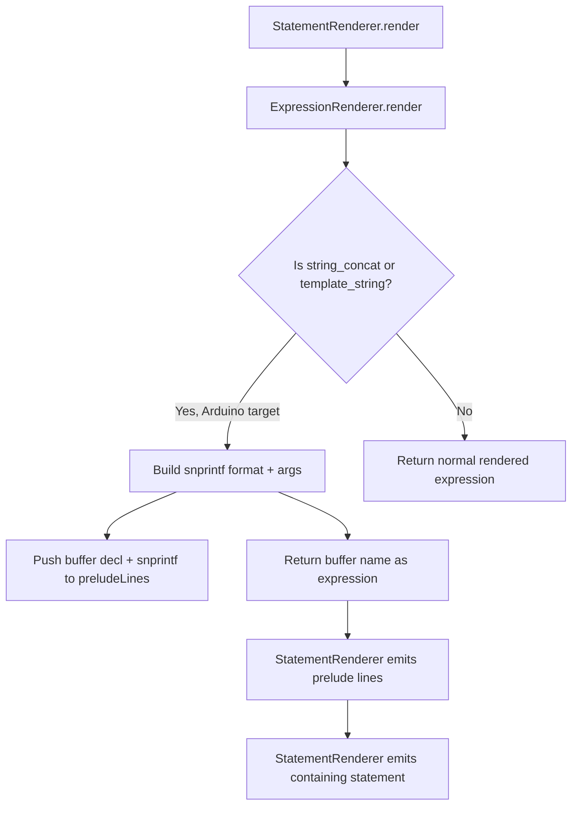
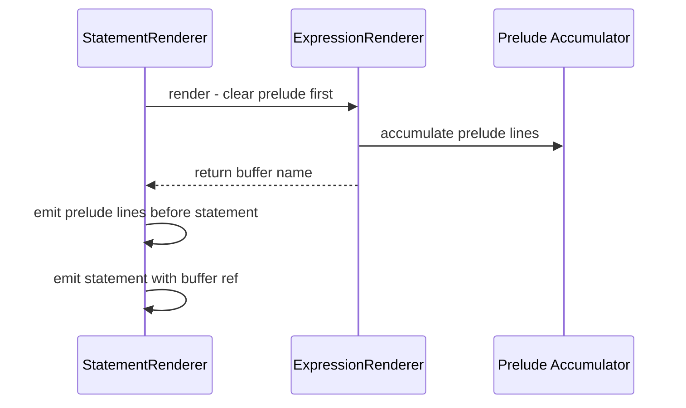

# Plan: Migrate String Concatenation from `String()` to `snprintf()`

## Problem

String concatenation and template literal interpolation currently produce Arduino `String()` object calls:

```cpp
// Current output for: uart.println(`d3: ${D3.read()}`)
uart.println("d3: " + String(String(digitalRead(3))));
```

This allocates heap memory on each concatenation, causes fragmentation, and is unsuitable for embedded targets. The goal is to use `snprintf()` instead:

```cpp
// Desired output:
char __typecode_str_1[24];
snprintf(__typecode_str_1, sizeof(__typecode_str_1), "d3: %d", digitalRead(3));
uart.println(__typecode_str_1);
```

## Scope

- **Arduino target**: Replace `String()` with `snprintf()` for all string concat/interpolation
- **AVR target**: Same — inherits from Arduino strategy
- **Generic C++ target**: No change — keeps `std::string` concatenation

## Current Architecture

### Where `String()` is produced

| Location | Method | Produces |
|---|---|---|
| [`expression-renderer.ts:153-168`](packages/cli/src/emit/expression-renderer.ts:153) | `renderStringConcat()` | `"str" + String(expr) + String(expr)` |
| [`expression-renderer.ts:170-172`](packages/cli/src/emit/expression-renderer.ts:170) | `renderTemplateString()` | `String(expr)` |
| [`expression-renderer.ts:188-197`](packages/cli/src/emit/expression-renderer.ts:188) | `renderBinary()` | Delegates to `strategy.wrapStringConcat()` |
| [`framework-arduino/strategy.ts:203-208`](packages/framework-arduino/src/strategy.ts:203) | `wrapStringConcat()` | `String(left) + right` |
| [`cpp-emitter.ts:417-438`](packages/cli/src/emit/cpp-emitter.ts:417) | `renderExpression()` | Same `String()` wrapping in legacy path |

### Existing snprintf infrastructure in `cpp-emitter.ts`

The legacy emitter already has snprintf logic but **only for specific statement patterns**:

| Statement kind | Lines | Status |
|---|---|---|
| `var_decl` with `string_concat` initializer | 2098-2131 | ✅ Works |
| `assign` to known snprintf buffer | 2133-2164 | ✅ Works |
| `console.*` call with `string_concat` arg | 2166-2214 | ✅ Works |
| `typecode-call` Serial println/print | 2216-2277 | ✅ Works |
| **Any other call with `string_concat` arg** | — | ❌ Falls through to `String()` |
| **Return with `string_concat`** | — | ❌ Falls through to `String()` |

Key existing helpers:
- [`buildSnprintfRenderResult()`](packages/cli/src/emit/cpp-emitter.ts:727) — converts `string_concat` IR → format string + args
- [`inferSnprintfArg()`](packages/cli/src/emit/cpp-emitter.ts:630) — maps expression → printf format specifier
- [`createArduinoFloatSnprintfArg()`](packages/cli/src/emit/cpp-emitter.ts:607) — handles float→dtostrf for AVR
- [`EmissionScopeState`](packages/cli/src/emit/cpp-emitter.ts:544) — tracks snprintf buffers and temp IDs

## Proposed Architecture

### Core Pattern: Prelude Accumulator

`snprintf` requires **multiple statements** — buffer declaration, optional prelude like `dtostrf()`, and the `snprintf()` call itself. But `ExpressionRenderer.render()` returns a single string. The solution is a **prelude accumulator**:



### Data Flow



## Detailed Changes

### 1. Add `useSnprintfForStrings()` to PlatformStrategy interface

**File**: [`packages/core/src/shared/platform-strategy.ts`](packages/core/src/shared/platform-strategy.ts)

Add new method:
```typescript
/** Whether string concat/interpolation should use snprintf instead of String(). */
useSnprintfForStrings(): boolean;
```

### 2. Implement in strategies

**File**: [`packages/framework-arduino/src/strategy.ts`](packages/framework-arduino/src/strategy.ts)
```typescript
useSnprintfForStrings(): boolean { return true; }
```

**File**: [`packages/cli/src/platform/generic-strategy.ts`](packages/cli/src/platform/generic-strategy.ts)
```typescript
useSnprintfForStrings(): boolean { return false; }
```

### 3. Add prelude accumulator to ExpressionRenderer

**File**: [`packages/cli/src/emit/expression-renderer.ts`](packages/cli/src/emit/expression-renderer.ts)

Add properties and methods:
```typescript
private _preludeLines: string[] = [];
private _snprintfTempCounter = 0;

/** Clear accumulated prelude lines. Call before each top-level render. */
clearPrelude(): void { this._preludeLines = []; }

/** Drain accumulated prelude lines and clear. */
drainPrelude(): string[] {
  const lines = this._preludeLines;
  this._preludeLines = [];
  return lines;
}
```

### 4. Refactor `renderStringConcat()` for snprintf

**File**: [`packages/cli/src/emit/expression-renderer.ts`](packages/cli/src/emit/expression-renderer.ts:153)

When `strategy.useSnprintfForStrings()` is true:
1. Walk `expr.parts` — build format string with `%d`, `%s`, `%g` etc. based on part types
2. For float parts on Arduino, emit `dtostrf()` prelude
3. Generate temp buffer name like `__typecode_str_N`
4. Push `char __typecode_str_N[estimatedLen];` and `snprintf(__typecode_str_N, sizeof(...), "fmt", args...);` to prelude
5. Return `__typecode_str_N` as the expression

When false (generic): keep current `String()` / `std::string` behavior.

### 5. Refactor `renderTemplateString()` for snprintf

**File**: [`packages/cli/src/emit/expression-renderer.ts`](packages/cli/src/emit/expression-renderer.ts:170)

When snprintf mode: treat as a single-interpolation snprintf — format string with one specifier, one arg.

### 6. Refactor `renderBinary()` for snprintf

**File**: [`packages/cli/src/emit/expression-renderer.ts`](packages/cli/src/emit/expression-renderer.ts:188)

When `+` operator with string left operand and snprintf mode: build a two-part snprintf instead of calling `wrapStringConcat()`.

### 7. Update StatementRenderer to flush prelude lines

**File**: [`packages/cli/src/emit/statement-renderer.ts`](packages/cli/src/emit/statement-renderer.ts)

In the `render()` method, before returning the rendered statement string:
1. Call `this.expressionRenderer.drainPrelude()`
2. Prepend prelude lines to the output

Since `StatementRenderer.render()` returns a single string, prelude lines need to be joined with newlines and prepended. Alternatively, the caller in `cpp-emitter.ts` can handle this.

### 8. Extend snprintf in `cpp-emitter.ts` legacy path

**File**: [`packages/cli/src/emit/cpp-emitter.ts`](packages/cli/src/emit/cpp-emitter.ts)

In `appendRenderedStatement()`, add a **general-purpose snprintf interception** before the generic fallback:

```
// General case: any call/typecode-call with string_concat argument
if (strategy.useSnprintfForStrings()) {
  const snprintfExprs = findStringConcatExpressions(statement);
  if (snprintfExprs.length > 0) {
    for each found expression:
      build snprintf render result
      emit buffer + prelude + snprintf call
      replace expression with buffer reference in rendered output
  }
}
```

Also update the inline `renderExpression()` function (lines 417-438) to use snprintf when the strategy says so, with its own prelude mechanism.

### 9. Ensure `stdio.h` include

**File**: [`packages/cli/src/emit/cpp-emitter.ts`](packages/cli/src/emit/cpp-emitter.ts)

The existing code already adds `<stdio.h>` when snprintf is detected via `statementNeedsSnprintf()`. Extend the detection to cover the new general case. The `programAnalysis` tracking should be updated to flag snprintf usage.

### 10. Update `wrapStringConcat()` on ArduinoStrategy

**File**: [`packages/framework-arduino/src/strategy.ts`](packages/framework-arduino/src/strategy.ts:203)

Since snprintf now handles string concat at the expression level, `wrapStringConcat()` should return `undefined` — letting the expression renderer handle it entirely. Or remove it if no longer called.

### 11. Update tests

**File**: [`tests/expressions.test.ts`](tests/expressions.test.ts)

The test at line 111-125 already expects snprintf output for Arduino template literals. Other string tests need updating:

- Tests using `{ target: "arduino" }` should expect `snprintf` + `char[]` buffers
- Tests using default/generic target should keep `std::string` expectations
- Add new tests for:
  - String concat as function argument
  - String concat in return statement
  - Nested string concat
  - String concat with float values — verify `dtostrf` prelude
  - Multiple string concats in same statement — verify unique buffer names

### 12. Verify demo output

**File**: [`demo/src/out/sketch/sketch.ino`](demo/src/out/sketch/sketch.ino)

After changes, the demo should produce:
```cpp
void setup() {
  pinMode(13, OUTPUT);
  const int uart = Serial.begin(9600);
  while (true) {
    digitalWrite(13, !digitalRead(13));
    char __typecode_str_1[24];
    snprintf(__typecode_str_1, sizeof(__typecode_str_1), "d3: %d", digitalRead(3));
    uart.println(__typecode_str_1);
    delay(1000);
  }
}
```

## Files to Modify

| File | Change |
|---|---|
| `packages/core/src/shared/platform-strategy.ts` | Add `useSnprintfForStrings()` method |
| `packages/framework-arduino/src/strategy.ts` | Implement `useSnprintfForStrings()` → `true`, update `wrapStringConcat()` |
| `packages/cli/src/platform/generic-strategy.ts` | Implement `useSnprintfForStrings()` → `false` |
| `packages/cli/src/emit/expression-renderer.ts` | Add prelude accumulator, refactor `renderStringConcat()`, `renderTemplateString()`, `renderBinary()` |
| `packages/cli/src/emit/statement-renderer.ts` | Flush prelude lines from expression renderer |
| `packages/cli/src/emit/cpp-emitter.ts` | Generalize snprintf interception, update `renderExpression()` |
| `tests/expressions.test.ts` | Update Arduino target expectations to snprintf |
| `tests/statements.test.ts` | Update if string statements are tested there |

## Risk Areas

1. **Nested expressions**: A `string_concat` inside another `string_concat` — each needs its own buffer. The temp counter ensures unique names.
2. **String concat in conditional expressions**: `cond ? "a" + x : "b" + y` — both branches need separate buffers. The prelude is emitted unconditionally before the ternary.
3. **String concat as lvalue**: Not possible in TypeScript, so not a concern.
4. **Buffer size estimation**: The existing `estimatedLength` calculation should be reused. Conservative estimates are fine for embedded.
5. **Multiple string concats in one statement**: Each gets a unique buffer via the counter.
