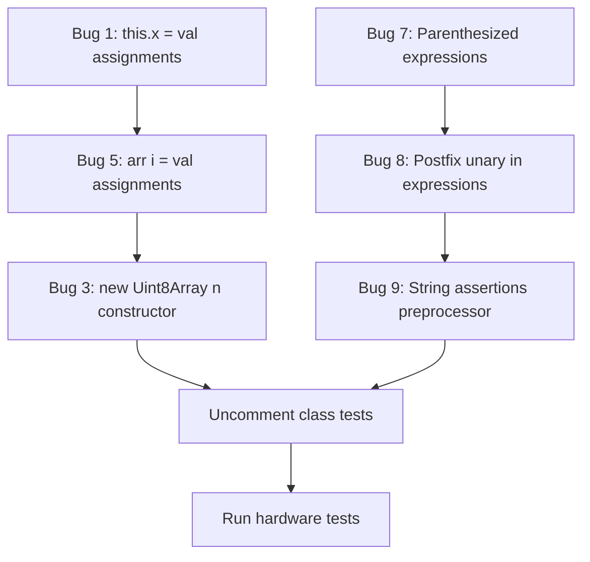

# Transpiler Bug Fix Plan

## Overview

9 bugs were discovered during hardware testing of the TypeCode transpiler. Analysis of the transpiler source code (`build-ir.ts`, `expression-renderer.ts`, `statement-renderer.ts`, `class-emitter.ts`, `preprocessor.ts`) reveals that **6 bugs are fixable** with targeted code changes and **3 are architectural limitations** to be documented.

---

## Fixable Bugs (6)

### Bug 1: `this.x = val` assignments dropped in constructor/method bodies

**Symptom:** `this.count = initial` inside a constructor produces an empty C++ constructor body. Same for `this.count = this.count + 1` in methods.

**Root Cause:** In [`expressionStatementToIR()`](packages/cli/src/ir/build-ir.ts:1438), the assignment handling at line 1497 only matches `BinaryExpression` where the left side is an `Identifier`:
```typescript
if (ts.isBinaryExpression(expr) && ts.isIdentifier(expr.left)) {
```
But `this.count` is a `PropertyAccessExpression`, not an `Identifier`. The register bit-field handler at line 1464 checks for `PropertyAccessExpression` left side but only matches register names. So `this.x = val` falls through to `return undefined` at line 1548, silently dropping the statement.

**Fix Location:** [`packages/cli/src/ir/build-ir.ts`](packages/cli/src/ir/build-ir.ts:1494) — after the register bit-field block (line 1494) and before the `isIdentifier` check (line 1497).

**Fix:** Add a new block handling `BinaryExpression` with `PropertyAccessExpression` left side:
```typescript
// Handle this.field = value  and  obj.field = value
if (ts.isBinaryExpression(expr) && ts.isPropertyAccessExpression(expr.left) && expr.operatorToken.kind === ts.SyntaxKind.EqualsToken) {
  const targetIR = expressionToIR(expr.left, sourceText, diagnostics, pointerVars);
  const targetText = renderExprAsText(targetIR); // e.g. "this->count"
  const comments = extractNodeComments(statement, sourceText);
  return {
    kind: "assign",
    sourceSpan: makeSourceSpan(statement, fileName, sourceText),
    leadingComments: comments.leadingComments,
    trailingComments: comments.trailingComments,
    target: targetText,
    operator: "=",
    value: expressionToIR(expr.right, sourceText, diagnostics),
  };
}
```
This works because `expressionToIR` already handles `this.field` → `"this->field"` at line 834-835.

**Files to modify:**
- `packages/cli/src/ir/build-ir.ts` — add PropertyAccessExpression assignment handling

---

### Bug 3: `new Uint8Array(n)` size constructor generates invalid C++

**Symptom:** `const buf = new Uint8Array(4)` transpiles to `uint8_t buf = uint8_t[4]` which is invalid C++.

**Root Cause:** In [`expressionToIR()`](packages/cli/src/ir/build-ir.ts:716), the size constructor case returns:
```typescript
return { kind: "raw", value: `${elementType}[${size}]` };
```
This produces `uint8_t[4]` as an expression value — a C++ type, not a value. When used as a variable initializer, the statement renderer emits `uint8_t buf = uint8_t[4]`.

**Fix Location:** [`packages/cli/src/ir/build-ir.ts`](packages/cli/src/ir/build-ir.ts:715) lines 715-719.

**Fix:** Change the size-constructor case to produce a zero-initialized C++ array literal:
```typescript
// new TypedArray(n) — allocate n elements (zero-initialized)
if (args.length === 1) {
  const size = renderExprAsText(expressionToIR(args[0], sourceText, diagnostics, pointerVars));
  // Generate a zero-initialized array: {0, 0, 0, 0} for size 4
  // Use a special IR kind so the statement renderer can emit the proper C++ declaration
  return { kind: "raw", value: `{${Array(parseInt(size)).fill("0").join(", ")}}` };
}
```

However, this only works for constant size arguments. A more robust approach: emit as a special IR kind that the var_decl renderer handles by emitting `uint8_t buf[4] = {0}` (the type becomes the array type, not a scalar). This requires checking how `renderVarDecl` in statement-renderer.ts handles the initializer.

**Alternative simpler fix:** Since the primary use case is `const buf = new Uint8Array(4)`, we can detect this pattern in the variable declaration handler and emit `uint8_t buf[4] = {0}` directly. The expression IR for the initializer should carry the array size info.

**Recommended approach:** Add a new expression IR kind `"typed_array_alloc"` with `elementType` and `size` fields. Then handle it in the statement renderer's var_decl path to emit `elementType name[size] = {0}`.

**Files to modify:**
- `packages/core/src/ir/model.ts` (or wherever ExpressionIR types are defined) — add `"typed_array_alloc"` kind
- `packages/cli/src/ir/build-ir.ts` — emit new IR kind instead of raw
- `packages/cli/src/emit/statement-renderer.ts` — handle new IR kind in var_decl rendering
- `packages/cli/src/emit/expression-renderer.ts` — handle new IR kind in expression rendering

---

### Bug 5: `arr[i] = val` element access assignments silently dropped

**Symptom:** `arr[i] = val` inside a function does not generate any C++ output.

**Root Cause:** Same as Bug 1 — [`expressionStatementToIR()`](packages/cli/src/ir/build-ir.ts:1497) only handles `Identifier` left side. `arr[i]` is an `ElementAccessExpression`, so the assignment falls through to `return undefined`.

**Fix Location:** [`packages/cli/src/ir/build-ir.ts`](packages/cli/src/ir/build-ir.ts:1494) — same area as Bug 1 fix.

**Fix:** Add handling for `ElementAccessExpression` left side:
```typescript
// Handle arr[index] = value
if (ts.isBinaryExpression(expr) && ts.isElementAccessExpression(expr.left) && expr.operatorToken.kind === ts.SyntaxKind.EqualsToken) {
  const targetIR = expressionToIR(expr.left, sourceText, diagnostics, pointerVars);
  const targetText = renderExprAsText(targetIR); // e.g. "arr[i]"
  const comments = extractNodeComments(statement, sourceText);
  return {
    kind: "assign",
    sourceSpan: makeSourceSpan(statement, fileName, sourceText),
    leadingComments: comments.leadingComments,
    trailingComments: comments.trailingComments,
    target: targetText,
    operator: "=",
    value: expressionToIR(expr.right, sourceText, diagnostics),
  };
}
```
This works because `expressionToIR` already handles element access at line 852-855, producing `arr[i]`.

**Files to modify:**
- `packages/cli/src/ir/build-ir.ts` — add ElementAccessExpression assignment handling

---

### Bug 7: Parenthesized expressions dropped — wrong operator precedence

**Symptom:** `(2 + 3) * 4` evaluates as `2 + 3 * 4 = 14` instead of `(2 + 3) * 4 = 20`.

**Root Cause:** In [`expressionToIR()`](packages/cli/src/ir/build-ir.ts:257), parenthesized expressions are unwrapped:
```typescript
if (ts.isParenthesizedExpression(expr)) {
  return expressionToIR(expr.expression, sourceText, diagnostics, pointerVars);
}
```
The comment says "the emitter re-parenthesizes as needed" but [`renderBinary()`](packages/cli/src/emit/expression-renderer.ts:328) renders without any precedence logic:
```typescript
return `${leftRendered} ${expr.operator} ${rightRendered}`;
```
So `(2 + 3) * 4` becomes IR: `binary(*, binary(+, 2, 3), 4)` → renders as `2 + 3 * 4`.

**Fix Location:** [`packages/cli/src/emit/expression-renderer.ts`](packages/cli/src/emit/expression-renderer.ts:328) — `renderBinary()` method.

**Fix:** Add precedence-aware parenthesization. Define a precedence map for C++ operators and wrap the left/right sub-expressions in parentheses when their precedence is lower than the parent operator:

```typescript
private renderBinary(expr: Extract<ExpressionIR, { kind: "binary" }>, exprTransformer?: (expr: string) => string): string {
  const leftRendered = this.render(expr.left, exprTransformer);
  const rightRendered = this.render(expr.right, exprTransformer);
  
  if (expr.operator === "+") {
    const wrapped = this.strategy.wrapStringConcat(leftRendered, rightRendered, expr.left.kind === "string");
    if (wrapped !== undefined) return wrapped;
  }
  
  const myPrec = operatorPrecedence(expr.operator);
  const leftNeedsParens = expr.left.kind === "binary" && operatorPrecedence((expr.left as any).operator) < myPrec;
  const rightNeedsParens = expr.right.kind === "binary" && operatorPrecedence((expr.right as any).operator) <= myPrec;
  
  const left = leftNeedsParens ? `(${leftRendered})` : leftRendered;
  const right = rightNeedsParens ? `(${rightRendered})` : rightRendered;
  return `${left} ${expr.operator} ${right}`;
}
```

With a helper:
```typescript
function operatorPrecedence(op: string): number {
  switch (op) {
    case "*": case "/": case "%": return 5;
    case "+": case "-": return 4;
    case "<<": case ">>": return 3;
    case "<": case "<=": case ">": case ">=": return 2;
    case "==": case "!=": return 1;
    case "&": case "|": case "^": return 0;
    case "&&": return -1;
    case "||": return -2;
    default: return 0;
  }
}
```

**Files to modify:**
- `packages/cli/src/emit/expression-renderer.ts` — add precedence logic to `renderBinary()`

---

### Bug 8: Post-increment return value not captured in expressions

**Symptom:** `let x = i++` — the post-increment side effect may not compose correctly in complex expressions.

**Root Cause:** [`expressionToIR()`](packages/cli/src/ir/build-ir.ts) handles `PrefixUnaryExpression` at line 262-269 but has **no handler for `PostfixUnaryExpression`**. Postfix expressions fall through to the raw text fallback at the end of the function. While `i++` as raw text `"i++"` works in simple contexts, it doesn't compose correctly in IR transformations (e.g., when the operand involves typecode calls or property access that needs rewriting).

**Fix Location:** [`packages/cli/src/ir/build-ir.ts`](packages/cli/src/ir/build-ir.ts:269) — after the prefix unary handler.

**Fix:** Add postfix unary handling:
```typescript
// Handle postfix unary (i++, i--)
if (ts.isPostfixUnaryExpression(expr)) {
  const operator = ts.tokenToString(expr.operator) ?? "";
  return {
    kind: "unary",
    operator,
    operand: expressionToIR(expr.operand, sourceText, diagnostics, pointerVars),
    postfix: true,  // Add postfix flag to distinguish from prefix
  };
}
```

This requires checking if the `unary` IR kind supports a `postfix` field. If not, add one to the model, and update the expression renderer to render postfix operators after the operand.

**Files to modify:**
- `packages/core` IR model — add `postfix?: boolean` to unary ExpressionIR
- `packages/cli/src/ir/build-ir.ts` — add PostfixUnaryExpression handler
- `packages/cli/src/emit/expression-renderer.ts` — handle postfix flag in unary rendering

---

### Bug 9: String assertions — preprocessor emits bare identifiers

**Symptom:** `.expectString(greeting).toBe("hello")` fails because the preprocessor treats the string variable as a number.

**Root Cause:** In [`emitSegments()`](packages/expect/src/host/preprocessor.ts:288), the string detection heuristic at line 295-296:
```typescript
const isString = seg.matcher === 'toContain' || seg.matcher === 'toHaveLength'
  || (seg.matcher === 'toBe' && isStringExpression(seg.actualExpr ?? ''));
```
And [`isStringExpression()`](packages/expect/src/host/preprocessor.ts:367) only detects string literals (starts with quote) or `.readString()` calls — not plain identifier variables that hold strings.

Additionally, when the chain uses `.expectString()`, the segment kind is still just `'expect'` (line 246) — the fact that it was `expectString` vs `expect` is lost.

**Fix Location:** [`packages/expect/src/host/preprocessor.ts`](packages/expect/src/host/preprocessor.ts:246) — segment collection and emission.

**Fix:** Two changes:
1. In `collectSegmentsRecursive`, distinguish `expectString` from `expect` by adding a flag to the segment:
```typescript
} else if (methodName === 'expect' || methodName === 'expectString') {
  collectSegmentsRecursive(receiver, sf, segments);
  const actualExpr = expr.arguments.length > 0
    ? expr.arguments[0].getText(sf)
    : '0';
  segments.push({ kind: 'expect', actualExpr, isStringExpect: methodName === 'expectString' });
}
```

2. In `emitSegments`, use the flag:
```typescript
const isString = seg.isStringExpect || seg.matcher === 'toContain' || seg.matcher === 'toHaveLength'
  || (seg.matcher === 'toBe' && isStringExpression(seg.actualExpr ?? ''));
```

**Files to modify:**
- `packages/expect/src/host/preprocessor.ts` — track `expectString` vs `expect` distinction, use it in emission

---

## Architectural Limitations (3 — document only)

### Bug 2: Nested objects — inner objects flattened

**Symptom:** `sensor.calibration.offset` where `calibration` is a nested object — the inner object fields are lost.

**Root Cause:** [`renderObject()`](packages/cli/src/emit/expression-renderer.ts:319) renders only values without field names: `{ 10, 20 }` instead of `{ .offset = 10, .gain = 20 }`. C++ aggregate initialization requires either positional matching to a defined struct or named designators. The transpiler doesn't generate struct definitions for nested object types.

**Decision:** Document as known limitation. Proper fix requires generating C++ struct definitions from TypeScript type information, which is a significant architectural change.

### Bug 4: Float arithmetic — literals truncated to int on AVR

**Symptom:** `1.5 + 2.5` evaluates as `1 + 2 = 3` instead of `4.0`.

**Root Cause:** The AVR platform strategy maps all `number` types to `int` for performance. This is by design — the ATmega328P has no FPU and float operations are expensive.

**Decision:** Document as platform limitation. This is intentional behavior for Arduino Uno.

### Bug 6: Nested functions — not hoisted to file scope

**Symptom:** A function declared inside another function is not transpiled correctly.

**Root Cause:** C++ does not support local function definitions. The transpiler would need to detect nested functions, hoist them to file scope with mangled names, and rewrite call sites.

**Decision:** Document as known limitation. Hoisting requires significant architectural changes to the IR builder.

---

## Implementation Order

The bugs should be fixed in this order to minimize conflicts and allow incremental testing:



1. **Bug 1 + Bug 5 together** — Both are missing assignment targets in `expressionStatementToIR()`. Fix in the same function, adjacent code locations.
2. **Bug 7** — Standalone fix in `expression-renderer.ts`. No dependencies.
3. **Bug 8** — Requires IR model change + expression renderer update. Independent of other fixes.
4. **Bug 3** — Requires IR model change + statement renderer update. Most complex fix.
5. **Bug 9** — Standalone fix in preprocessor. No dependencies on transpiler changes.
6. **Uncomment class tests** — After Bug 1 is fixed, re-enable the commented-out class tests.
7. **Hardware validation** — Run full test suite on Arduino Uno.

---

## Test Plan

For each bug fix:
1. Add a unit test in `tests/` that verifies the transpiler generates correct C++ output
2. After all fixes, uncomment the class tests in `demo/src/03-classes-matchers.test.ts`
3. Run `npm test` to verify all existing unit tests still pass
4. Run `npm run test:hw` in the demo directory to verify all 81+ tests pass on hardware
