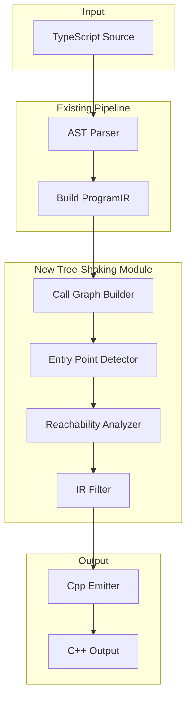

# Tree-Shaking Feature Plan

> **Status: ✅ IMPLEMENTED** (February 2026)
>
> This feature has been fully implemented. The tree-shaking system is enabled by default and includes:
> - Call graph builder ([`src/ir/call-graph.ts`](../src/ir/call-graph.ts))
> - Entry point detector ([`src/ir/entry-points.ts`](../src/ir/entry-points.ts))
> - Reachability analyzer ([`src/ir/reachability.ts`](../src/ir/reachability.ts))
> - IR filter ([`src/ir/filter.ts`](../src/ir/filter.ts))
> - Comprehensive test suite ([`tests/tree-shaking.test.ts`](../tests/tree-shaking.test.ts))
>
> CLI options are documented in the main README.md.

## Overview

Add dead code elimination (tree-shaking) to the TypeScript-to-C++ transpiler to reduce output size by only emitting code that is actually reachable from entry points.

## Goals

1. Reduce generated C++ code size by eliminating unused functions, classes, and enums
2. Maintain backward compatibility - tree-shaking should be optional and configurable
3. Leverage existing IR infrastructure (`collectUsedIdentifiers`, `ProgramIR`)
4. Support both Arduino (`setup`/`loop`) and generic (`main`) entry points

## Architecture



## Component Design

### 1. Call Graph Builder - `src/ir/call-graph.ts`

Builds a dependency graph showing which functions/classes reference each other.

```typescript
interface CallGraphNode {
  name: string;
  kind: 'function' | 'class' | 'enum' | 'variable';
  dependencies: Set<string>; // Names of referenced symbols
}

interface CallGraph {
  nodes: Map<string, CallGraphNode>;
  // Reverse mapping: symbol -> who references it
  referencedBy: Map<string, Set<string>>;
}

function buildCallGraph(program: ProgramIR): CallGraph;
```

**Implementation approach:**
- Reuse existing `collectStatementIdentifiers` and `collectExpressionIdentifiers` from [`transpile.ts`](src/transpile.ts:174)
- Extend to track class instantiations via `new` expressions
- Track method calls on class instances
- Handle property access patterns

### 2. Entry Point Detector - `src/ir/entry-points.ts`

Identifies the root functions from which reachability analysis begins.

```typescript
interface EntryPointConfig {
  // Arduino target
  arduinoEntryPoints: ['setup', 'loop'];
  // Generic C++ target  
  genericEntryPoints: ['main'];
  // Custom entry points from config
  customEntryPoints: string[];
}

function detectEntryPoints(
  program: ProgramIR, 
  target: TargetProfile,
  config?: EntryPointConfig
): Set<string>;
```

**Entry point detection rules:**
- Arduino: Always include `setup` and `loop` if they exist
- Generic: Always include `main` if it exists
- Top-level executable statements are always included
- Classes instantiated at top-level are entry points
- Exported symbols (if module support is added later)

### 3. Reachability Analyzer - `src/ir/reachability.ts`

Performs mark-and-sweep analysis to determine reachable code.

```typescript
interface ReachabilityResult {
  reachableFunctions: Set<string>;
  reachableClasses: Set<string>;
  reachableEnums: Set<string>;
  reachableTypeAliases: Set<string>;
  reachableTopLevelStatements: number[]; // Indices
  unreachable: {
    functions: FunctionIR[];
    classes: ClassIR[];
    enums: EnumIR[];
  };
}

function analyzeReachability(
  program: ProgramIR,
  callGraph: CallGraph,
  entryPoints: Set<string>
): ReachabilityResult;
```

**Algorithm:**
1. Initialize worklist with entry points
2. For each item in worklist:
   - Mark as reachable
   - Add all its dependencies to worklist
3. Continue until worklist is empty
4. Collect unreachable items

### 4. IR Filter - `src/ir/filter.ts`

Creates a filtered ProgramIR with only reachable code.

```typescript
interface TreeShakingOptions {
  enabled: boolean;
  keepUnusedEnums: boolean;  // Some enums may be used for type info only
  keepUnusedClasses: boolean;
  aggressive: boolean;  // Also remove unreachable statements within functions
  reportUnused: boolean; // Emit diagnostics for removed code
}

function filterProgramIR(
  program: ProgramIR,
  reachability: ReachabilityResult,
  options: TreeShakingOptions
): ProgramIR;
```

## Integration Points

### 1. Transpile Function - [`src/transpile.ts`](src/transpile.ts:358)

```typescript
export function transpileFile(options: TranspileOptions): GeneratedOutputs {
  // ... existing code ...
  
  const programIR = buildProgramIR(filePath, sourceText);
  
  // NEW: Apply tree-shaking if enabled
  if (options.treeShaking?.enabled !== false) {
    const callGraph = buildCallGraph(programIR);
    const entryPoints = detectEntryPoints(programIR, options.target);
    const reachability = analyzeReachability(programIR, callGraph, entryPoints);
    programIR = filterProgramIR(programIR, reachability, options.treeShaking);
  }
  
  // ... rest of existing code ...
}
```

### 2. Types - [`src/types.ts`](src/types.ts)

```typescript
interface TranspileOptions {
  // ... existing options ...
  treeShaking?: TreeShakingOptions;
}
```

### 3. CLI - [`src/cli.ts`](src/cli.ts)

Add command-line flags:
- `--no-tree-shake` - Disable tree-shaking
- `--keep-unused-enums` - Keep all enums
- `--keep-unused-classes` - Keep all classes  
- `--report-unused` - Print unused code warnings

## Configuration Options

```typescript
interface TreeShakingOptions {
  /** Enable tree-shaking (default: true) */
  enabled: boolean;
  
  /** Keep enums even if not referenced (default: false) */
  keepUnusedEnums: boolean;
  
  /** Keep classes even if not instantiated (default: false) */
  keepUnusedClasses: boolean;
  
  /** Remove unreachable code within functions (default: false) */
  aggressive: boolean;
  
  /** Emit diagnostics for removed code (default: true) */
  reportUnused: boolean;
  
  /** Additional symbols to treat as entry points */
  entryPoints: string[];
}
```

## Edge Cases and Considerations

### 1. Dynamic Patterns
- **Reflection-like patterns**: Code that constructs class names dynamically cannot be analyzed statically
- **Solution**: Warn and require explicit entry point configuration

### 2. Side Effects
- **Top-level IIFE**: Immediately invoked function expressions at top level
- **Global side effects**: Functions that modify global state
- **Solution**: Always include top-level executable statements

### 3. Inheritance
- **Base classes**: May be needed even if not directly instantiated
- **Solution**: Include base classes of reachable derived classes

### 4. External References
- **Library code**: Functions meant to be called from external code
- **Solution**: Support `@public` or `@export` JSDoc annotation

## Implementation Phases

### Phase 1: Core Infrastructure
- [ ] Create `src/ir/call-graph.ts` with `buildCallGraph()`
- [ ] Create `src/ir/entry-points.ts` with `detectEntryPoints()`
- [ ] Create `src/ir/reachability.ts` with `analyzeReachability()`
- [ ] Create `src/ir/filter.ts` with `filterProgramIR()`

### Phase 2: Integration
- [ ] Add `TreeShakingOptions` to `src/types.ts`
- [ ] Integrate tree-shaking into `transpileFile()`
- [ ] Add CLI flags to `src/cli.ts`

### Phase 3: Testing
- [ ] Unit tests for call graph builder
- [ ] Unit tests for reachability analysis
- [ ] Integration tests with example programs
- [ ] Verify output size reduction

### Phase 4: Polish
- [ ] Add diagnostics for unused code
- [ ] Handle edge cases (inheritance, etc.)
- [ ] Documentation updates

## File Structure

```
src/
├── ir/
│   ├── build-ir.ts      # Existing
│   ├── model.ts         # Existing
│   ├── call-graph.ts    # NEW
│   ├── entry-points.ts  # NEW
│   ├── reachability.ts  # NEW
│   └── filter.ts        # NEW
├── types.ts             # Modified - add TreeShakingOptions
├── transpile.ts         # Modified - integrate tree-shaking
└── cli.ts               # Modified - add CLI flags
```

## Testing Strategy

### Unit Tests
```typescript
// tests/call-graph.test.ts
describe('buildCallGraph', () => {
  it('should track function calls');
  it('should track class instantiations');
  it('should track method calls');
  it('should handle nested calls');
});

// tests/reachability.test.ts
describe('analyzeReachability', () => {
  it('should mark entry points as reachable');
  it('should follow transitive dependencies');
  it('should identify unreachable functions');
  it('should handle circular dependencies');
});

// tests/tree-shaking.test.ts
describe('filterProgramIR', () => {
  it('should remove unreachable functions');
  it('should preserve entry points');
  it('should handle keepUnusedEnums option');
  it('should emit diagnostics for removed code');
});
```

### Integration Tests
- Test with `example/example.ts` to verify output reduction
- Compare output size before/after tree-shaking
- Verify functional correctness of transpiled code

## Success Metrics

1. **Code Size Reduction**: Measure % reduction in generated C++ for typical programs
2. **Correctness**: All existing tests continue to pass
3. **Performance**: Tree-shaking adds < 100ms to transpilation time
4. **Diagnostics**: Users can see what code was eliminated

## Risks and Mitigations

| Risk | Mitigation |
|------|------------|
| Removing code that appears unused but is needed | Conservative defaults, extensive testing, easy disable |
| False positives in reachability analysis | Multiple analysis passes, manual entry point config |
| Performance impact on large codebases | Lazy evaluation, caching, optional feature |
| Breaking existing workflows | Opt-in initially, then opt-out with clear migration path |
