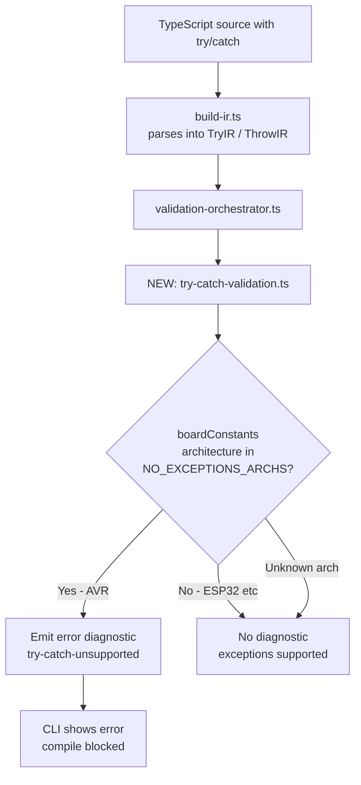

# Plan: Add Compile-Time Validation for try/catch on AVR Targets

## Problem

The transpiler currently:
1. Parses `try`/`catch`/`finally` into IR ([`build-ir.ts:1777`](packages/cli/src/ir/build-ir.ts:1777))
2. Emits raw C++ `try { ... } catch (const std::exception& e) { ... }` ([`cpp-emitter.ts:2105`](packages/cli/src/emit/cpp-emitter.ts:2105))
3. AVR-GCC compiles with `-fno-exceptions` by default, so the generated `.ino` **fails to compile**

The `ArduinoStrategy.renderThrow()` already replaces `throw` with `for (;;) {}` ([`strategy.ts:286`](packages/framework-arduino/src/strategy.ts:286)), but the `try`/`catch` block structure is emitted unmodified.

## Solution: Option A — Compile-Time Error

Add a validation pass that detects `try`/`catch`/`throw` IR nodes and emits an error diagnostic when targeting AVR architectures. This follows the same pattern as [`pulldown-validation.ts`](packages/cli/src/ir/pulldown-validation.ts) which checks for unsupported hardware features.

## Files to Change

### 1. New: `packages/cli/src/ir/try-catch-validation.ts`

A new validation module following the pattern of `pulldown-validation.ts`:

- Define `NO_EXCEPTIONS_ARCHS = new Set(['avr', 'megaavr'])` — architectures without C++ exception support
- Export `validateTryCatch(program: ProgramIR, boardConstants: BoardConstants | undefined): Diagnostic[]`
- Check `boardConstants?.get('architecture')` against the set
- Walk all statements in the program (top-level, functions, class methods, constructors) looking for `kind === "try"` or `kind === "throw"`
- For each found, emit a diagnostic with:
  - `severity: 'error'`
  - `code: 'try-catch-unsupported'`
  - `source: 'try-catch-validation'`
  - `message` explaining AVR-GCC disables exceptions
  - `hint` suggesting return-code pattern
  - `line`/`column` from `sourceSpan`

Statement walking helper — reuse the `scanNestedStatements` pattern from [`interrupt-analysis.ts:231`](packages/cli/src/ir/interrupt-analysis.ts:231) or write a simple recursive walker that handles all statement kinds with nested blocks (if/else, while, for, for-of, switch, try itself, blocks, labeled).

### 2. Modify: `packages/cli/src/ir/validation-orchestrator.ts`

Add import and call:

```typescript
import { validateTryCatch } from "./try-catch-validation";
// ...
diagnostics.push(...validateTryCatch(program, program.boardConstants));
```

### 3. Modify: `demo/src/sketch.ts`

Rewrite the `readSensor()` function to use return-code error checking instead of `try`/`catch`:

```typescript
function readSensor(): number | null {
  // Read 2 bytes from register 0xFA (temperature data)
  const data = sensor.device(SENSOR_ADDR).readBytes(0xFA, 2);

  if (data.length < 2) {
    serial.println(`Warning: Only received ${data.length} bytes (expected 2)`);
    return null;
  }

  // Combine into raw temperature value
  const tempRaw = (data[0] << 8) | data[1];
  return tempRaw;
}
```

### 4. New: `tests/try-catch-validation.test.ts`

Test cases:
- `try/catch on AVR target → error diagnostic`
- `try/catch on ESP32 target → no diagnostic` (ESP32 supports exceptions)
- `try/catch with no board constants → no diagnostic` (graceful fallback)
- `throw on AVR target → error diagnostic`
- `nested try/catch inside if/while → detected`
- `no try/catch → no diagnostics`

## Architecture



## Statement Walking Strategy

The walker must recurse into all nested statement containers:

| Statement kind | Nested blocks to recurse into |
|---|---|
| `if` | `thenBranch`, `elseBranch` |
| `while`, `do_while` | `body` |
| `for`, `for_of`, `for_in` | `body` |
| `switch` | each `case.body` |
| `try` | `tryBlock`, `catchBlock`, `finallyBlock` |
| `block` | `body` or `statements` |
| `labeled` | `body` |

This matches the pattern used in [`ownership-analysis.ts:553`](packages/cli/src/ir/ownership-analysis.ts:553) and [`interrupt-analysis.ts:263`](packages/cli/src/ir/interrupt-analysis.ts:263).
