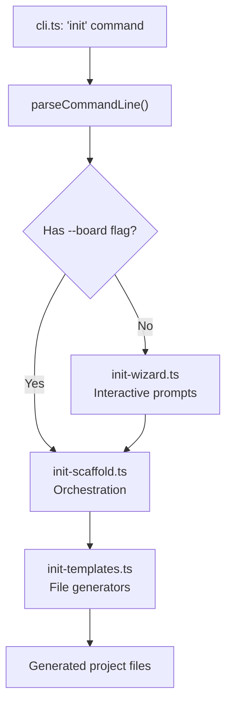

# Plan: `typecode init` — Project Scaffolding Command

## Goal

Add a `typecode init` CLI command that scaffolds a new TypeCode project from scratch. A new user should be able to run `typecode init` and get a working project that they can immediately build, compile, and upload to their board.

## User Experience

### Interactive Mode (default)

```
$ typecode init

⤳ typeCode — Project Setup

? Project name: my-blink
? Board: (Use arrow keys)
  ❯ Arduino Uno (AVR)
    ESP32 DevKit
    Raspberry Pi Pico (RP2040)
    Custom board...
? Framework:
  ❯ Arduino (digitalWrite, Wire, SPI)
    Bare-metal AVR (PORTB, etc.)
? Serial baud rate: 9600
? Create starter sketch? Yes

✓ Created my-blink/
  my-blink/package.json
  my-blink/tsconfig.json
  my-blink/typecode.config.ts
  my-blink/typecode-env.d.ts
  my-blink/src/sketch.ts

Next steps:
  cd my-blink
  npm install
  npx typecode ./src/sketch.ts --compile --fqbn arduino:avr:uno
```

### Non-Interactive Mode (CI / scripting)

```
typecode init my-blink --board arduino-uno --framework arduino --baud 9600
```

### Flags

| Flag | Description | Default |
|------|-------------|---------|
| `--board <id>` | Board package ID (e.g. `arduino-uno`) | Interactive prompt |
| `--framework <id>` | `arduino` or `avr` | `arduino` |
| `--baud <rate>` | Serial monitor baud rate | `9600` |
| `--no-sketch` | Skip generating the starter sketch | false |
| `--outDir <path>` | Output directory | `./<project-name>` |

---

## Architecture

### Flow



### Board Registry (built-in)

A static map of known boards, keyed by ID. Each entry contains all the data needed to generate config files without hitting the network:

```typescript
interface KnownBoard {
  id: string;                    // 'arduino-uno'
  displayName: string;           // 'Arduino Uno'
  architecture: ArchitectureIdentifier;  // 'avr'
  boardPackage: string;          // '@typecode/board-arduino-uno'
  frameworkPackage: string;      // '@typecode/framework-arduino'
  fqbn: string;                  // 'arduino:avr:uno'
  mcu: string;                   // 'ATmega328P'
}
```

Initial registry: just `arduino-uno`. The `create-board` wizard already exists for adding new boards.

---

## Files to Create / Modify

### New Files

#### 1. `packages/cli/src/scaffold/init-templates.ts`

Template generators — pure functions that return file content strings. Mirrors the pattern in [`templates.ts`](packages/cli/src/scaffold/templates.ts:1) used by `create-board`.

Functions:
- `generateProjectPackageJson(options)` — `package.json` with typecode dependencies and npm scripts
- `generateProjectTsconfig(options)` — `tsconfig.json` with `noEmit: true` and `@typecode` path mapping
- `generateProjectConfig(options)` — `typecode.config.ts` with board, framework, output settings
- `generateProjectEnvDts(options)` — `typecode-env.d.ts` with `@typecode` module declaration
- `generateStarterSketch(options)` — `src/sketch.ts` with a blink example using the board's LED pin

#### 2. `packages/cli/src/scaffold/init-wizard.ts`

Interactive prompts using `node:readline/promises` (same pattern as [`wizard.ts`](packages/cli/src/scaffold/wizard.ts:1)). Prompts for:
1. Project name (with validation)
2. Board selection (from built-in registry)
3. Framework selection (filtered by architecture)
4. Serial baud rate
5. Whether to include starter sketch

Returns `InitProjectOptions`.

#### 3. `packages/cli/src/scaffold/init-scaffold.ts`

Orchestration function. Mirrors [`board-scaffold.ts`](packages/cli/src/scaffold/board-scaffold.ts:1).

Functions:
- `scaffoldProject(options)` — creates directory, writes all files, returns list of created paths
- `printInitNextSteps(options)` — prints "Next steps" instructions

### Modified Files

#### 4. `packages/cli/src/types.ts`

Add `InitCommandOptions` interface:

```typescript
export interface InitCommandOptions {
  command: 'init';
  projectName?: string;
  board?: string;
  framework?: string;
  baud?: number;
  noSketch?: boolean;
  outDir?: string;
}
```

#### 5. `packages/cli/src/utils/cli.ts`

- Add `'init'` to the subcommand routing in [`parseCommandLine()`](packages/cli/src/utils/cli.ts:151)
- Parse `--board`, `--framework`, `--baud`, `--no-sketch`, `--outDir` flags
- Return `InitCommandOptions`

#### 6. `packages/cli/src/cli.ts`

- Add `init` command handler block in [`main()`](packages/cli/src/cli.ts:117), following the same pattern as the `create-board` handler at [line 127](packages/cli/src/cli.ts:127)
- Route to wizard if no `--board` flag, otherwise scaffold directly

#### 7. `packages/cli/src/utils/cli.ts` — `printHelp()`

Add init section to help output:

```
PROJECT SCAFFOLDING

  init [name]              Create a new TypeCode project
                           Generates package.json, tsconfig.json, typecode.config.ts,
                           and an optional starter sketch.

  --board <id>             Board to target (e.g., arduino-uno)
  --framework <id>         Framework: arduino or avr (default: arduino)
  --baud <rate>            Serial baud rate (default: 9600)
  --no-sketch              Skip generating starter sketch
  --outDir <path>          Output directory (default: ./<name>)
```

Add example:

```
  # Interactive project setup
  typecode init

  # Non-interactive
  typecode init my-project --board arduino-uno --framework arduino
```

#### 8. `tests/init-scaffold.test.ts`

Unit tests covering:
- Template generation produces valid output for each board
- Scaffold creates all expected files
- Existing directory detection (refuses to overwrite)
- Project name validation
- Non-interactive mode with all flags

---

## Generated Project Structure

```
my-blink/
├── package.json            # Dependencies + npm scripts
├── tsconfig.json           # noEmit, paths for @typecode
├── typecode.config.ts      # Board, framework, output config
├── typecode-env.d.ts       # Virtual module declaration
└── src/
    └── sketch.ts           # Starter blink sketch
```

### `package.json`

```json
{
  "name": "my-blink",
  "version": "1.0.0",
  "private": true,
  "scripts": {
    "build": "typecode ./src/sketch.ts",
    "compile": "typecode ./src/sketch.ts --compile",
    "upload": "typecode ./src/sketch.ts --compile --upload --port COM4",
    "monitor": "typecode ./src/sketch.ts --compile --upload --monitor --port COM4"
  },
  "dependencies": {
    "@typecode/core": "^0.1.0",
    "@typecode/board-arduino-uno": "^0.1.0",
    "@typecode/framework-arduino": "^0.1.0"
  }
}
```

### `tsconfig.json`

```json
{
  "compilerOptions": {
    "target": "ES2021",
    "module": "nodenext",
    "moduleResolution": "nodenext",
    "strict": true,
    "esModuleInterop": true,
    "skipLibCheck": true,
    "forceConsistentCasingInFileNames": true,
    "noEmit": true,
    "paths": {
      "@typecode": ["./node_modules/@typecode/board-arduino-uno"],
      "@typecode/core": ["./node_modules/@typecode/core"]
    }
  },
  "include": ["src/**/*.ts", "typecode.config.ts", "typecode-env.d.ts"]
}
```

Note: For published npm packages, `paths` would point to `./node_modules/...`. For monorepo development, paths would be relative to the workspace root. The template should detect which context it's in.

### `typecode.config.ts`

```typescript
import type { TypecodeConfig } from '@typecode/core';

const config: TypecodeConfig = {
  target: 'avr',
  board: '@typecode/board-arduino-uno',
  framework: '@typecode/framework-arduino',
  fqbn: 'arduino:avr:uno',
  output: {
    framework: 'arduino',
    optimize: 'size',
    outDir: './out',
  },
  toolchain: {
    type: 'arduino-cli',
  },
  console: {
    baudRate: 9600,
  },
};

export default config;
```

### `typecode-env.d.ts`

```typescript
// Auto-generated by typecode init. Do not edit manually.
declare global {
  type Owned<T = any> = T;
  type Ref<T = any> = T;
  type MutRef<T = any> = T;
}

declare module '@typecode' {
  export * from '@typecode/board-arduino-uno';
}

export {};
```

### `src/sketch.ts`

```typescript
import { LED, delay } from '@typecode';

const led = LED.asOutput(false);

while (true) {
  led.toggle();
  delay(1000);
}
```

---

## Key Design Decisions

1. **Separate from `create-board`**: `init` creates a *user project* (a sketch). `create-board` creates a *board definition package*. They serve different audiences and produce different outputs.

2. **Board registry is static**: No network calls. The registry is a simple map in code. New boards get added by contributors. Users who need unlisted boards are directed to `create-board` first.

3. **Reuses readline pattern**: The interactive wizard uses `node:readline/promises` identically to the existing [`runBoardWizard()`](packages/cli/src/scaffold/wizard.ts:1), keeping the dependency footprint at zero.

4. **No `npm install` auto-run**: The command generates files and prints next steps. Running `npm install` is the user's responsibility. This avoids permission issues and keeps the command fast.

5. **Starter sketch is board-aware**: The generated `sketch.ts` uses the board's LED pin constant, so it compiles correctly for the selected board without modification.

---

## Implementation Order

1. Add `InitCommandOptions` to [`types.ts`](packages/cli/src/types.ts)
2. Create [`init-templates.ts`](packages/cli/src/scaffold/init-templates.ts) — all template generators
3. Create [`init-wizard.ts`](packages/cli/src/scaffold/init-wizard.ts) — interactive prompts
4. Create [`init-scaffold.ts`](packages/cli/src/scaffold/init-scaffold.ts) — orchestration
5. Add `init` parsing to [`cli.ts`](packages/cli/src/utils/cli.ts) `parseCommandLine()`
6. Add `init` routing to [`cli.ts`](packages/cli/src/cli.ts) `main()`
7. Update [`printHelp()`](packages/cli/src/utils/cli.ts:9) with init docs
8. Add tests in [`tests/init-scaffold.test.ts`](tests/init-scaffold.test.ts)
9. Manual end-to-end verification
