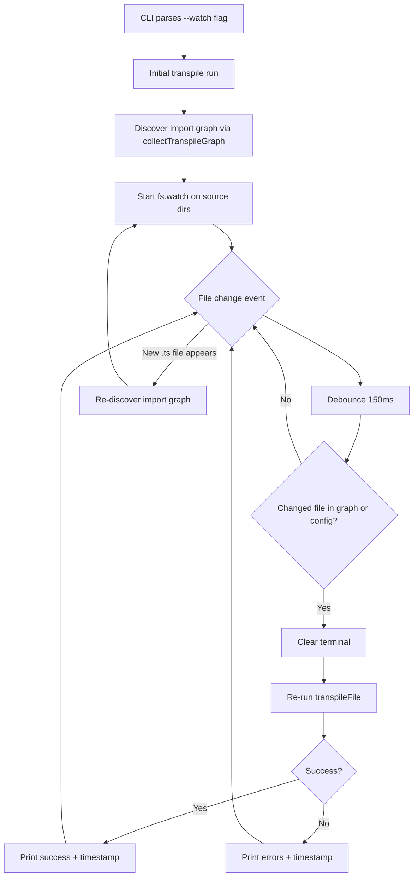

# Plan: `typecode --watch`

## Goal

Add a `--watch` flag to the default transpile command that monitors source files for changes and automatically retranspiles. This gives users a tight edit→build loop during development.

## Usage

```bash
# Watch mode — transpile on every change
typecode sketch.ts --watch

# Watch + compile for Arduino
typecode sketch.ts --watch --compile

# Watch with explicit FQBN
typecode sketch.ts --watch --fqbn arduino:avr:uno
```

## Architecture



## Key Design Decisions

### 1. Flag-based, not a subcommand

`--watch` is a flag on the default transpile command, not a separate `typecode watch` subcommand. This mirrors how `--compile` and `--upload` work — they are modifiers on the transpile pipeline. The watch flag simply wraps the existing pipeline in a file watcher loop.

### 2. Node.js built-in `fs.watch` with `recursive: true`

No external dependencies. `fs.watch(path, { recursive: true })` is supported on:
- **Windows** — all Node versions (the users platform)
- **macOS** — Node 19+
- **Linux** — Node 19+ (backed by inotify)

This avoids adding `chokidar` as a dependency. If Linux compatibility with older Node versions becomes important later, we can add a fallback.

### 3. Directory-level watching, not file-level

Instead of watching individual files from the import graph, watch the **source directories** recursively. This automatically handles:
- New files being created (no need to add watchers)
- Files being deleted
- Renames

We filter events to only react to `.ts` files (and `typecode.config.ts`).

### 4. Debounce with change relevance check

File system watchers can fire multiple events for a single save (especially on some editors that write temp files then rename). A 150ms debounce collapses these. After debouncing, we check if the changed file is actually in the current import graph or is the config file before triggering a rebuild.

### 5. Graph re-discovery on rebuild

Each rebuild calls `collectTranspileGraph()` fresh, so new imports are automatically picked up. No need for a separate mechanism to detect graph changes.

### 6. Terminal clearing

Between builds, clear the terminal so output is clean. Use ANSI escape sequences (`\x1Bc`) rather than spawning a `clear` process.

## File Changes

### New file: `packages/cli/src/watch.ts`

Core watcher module. Responsibilities:

- **`runWatch(options)`** — main entry point
  1. Resolves config (same as current `main()`)
  2. Runs initial transpile
  3. Discovers directories to watch from the import graph
  4. Starts `fs.watch` on each directory
  5. On file change: debounce → check relevance → retranspile
  6. Handles Ctrl+C gracefully

- **`discoverWatchDirs(entryFile, boardPackage)`** — helper
  - Calls `collectTranspileGraph()` to get all files
  - Extracts unique directory paths
  - Adds the directory containing `typecode.config.ts` if found

- **`isRelevantChange(changedPath, graphFiles, configPath)`** — helper
  - Returns true if the changed file is a `.ts` file in the graph
  - Or if it is `typecode.config.ts`

### Modified: `packages/cli/src/types.ts`

Add `watch: boolean` to `CommandLineOptions`:

```typescript
export interface CommandLineOptions {
  // ... existing fields ...
  /** Watch for file changes and retranspile automatically */
  watch: boolean;
}
```

### Modified: `packages/cli/src/utils/cli.ts`

- Parse `--watch` / `-w` flag in the default command section
- Add watch examples to `printHelp()`

### Modified: `packages/cli/src/cli.ts`

- After the existing transpile+compile+upload pipeline, check `options.watch`
- If `watch` is true, call `runWatch()` instead of returning after the first build
- The initial build reuses the same transpile logic already in `main()`

## Watcher Lifecycle

```
1. Parse CLI flags
2. Load config (typecode.config.ts)
3. Run initial transpile (same as non-watch mode)
4. Print initial result
5. Discover import graph → extract directories
6. Start fs.watch on each directory
7. Print "Watching for changes..." with file count
8. Loop:
   a. Receive FS event
   b. Wait 150ms debounce
   c. Check if changed file is relevant
   d. If relevant:
      - Clear terminal
      - Print header + timestamp
      - Re-run transpileFile()
      - Print result (success or errors)
      - If --compile: also recompile
   e. If not relevant: ignore
9. On SIGINT: close watchers, print "Stopped.", exit
```

## Output Format

```
⤳ typeCode v0.1.0

  • Framework: @typecode/framework-arduino
  • Board: @typecode/board-arduino-uno

↦ Transpiling...
✓ Done

↦ Watching 3 files in 2 directories... (Ctrl+C to stop)

[12:34:56] Change detected: src/sketch.ts
↦ Transpiling...
✓ Done

[12:35:01] Change detected: src/sketch.ts
↦ Transpiling...
✗ TypeScript type-checking failed:
  ERROR: src/sketch.ts:15:5 - Type 'string' is not assignable to type 'number'
```

## Edge Cases

| Scenario | Behavior |
|---|---|
| Config file changes | Trigger rebuild — config affects FQBN, board package, framework |
| New .ts file created | Next rebuild picks it up via fresh `collectTranspileGraph()` |
| File deleted | If it was imported, type-check fails → error shown. If not imported, ignored |
| Type error in source | Show error, keep watching. Next change retries |
| Compile error | Show mapped error, keep watching |
| Upload in watch mode | `--upload` with `--watch` is allowed — uploads on each successful compile |
| `--monitor` with `--watch` | Rejected — monitor blocks the process, incompatible with watch loop |
| Multiple changes rapidly | Debounce collapses them into one rebuild |
| `node_modules` changes | Ignored — only watch project source directories |
| `typecode-env.d.ts` changes | Ignored — it is auto-generated from config |

## Validation Rules

- `--watch` requires an input file (no bare `typecode --watch`)
- `--watch --monitor` is rejected with a clear error message
- `--watch` implies `--force` on retranspiles to bypass stale cache concerns

## Test Plan

Tests in `tests/watch.test.ts`:

1. **`discoverWatchDirs`** — returns correct directories from a graph
2. **`isRelevantChange`** — correctly filters .ts files in graph vs unrelated files
3. **Debounce logic** — multiple rapid changes produce single rebuild
4. **Config change detection** — `typecode.config.ts` changes trigger rebuild
5. **Watch flag parsing** — `--watch` and `-w` both set `options.watch = true`
6. **Validation** — `--watch --monitor` throws error
7. **Integration** — create temp project, start watcher, modify file, verify retranspile

## Implementation Order

1. Add `watch: boolean` to `CommandLineOptions` in `types.ts`
2. Parse `--watch` flag in `utils/cli.ts` + update help text
3. Create `watch.ts` with `runWatch()`, `discoverWatchDirs()`, `isRelevantChange()`
4. Wire up `watch` in `cli.ts` — route to `runWatch()` when flag is set
5. Write tests in `tests/watch.test.ts`
6. Manual end-to-end verification
